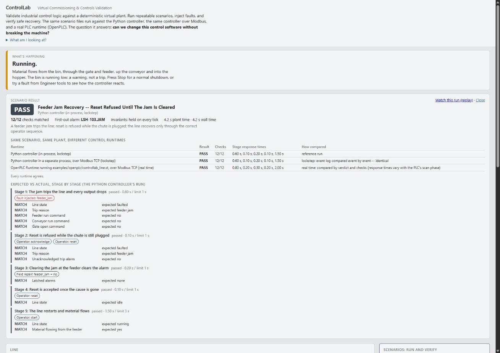
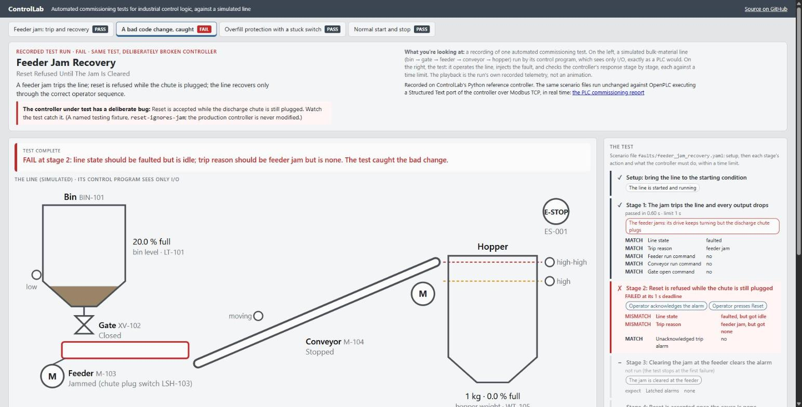
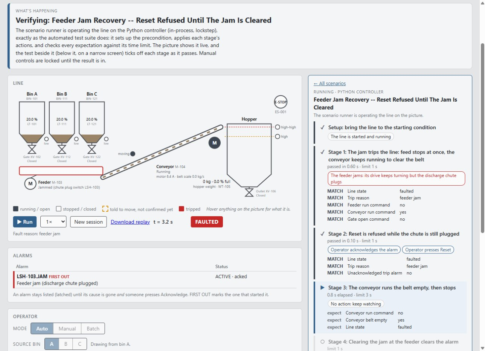

# ControlLab

[](https://github.com/taborbachelor/controllab/actions/workflows/tests.yml)

**Automated commissioning tests for industrial control logic, run against a
simulated plant before the logic ever reaches real equipment.**

### ▶ [Watch a test run in your browser](https://taborbachelor.github.io/controllab/): recorded runs, nothing to install

[](https://taborbachelor.github.io/controllab/)

**What you're looking at.** On the left is a small bulk-material handling
line: bin → slide gate → screw feeder → inclined conveyor → weighed hopper.
It is simulated, with the motors, limit switches, level switches and weigh
scale a real line has. Its control program sees only I/O, the same way a PLC
does. On the right is a commissioning test for a feeder jam. The test jams
the feeder, then checks the controller's response one stage at a time, each
against a time limit: the line must trip within 1 s, a reset must be refused
while the chute is still plugged, and the line may recover only in the right
order. In the frame above, stage 2 has just passed: the line is faulted, the
chute plug switch has caught the jam, the operator's reset was refused, and
the conveyor is still running to clear the belt (trips cascade upstream;
what's downstream of the fault keeps running so it can clear).

**Why it exists.** The question it answers: *can we change control software
without breaking the machine?* Control logic gets changed all the time: a
new permissive, a retuned timer, a quick fix for a nuisance trip. ControlLab
turns the machine's required behavior into executable scenarios, so every
change is checked against all of them before it goes near equipment. The
demo's [second tab](https://taborbachelor.github.io/controllab/bad-change.html)
shows a plausible bad change being caught: reset accepted with the chute
still plugged.

**What's verified:**

- 40 scenarios covering all 11 interlocks in the spec, in both Auto and
  Manual mode: trips, recoveries, E-stop, and instrument faults (stuck and
  failed sensors, a 1oo2 overfill trip with a switch/transmitter
  disagreement alarm).
- The same scenario files run unchanged against **OpenPLC** executing an
  IEC 61131-3 Structured Text port of the controller over Modbus TCP, in
  real time, Auto and Manual mode alike: **38/38 scenarios, 114/114 runs**
  at its last full run ([commissioning report](examples/openplc/COMMISSIONING-REPORT.md)).
- Mass is conserved to the milligram and checked on every scan, and every
  run is deterministic, so the same scenario gives the same result every
  time.
- 772 automated tests, run on every push (Python 3.12 and 3.13; the badge
  above is the latest run). The demo site is rebuilt from the current code
  on every push too, so it can't drift from the repository.

## Quick start

To run it yourself (Python 3.12+):

```bash
pip install -e ".[dev]"
python scripts/dashboard.py        # the live dashboard: open http://127.0.0.1:8000
controllab test                    # every scenario against the Python controller
controllab test feeder_jam_recovery --regression reset-ignores-jam   # watch a regression get caught
pytest                             # the full test suite, every scenario included
```

A ten-minute walkthrough for showing it to another engineer:
[`docs/DEMO.md`](docs/DEMO.md).

## 1. What is ControlLab?

A virtual commissioning environment. Commissioning is the stage where a
control program meets the machine for the first time: every start sequence,
interlock, trip and recovery gets proven before production. ControlLab does
that against a simulated plant instead, so it can happen before the equipment
exists, and can be repeated automatically every time the control logic
changes.

It has four parts:

- **A virtual plant**: deterministic equipment models with real I/O (the
  signals a PLC would wire to).
- **Control logic under test**: a Python reference controller, or any
  external controller that speaks Modbus TCP, including a PLC runtime.
- **Commissioning scenarios**: YAML files, each one a test, with setup,
  actions, faults, expected behavior at each stage, and a time limit.
- **A validator**: runs a scenario, checks every expectation and physical
  invariant on every scan, and produces a PASS/FAIL result with expected vs
  actual at each stage.

## 2. What problem does it solve?

Control software is changed constantly: a new permissive, a retuned timer, a
"quick fix" for a nuisance trip. On a real line, the usual way to learn a
change broke something is when the machine does something it shouldn't.
ControlLab makes the machine's required behavior an executable
specification. Every scenario states what the controller must do when, for
example, the feeder jams: trip within one second, refuse a reset while the
chute is plugged, recover only in the right order. Any change to the control
logic can then be checked against all of it, automatically, before it
reaches equipment.

## 3. What does the virtual plant represent?

A bulk-material handling line: a storage **bin** → a slide **gate** → a
screw **feeder** → an inclined **conveyor** → a weighed **hopper**, plus an
**E-stop**. It has the instrumentation a real one would:

- motor run commands and running feedback;
- a conveyor motion switch (a motor can run while its belt slips);
- gate limit switches;
- a discharge-chute plug switch that catches a feeder jam;
- bin low-level and hopper high / high-high level switches;
- a hopper weight transmitter.

That's 19 I/O tags in all ([`docs/CONTROL-LAB.md`](docs/CONTROL-LAB.md) §5.3).
Material moves through it with mass conserved (checked to a milligram
every scan), spillage accounted for, and every scan deterministic: the same scenario gives
identical results every run.

The controller never touches the equipment models. It reads and writes I/O
tags only, exactly as a PLC does through its I/O cards. A test enforces
this.

## 4. How are faults injected?

Through the same vocabulary the scenarios use, acting on the plant, never on
the controller. The controller has to notice the fault on its own:

- **Equipment:** motor trips and fail-to-start, belt slip, a stuck gate, a
  feeder jam (the drive keeps running; only the plug switch sees it), E-stop.
- **Instruments:** a transmitter or switch **stuck** at its last reading
  (a seized float; nothing in the signal says it's wrong), or **failed**
  (lost signal: the weight transmitter reads 0 with its input-channel
  diagnostic set; a fail-safe switch reads "tripped").
- **Process conditions:** bin and hopper levels.

In the dashboard they live under **Engineer tools**. In a scenario they're
a line of YAML (`feeder_jam: true`).

## 5. How are scenarios validated?

A scenario is a file. This one is abridged; the full file has five stages:

```yaml
name: Feeder Jam Recovery -- Reset Refused Until The Jam Is Cleared
given: {line_state: running}                  # setup
when: {feeder_jam: true}                      # the fault
expect:                                       # what the controller must do...
  line_state: faulted
  fault_reason: "feeder jam"
  feeder_run_commanded: false
within: {seconds: 1.0}                        # ...and how fast
then:                                         # the recovery procedure, stage by stage
  - title: "Reset is refused while the chute is still plugged"
    when: {acknowledge: true, reset: true}
    expect: {line_state: faulted, any_unacknowledged_trip: false}
    within: {seconds: 1.0}
  # clear the jam -> reset accepted -> restart with material flowing
```

The runner applies the setup, then each stage's actions. It checks every
expectation on every scan until they all hold, or the stage's time limit
expires. On every tick it also checks physical invariants: mass conserved,
the feeder never running onto an unproven belt, no motor energized during
E-stop. The result is an engineering record:
- the verdict;
- every check, **MATCH** or **MISMATCH** with the actual value;
- the response time of each stage against its limit;
- the first-out alarm;
- on a failure, the **first divergence**, meaning the stage and deadline where
  the run left the scenario.

Nothing in that record is inferred beyond what the runner observed.

The repository has 40 scenarios covering all 11 interlock rows of the
specification, in Auto and Manual mode. New scenarios, hand-written or AI-generated, go through a
deterministic review gate that rejects a scenario that is vacuous (it still
passes with its fault, or any later stage's actions, removed),
non-deterministic, or disagrees between the in-process and Modbus runs.

```bash
controllab test                         # all of them
controllab test hopper -v               # matching files, full results
python scripts/scenario_report.py --markdown report.md   # coverage matrix + commissioning report
python scripts/scenario_report.py --json report.json --html report.html   # the same, as JSON / printable HTML (PDF)
```

## 6. How does OpenPLC fit into it?

The scenario never changes; the control runtime does.

```
                 SAME SCENARIO (scenarios/*.yaml)
                               │
        ┌──────────────────────┼─────────────────────────────┐
        ▼                      ▼                             ▼
 Python controller    Same controller, separate      OpenPLC Runtime running a
 (in-process)         process, over Modbus TCP       Structured Text port, over
                                                     Modbus TCP, in real time
        └──────────────────────┼─────────────────────────────┘
                               ▼
                 SAME VIRTUAL PLANT (served as Modbus remote I/O)
                               ▼
                 EXPECTED BEHAVIOR, checked the same way
```

ControlLab serves the plant as a Modbus TCP remote-I/O device with a
documented register map ([`docs/MODBUS-MAP.md`](docs/MODBUS-MAP.md)).
OpenPLC, in Docker, polls it exactly as it would a real I/O rack, and runs
[`controllab_line.st`](examples/openplc/controllab_line.st), an IEC 61131-3
Structured Text port of the controller. Against a PLC, scenarios run in real
time, with limits in plant time and a stated I/O latency allowance. Every
scenario starts from a cold PLC restart.

**Result on OpenPLC: 38/38 scenarios over 3 passes (114/114 runs), Auto and Manual mode, none needing the latency
allowance, 11/11 interlock rows covered**
([`examples/openplc/COMMISSIONING-REPORT.md`](examples/openplc/COMMISSIONING-REPORT.md)).

In the dashboard, **Compare runtimes** runs one scenario on every available
runtime and says how each was compared. Two lockstep runs are compared event
for event. A real-time PLC run is compared by verdict and checks, since its
response times depend on where in its scan a change lands.



## 7. How does regression testing work?

Every scenario is a regression test. To demonstrate that a bad change is
caught, ControlLab ships **deliberate regressions**. They are named,
deliberately broken builds of the controller, each a plausible bad commit,
and they live only in the testing layer
([`services/testing/regressions.py`](services/testing/regressions.py)).
Production code is never modified to show a failure.

| Regression | The bad change | Caught at |
|---|---|---|
| `jam-trip-removed` | the feeder-jam trip deleted from RUNNING | feeder jam recovery, stage 1 |
| `reset-ignores-jam` | reset accepted while the chute is still plugged | feeder jam recovery, stage 2 |
| `high-high-switch-only` | the 1oo2 overfill trip reverted to the switch alone | stuck high-high switch, stage 1 |
| `feeder-starts-with-conveyor` | the feeder started together with the conveyor | normal operation, stage 1 |
| `purge-too-short` | the stop sequence's belt purge cut shorter than the belt's transit time | normal operation, stage 4 (belt not empty) |

```
$ controllab test feeder_jam_recovery --regression reset-ignores-jam
  FAIL             6/8  checks  faults/feeder_jam_recovery.yaml
REGRESSION FAILURE
...
Stage 2: Reset is refused while the chute is still plugged
  MISMATCH     Line state: expected faulted  (actual: idle)
  MISMATCH     Trip reason: expected feeder jam  (actual: —)
...
Failure detected at: stage 2 (Reset is refused while the chute is still plugged), t = 3.30 s (the stage's deadline)
REGRESSION DETECTED: 1 scenario(s) caught 'reset-ignores-jam' (expected behavior: Reset refused while the jam remains).
```

The test suite proves each regression is caught where it should be, and that
each copied method differs from production only by its marked change.

[](https://taborbachelor.github.io/controllab/bad-change.html)

## 8. Where does AI assistance fit?

It's optional, and it sits on top of the validation system, not inside it.
It does two things, both producing files an engineer reads:

- **proposes new scenarios**, which must pass the same review gate as a
  hand-written one;
- **analyzes a failed run**, starting from the validator's first divergence,
  and returns hypotheses explicitly marked unverified.

It never issues a command, never changes control logic, and nothing in the
plant, controller, runner or PLC path imports it. The whole loop runs without
an API key using a labelled scripted stand-in. The live-model path is built
and tested against a faked SDK, but has deliberately not been run against a
real model. Details: [`docs/AI.md`](docs/AI.md).

## What else is in it

- **Controller:** the full `IDLE/STARTING/RUNNING/STOPPING/FAULTED/ESTOPPED`
  state machine; downstream-first start and upstream-first stop with belt
  purge; latched alarms with first-out and acknowledge; resets refused while
  a cause remains; a machine-readable reason for every refused start.
  Overfill protection is built as on a real line: fail-safe level switches,
  a 1oo2 high-high vote between the switch and the weight transmitter, and
  an alarm when they disagree.
- **Dashboard** (`python scripts/dashboard.py`):
  - the plant running live, and scenarios verified live on the picture;
  - a plain-English status card;
  - guided walkthroughs to operate it by hand;
  - engineer tools to break it;
  - a replay of every run.

  
- **Telemetry and reports:** tag history (CSV), event log (JSONL), a
  deterministic commissioning report (Markdown, JSON, or print-ready HTML
  that saves as PDF; build-stamped with the git commit) with the interlock
  coverage matrix and operating modes validated, and a self-contained HTML
  replay of any run
  (`python scripts/replay.py SCENARIO.yaml`).
- **Modbus and external controllers:**
  - a stdlib Modbus TCP server, tested against the spec's examples and
    `pymodbus`;
  - an external-controller mode with a comm-loss watchdog
    (`scripts/dashboard.py --external` + `scripts/external_controller.py`);
  - I/O map files that serve the plant at an existing PLC program's
    addresses ([`configs/io/`](configs/io/));
  - *not observable* verdicts for a controller that publishes no status
    block, instead of a guess.

## Reference

```bash
python scripts/dashboard.py --modbus-port 5020      # also expose the live line to any Modbus client
python scripts/scenario_report.py --external        # the suite across Modbus, lockstep
python scripts/scenario_report.py --realtime reference --speed 4    # against a free-running controller
python scripts/scenario_report.py --realtime openplc --repeat 3     # against OpenPLC (examples/openplc)
controllab test --runtime openplc normal_operation  # one scenario on OpenPLC, full result
controllab test --list-regressions
python scripts/review_candidates.py candidates/     # the review gate, on proposed scenarios
```

Setting up OpenPLC: [`examples/openplc/README.md`](examples/openplc/README.md).

## Documentation

- [`docs/DEMO.md`](docs/DEMO.md): the demonstration, step by step.
- [`docs/ARCHITECTURE.md`](docs/ARCHITECTURE.md): layers, runtimes, module responsibilities.
- [`docs/CONTROL-LAB.md`](docs/CONTROL-LAB.md): the specification, the phased roadmap, and the change log with every finding.
- [`docs/AI.md`](docs/AI.md): the optional AI layer.
- [`docs/MODBUS-MAP.md`](docs/MODBUS-MAP.md): the register map.

## Status

All roadmap phases are complete, and 772 tests pass.

| Phase | Focus | Status |
|---|---|---|
| 0–2 | Foundation, simulation core, control | done |
| 3–4 | Commissioning scenarios; fault injection and alarms | done |
| 5–6 | Telemetry; visualization | done |
| 7 | Protocols (Modbus, external-controller mode) | done |
| 8 | AI engineering assistance | done (the live-model path is built but not exercised) |
| 9 | Virtual commissioning against a real PLC | done |
| 10 | Demonstration and validation workflow | done |

## License

MIT; see [`LICENSE`](LICENSE).
