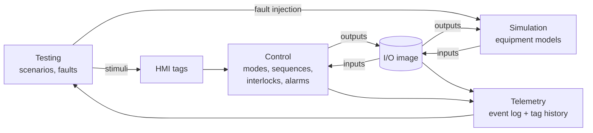

# ControlLab — Project Specification

*Living document and source of truth for the project. Last updated: 2026-09-23. Status: all roadmap phases (0-10) complete. The simulated line, its Auto-mode controller, 27 declarative commissioning scenarios covering all 11 of §6.3's rows, fault injection with alarm management, telemetry and a generated commissioning report, a replay viewer and live dashboard, a Modbus TCP server with external-controller mode, optional AI assistance behind a deterministic review gate, and virtual commissioning against a free-running PLC (OpenPLC running a Structured Text port of the controller: 27/27 scenarios, 81/81 runs over 3 passes). Phase 10 made the purpose obvious: run summaries with expected vs actual, `controllab test`, deliberate-regression fixtures, and dashboard scenarios verified live with runtime comparison. The AI live-model path is built but deliberately not exercised (no API spend on this project). Section 10 has the per-phase detail; `docs/ARCHITECTURE.md` has what is actually implemented and the current test count.*

---

## 1. Purpose

ControlLab is an open-source environment for virtual commissioning of industrial control systems. It pairs a simulated plant with a control layer, so an engineer can run and test control logic against equipment that behaves like the real thing (including when it fails) before any physical hardware exists.

The first target is deliberately small: a single bulk-material handling line. The goal is to do one line properly: realistic device behavior, explicit control logic, repeatable tests, and an auditable record of what happened.

## 2. The Problem

Control logic is usually tested for the first time on site, against real equipment, on a schedule that is already late. The consequences are well known:

- **Fault paths are the least tested code.** Startup and normal running get exercised. A feeder jam, a gate that never reaches its limit switch, or a motor that drops out mid-run often gets tested for the first time when it happens for real.
- **Commissioning evidence is manual.** Test sheets get filled in by hand, results are hard to reproduce, and a later logic change quietly invalidates tests that already passed.
- **Simulation tools tend to be expensive, closed, and tied to one vendor,** so small integrators and students don't use them.
- **Regression testing barely exists in controls work** compared with software. A change to one interlock can break another, and nothing catches it.

ControlLab applies software testing discipline (deterministic, automated, repeatable tests) to control-system behavior, while keeping controls engineering concepts first-class: I/O, scan cycles, permissives, trips, sequences, alarms.

## 3. Core Architecture

### 3.1 Separation of concerns

| Layer | Responsibility | Knows about |
|---|---|---|
| **Simulation** | Physical equipment behavior: material flow, motor response, gate travel, sensor signals, injected faults | Its own device models and the output side of the I/O image |
| **Control** | States, sequences, interlocks, modes, alarms, and responses to operator commands | Only the I/O image and operator commands, never simulation internals |
| **Testing** | Runs scenarios: sets initial conditions, schedules stimuli and faults, checks expectations | Drives the other layers; observes through I/O and telemetry |
| **Telemetry** | Records timestamped events, tag values, state transitions, and alarms | Reads everything; writes nothing back |
| **Visualization** | HMI/dashboard for observation and operator commands | Telemetry (read) and operator commands (write) |
| **AI** *(later)* | Proposes test cases and helps analyze results | Specs, scenario files, and telemetry. Never in the control loop |

### 3.2 The I/O image is the contract

The one hard boundary in the system is the **I/O image**: a flat table of named tags (digital and analog inputs and outputs), just like the process image in a PLC.

- Simulation writes **inputs** (sensor signals) and reads **outputs** (actuator commands).
- Control reads **inputs** and writes **outputs**.
- Control code may never import or inspect simulation objects. If control needs a piece of information, it has to exist as a tag, because that is all a real controller gets.

This boundary is what makes future protocol work straightforward. Exposing the I/O image over Modbus or OPC UA lets an external controller (a soft PLC, or a real one) replace ControlLab's built-in control layer without changing the simulation.

Operator commands (Start, Stop, Reset, mode selection, manual device commands) are a separate small set of **HMI tags**, kept apart from field I/O the same way HMI tags are kept apart from physical I/O in a real system.

### 3.3 Execution model

ControlLab runs on **simulated time** with a fixed step (initially `dt = 100 ms`). Each tick is one scan cycle:

```
1. Testing   applies any stimuli scheduled for time t (operator commands, fault injections)
2. Control   scans: reads inputs + HMI tags → executes logic → writes outputs
3. Simulation advances physics by dt using the new outputs → updates inputs
4. Telemetry records every tag change, state transition, and alarm at time t
5. t ← t + dt
```

Simulated time means tests are deterministic, run far faster than real time (a 10-minute sequence runs in well under a second), and give identical results every run. Anything random, such as sensor noise, uses a seeded generator.



### 3.4 Technology choices

- **Python 3.12+**: readable, strong testing tools, and the eventual protocol libraries (pymodbus, asyncua, paho-mqtt) are mature.
- **pytest** as the test runner. Scenarios are ordinary pytest tests at first.
- **No framework, no database, no web server** until a later phase needs one. Telemetry (Phase 5) goes to JSON Lines and CSV files. Phase 6's live dashboard is the first thing that needed a server, and it uses Python's stdlib `http.server`, localhost only, still no framework.
- Minimal dependencies. Anything added has to justify itself.

Current repository layout and what's actually implemented: `docs/ARCHITECTURE.md`.

## 4. Major Subsystems

**Simulation** (`services/simulation/`): One class per device type, each with a `step(dt)` method, plus a `Plant` that wires the five devices of the initial line together and moves material between them. Each device exposes its fault-injection hooks explicitly.

**I/O** (`services/simulation/engine/io_image.py` + `plant_io.py`, Phase 2 step 1 — done): A tag table shared between Simulation and Control — tag name, type (DI/DO/AI/AO), engineering units, current value — kept deliberately simple, a validated dictionary rather than a framework. The direction encoded in each tag's type is enforced in code, not just convention: Simulation can only `write_input()` DI/AI tags, Control can only `write_output()` DO/AO tags, and either side can `read()` anything. `plant_io.py` defines the exact 17-tag line from §5.3 and the glue (`publish_plant_inputs`/`apply_plant_commands`/`scan`) that wires `Plant` to it without `Plant` itself ever importing the I/O image — see `docs/ARCHITECTURE.md`.

**Control** (Phase 2, done — `services/control/`):
- ✅ *Device control modules*, one per actuator: `MotorControl` (run + optional speed command, a start-proof timer that detects "commanded to run but never confirmed" by timing since the device can't report that itself, and pass-through trip/fault detection) and `GateControl` (open/close command, a travel timeout — there's no "gate fault" DI tag in §5.3, so this is Control's own detection too). Both bind to I/O image tags by name, validated at construction; neither imports anything from `services.simulation.equipment` — `tests/unit/test_control_boundary.py` enforces that mechanically, not just by convention.
- ✅ *Line control*: `Interlocks` (a query object evaluating §6.3's table — permissives + trips, including `conveyor_confirmed_running`'s `RUNNING`-AND-`ZSS-104` combination, which catches a belt-slip fault `MotorControl` alone can't see), `HopperHysteresis` (the on/off feed-demand cycle from §6.2, pure logic, no I/O dependency), and `LineController` (the state machine itself — `IDLE/STARTING/RUNNING/STOPPING/FAULTED/ESTOPPED`, the downstream-first start sequence's three sub-steps, the upstream-first stop sequence's purge timer). Auto mode only — the mode manager doesn't exist yet because there's only one mode to manage; it arrives with Manual mode in a later increment (§6.1: "Auto first; Manual once Auto is proven").
- ✅ *Alarms (Phase 4 steps 1-3, complete)*: `Alarm`/`AlarmManager` (`services/control/alarms.py`) — latching, first-out, and acknowledge for the line's 9 alarm conditions (8 trip + bin-low warning), built directly on `Interlocks` and the device-control fault flags. `LineController` owns an `AlarmManager` instance, scans it every tick, exposes `acknowledge()` alongside `start()`/`stop()`/`reset()`, and `_scan_idle()` refuses a start while any trip-class alarm is latched and unacknowledged — independent of `reset()`, which only clears `FAULTED`. Surfaced through Testing: `vocabulary.py`'s `acknowledge` action + `any_unacknowledged_trip`/`latched_alarm_ids` read fields, and the scenario that closes §6.3's 8th interlock row.

`reset()`'s two-tier fault-clearing rule is the one piece of this worth flagging here: a pass-through condition (hopper high-high, a motor's own fault tag) genuinely blocks `reset()` until it clears, because Control can check it directly — but a *latched timing diagnostic* (`start_proof_fault`, `travel_fault`) has no independent "is it still broken" signal, so `reset()` clears it unconditionally and just gives the sequence one more chance; if the underlying problem is still there, the next start attempt fails again on its own. Both behaviors are tested explicitly (`tests/integration/test_line_controller.py`).

**Telemetry** (`services/telemetry/`, Phase 5, done): An append-only event log (commands, state transitions, alarms, faults) plus sampled tag history. ✅ *Sampled tag history — step 1, done*: `TagHistory` (`tag_history.py`) is a generic, IOImage-only recorder (knows nothing about this line's tags, Plant, or LineController — the same genericness `IOImage` itself has), sampled by an outside caller at the same tick boundary `services/testing/rig.py` uses; `write_csv()` is a separate, standalone export function, never called during a normal test run. ✅ *State/alarm event log — step 2, done*: `EventLog` (`events.py`) diffs `LineController.state` and every `Alarm`'s `active`/`acknowledged` fields against the previous sample, emitting `state_changed`/`alarm_activated`/`alarm_cleared`/`alarm_acknowledged` events; `write_jsonl()` exports it the same way `write_csv()` does. Zero lines changed in `line_controller.py`/`alarms.py`. ✅ *Commands — step 3, done*: `LineController.command_sink`, an optional plain callable (None by default) that `start()`/`stop()`/`reset()`/`acknowledge()` report to; `EventLog.record_command` is the intended target, emitting `command_issued` events stamped at the consuming tick. ✅ *Commissioning report — step 4, done*: `services/testing/commissioning_report.py` renders one deterministic Markdown document from the coverage matrix plus the event sequence every scenario run now records. Existing tests still assert on equipment/control state directly, deliberately — telemetry is an additional observation layer, not a replacement for the direct-state assertions already proven to work (confirmed explicitly before starting this phase; see §10's Phase 5 entry).

**Testing** (`tests/` for hand-written pytest; `services/testing/` + `scenarios/` for declarative commissioning scenarios, Phase 3 — done): `Scenario` loads the `given`/`when`/`expect`/`within` YAML shape from `CLAUDE.md` §10; `ScenarioRunner` builds a fresh rig, applies `given` (including driving `line_state: running` through a real `start()`, not a shortcut — and settling one tick before `when` is applied, since a precondition needs to be fully published, not a stale reading), applies `when`, then polls `expect` every scan until satisfied or `within` elapses — checking `Invariants` (§7 item 6: material conservation, "feeder never running while the conveyor isn't proven, beyond one scan," "no motor energized during E-stop") on every single tick, failing immediately and harder than a timeout the instant one trips. `services/testing/vocabulary.py` is the closed, explicit set of fields a scenario may reference — an unknown key is a hard error at load time, not silently ignored. Unlike Control, Testing is *allowed* to touch Simulation objects directly (§3.3: "Testing applies stimuli") — `services/testing/rig.py` is shared by the scenario runner and the ordinary pytest suite, so there's one canonical rig definition, not two that could drift. 15 scenarios now cover all 8 of §6.3's interlocks (the 8th, alarms, closed in Phase 4 step 3 once the alarm system existed); `services/testing/report.py` + `scripts/scenario_report.py` produce the coverage matrix, with four distinct states per row (covered / covered-but-failing / not-covered / not-applicable-yet) so a real gap is never confused with something that simply isn't buildable yet.

## 5. Initial Simulated Equipment

### 5.1 Process line

```
BIN-101 ──► XV-102 ──► FDR-103 ──► CV-104 ──► HOP-105 ──► (downstream draw)
Material    Slide      Screw        Belt        Surge
bin         gate       feeder       conveyor    hopper
```

The slide gate is included because it is the simplest device with travel time and limit switches, which is the classic source of "commanded but never arrived" faults.

### 5.2 Device behavior (Phase 1 — implemented)

| Device | Behavior modeled | Key parameters (initial) |
|---|---|---|
| **BIN-101** Material bin | Holds a mass of material and discharges only through the gate | Capacity 10,000 kg; low level at 10% |
| **XV-102** Slide gate | Travels open/closed over a fixed time; limit switches make only at the end of travel | Travel time 2 s |
| **FDR-103** Screw feeder (VFD) | Rate proportional to speed reference, *only if* motor running, gate open, and bin not empty | Max rate 5 kg/s; start delay 0.5 s |
| **CV-104** Belt conveyor | Carries material with a transport delay (material on the belt is modeled as a queue); motion switch confirms the belt is moving | 20 m at 2 m/s → 10 s transit; start delay 1 s |
| **HOP-105** Surge hopper | Accumulates incoming mass and discharges at a fixed downstream draw rate | Capacity 2,000 kg; draw 3 kg/s (configurable, may be 0) |
| **ES-001** E-stop / safety relay | When tripped, removes power from all motors **in the simulation**, regardless of control outputs | — |

**Material is conserved.** At every tick, bin + belt + hopper + discharged downstream + spilled equals the initial total. Spillage is modeled explicitly: material fed onto a stopped belt, or into a full hopper, is counted as spilled and logged. Spillage is the measurable consequence that most control mistakes produce, so tests can assert on it directly (for example, "zero spillage during a normal stop").

### 5.3 I/O list

| Tag | Type | Description |
|---|---|---|
| `LT-101` | AI | Bin level, % |
| `LSL-101` | DI | Bin low level switch |
| `XV-102.CMD_OPEN` | DO | Gate open command (de-energized = close) |
| `ZSO-102` | DI | Gate open limit switch |
| `ZSC-102` | DI | Gate closed limit switch |
| `M-103.RUN` | DO | Feeder motor run command |
| `M-103.RUNNING` | DI | Feeder motor running feedback (VFD) |
| `M-103.FAULT` | DI | Feeder VFD fault |
| `SC-103` | AO | Feeder speed reference, % |
| `LSH-103` | DI | Feeder discharge chute plug switch (jam) |
| `M-104.RUN` | DO | Conveyor motor run command |
| `M-104.RUNNING` | DI | Conveyor motor running feedback (contactor aux) |
| `M-104.OL` | DI | Conveyor motor overload tripped |
| `ZSS-104` | DI | Conveyor motion (zero-speed) switch |
| `WT-105` | AI | Hopper weight, kg |
| `WT-105.FLT` | DI | Hopper weight input channel fault (wire break / transmitter failed) |
| `LSH-105` | DI | Hopper high level switch (80%; 1 = below, fail-safe polarity) |
| `LSHH-105` | DI | Hopper high-high level switch (95%; 1 = below, fail-safe polarity) |
| `ES-001` | DI | E-stop healthy (1 = healthy; fail-safe polarity) |

Tag naming loosely follows ISA-5.1 conventions. This table is the first commissioning artifact the project produces, and it should stay in sync with the code.

### 5.4 Injectable faults (Phase 1 hooks exist; Phase 4 surfaces them)

| Fault | Where it shows up |
|---|---|
| Motor fails to start | `RUN` set, `RUNNING` never arrives |
| Motor trips while running | Overload / VFD fault asserts, `RUNNING` drops |
| Belt slip / broken belt | `M-104.RUNNING` true but `ZSS-104` false |
| Gate fails to open / close | Limit switch never makes within the timeout |
| Gate limit switch stuck | Switch reads constant regardless of position |
| Feeder jam | Motor running, zero material flow; the discharge-chute plug switch `LSH-103` makes after the screw pushes against the jam, and stays made until it's cleared (weight-trend detection was the first idea; rejected, since Control doesn't know the downstream draw) |
| Sensor failure | *Stuck*: any instrument keeps its last reading (undetectable from its own signal). *Failed*: an analog signal reads bottom of range and its input channel's diagnostic sets (`WT-105.FLT`); a switch without a diagnostic reads 0 when it fails (on a fail-safe switch, the tripped state) or sticks at its last reading |
| E-stop pressed | `ES-001` drops; simulation de-energizes motors |
| Bin runs empty | Natural consequence, no special injection needed |

## 6. Operating Modes and Line States

**Modes** (operator-selected) and **states** (where the line currently is) are kept separate.

### 6.1 Modes

| Mode | Behavior |
|---|---|
| **Auto** | The line runs from Start/Stop commands via the automatic sequences. Hopper level control is active. |
| **Manual** | The operator commands individual devices. **All interlocks remain enforced**; manual mode bypasses the sequence, not the protection. |

The mode can only change while the line is **Idle**. Changing mode mid-run is refused and logged. (Interlock bypass for maintenance is a deliberate non-goal for early versions.)

### 6.2 Line state machine (Auto)

```
            Start                all proven             Stop
  IDLE ─────────────► STARTING ─────────────► RUNNING ─────────► STOPPING ──► IDLE
   ▲                     │                       │                   │
   │ Reset (fault        │ trip / step timeout   │ trip              │ trip
   │ cleared)            ▼                       ▼                   ▼
   └──────────────── FAULTED ◄──────────────────────────────────────┘

  E-stop from any state → ESTOPPED → (E-stop released + Reset) → IDLE
```

- **Start sequence (downstream first):** confirm permissives → start CV-104 → prove running (`RUNNING` and `ZSS-104` within 3 s) → open XV-102 → prove open (`ZSO-102` within 5 s) → start FDR-103 → prove running → RUNNING.
- **Stop sequence (upstream first):** stop FDR-103 → close XV-102 → run CV-104 for a purge time (transit time + margin, 15 s) so the belt clears → stop CV-104 → IDLE.
- **Hopper level control (RUNNING only):** the feeder runs at a fixed speed with on/off hysteresis. It stops at `LSH-105` and restarts when the hopper weight falls below a restart setpoint (60%). The conveyor stays running. (A PI rate controller comes later.)
- **No automatic restart after a trip.** A trip always goes to FAULTED. Returning to IDLE requires the cause to clear *and* an operator Reset.

### 6.3 Interlocks

**Permissives** gate a start. **Trips** act while running.

| Interlock | Type | Action |
|---|---|---|
| E-stop healthy | Permissive + trip | All outputs off; line → ESTOPPED |
| No active latched alarms | Permissive | Start refused |
| Hopper not high-high | Permissive | Start refused |
| Bin not low | Permissive | Start refused (warning only while running) |
| Conveyor proven running | Permissive + trip for feeder | Feeder cannot run onto a stopped belt; conveyor loss stops feeder immediately |
| Hopper high-high | Trip | 1oo2: `LSHH-105` open **or** `WT-105` ≥ 95 % (while its channel is healthy). Feeder stops, gate closes; line → FAULTED |
| Hopper level instruments agree | Alarm | Each hopper switch must agree with `WT-105` (open exactly when the weight is at or above its point, 2 % deadband, 1 s delay; not judged while WT-105 has failed). `LSH-105.DISAGREE` is a warning; `LSHH-105.DISAGREE` is trip-class (the overfill protection is down to one measurement), so it must be acknowledged before a restart |
| Any motor fail-to-start / trip | Trip | Upstream equipment stops; line → FAULTED |
| Gate travel timeout | Trip | Feeder stops; line → FAULTED |
| Feeder jam | Trip | Discharge-chute plug switch LSH-103: feeder stops; line → FAULTED; reset refused while the chute stays plugged |
| Hopper weight signal healthy | Permissive + trip | WT-105's channel fault (WT-105.FLT): start refused; while starting or running the line → FAULTED (the feed decision reads WT-105; unknown means stopped); reset refused until the signal is restored |

Trips cascade **upstream**: if a device stops, everything feeding it stops, and anything downstream keeps running so it can clear.

## 7. Testing Philosophy

1. **Tests read like commissioning procedures.** A scenario states initial conditions, operator actions, injected faults, and expected observable results, in that order. An engineer who has never read the code should be able to follow it. A procedure with several steps (trip, reset refused, clear, reset, restart) is a multi-stage scenario (`then:`), each stage acted on only once the previous result is seen.
2. **Tests observe the way a commissioning engineer does:** through I/O tags, line state, alarms, and the event log. They do not reach into internal variables.
3. **Deterministic by construction.** Simulated time and seeded randomness mean a failing test fails the same way every run.
4. **Every interlock gets a test that trips it.** An interlock without a test is an untested claim. Phase 3 adds a coverage matrix that makes gaps visible.
5. **Timing is asserted, not assumed.** Expectations come with windows ("feeder stops within 200 ms of conveyor motion loss"), because timing is where real control bugs hide.
6. **Invariants run on every scan of every test,** not just in dedicated tests. Initial invariants:
   - Material is conserved (§5.2).
   - The feeder is never running while the conveyor is not proven running (beyond one scan).
   - No motor output is energized while the E-stop is tripped.
   - No spillage occurs during normal start and stop sequences.
7. **The simulator is tested too.** Device models get their own unit tests (gate travel time, transport delay, conservation). A wrong plant model makes every control test meaningless.

Test tiers, in the order they get built:

| Tier | Example |
|---|---|
| Device model | Gate reaches `ZSO-102` in 2.0 s ± one tick |
| Control module | Motor module raises fail-to-start after 3 s without `RUNNING` |
| Sequence | Normal start reaches RUNNING in the correct order; normal stop leaves an empty belt |
| Fault | Conveyor overload mid-run → feeder stops, gate closes, line FAULTED, zero spillage beyond transit contents |
| Commissioning suite | The full ordered set, producing a report (Phase 3) |

## 8. Design Principles

- **Concrete before generic.** Build this one line in plain code first. A plant-configuration format, a device plugin system, or a generic sequence engine only gets built once the hardcoded version has shown what is actually needed.
- **The I/O image is the only contract** between control and simulation (§3.2).
- **Fail-safe defaults.** A de-energized output is the safe state. Loss of signal is treated as the unsafe condition. Unknown means stopped.
- **Explicit state machines.** Every state is named and enumerated, every transition is logged with its cause, and there is no implicit state hidden in flags.
- **Determinism over realism.** Model behavior at the level controls engineering needs (delays, limits, feedback, failure), not physics for its own sake.
- **Deterministic logic controls; AI assists.** AI may propose tests or explain results. It never issues commands to the control layer or the plant.
- **Every artifact is inspectable.** Event logs, reports, and scenarios are plain text that a human can read and diff.

## 9. Non-Goals

- **Not a safety system and not for safety validation.** ControlLab does not provide or verify SIL-rated functions. The simulated E-stop exists to test *control-system responses* to a safety trip, not to validate safety design.
- **Not a physics simulator.** No discrete-element material modeling, no 3D, no motor electrical dynamics.
- **Not a PLC runtime for real equipment,** and not an IEC 61131-3 compiler or editor.
- **Not a SCADA/HMI product.** The eventual dashboard exists to observe and drive tests.
- **No multi-user, authentication, cloud deployment, or database** in early phases.
- **No generic plant builder before Phase 7 (Protocols).** The initial line is defined in code until then.
- **No interlock bypass / maintenance override** until the core is solid, since bypass logic is a safety-sensitive feature in its own right.

## 10. Roadmap

*Phase numbering matches `CLAUDE.md` §18. Each phase must be usable and fully tested before the next one starts. Current status of each phase: `docs/ARCHITECTURE.md`.*

### Phase 0 — Foundation ✅ done
- Repository, this specification, `docs/ARCHITECTURE.md`, Python environment, pytest, coding conventions, the domain model in §5.

### Phase 1 — Simulation core ✅ done
- The five devices plus E-stop (`SimClock`, `Motor`, `Gate`, `MaterialBin`, `Hopper`, `Feeder`, `Conveyor`, `EStop`, `Plant`), material transport, conservation, spillage accounting, deterministic state transitions.

**Done when:** a normal start → run → stop scenario shows material moving bin-to-hopper with zero spillage, a feeder-onto-a-stopped-conveyor scenario shows spillage, an E-stop scenario shows every motor held until an explicit reset, and running the same scenario twice gives identical results. All four are covered in `tests/integration/test_plant.py`.

### Phase 2 — Control ✅ done
- ✅ **Step 1 — the I/O image** (tag table). `services/simulation/engine/io_image.py` (the generic, reusable mechanism) + `plant_io.py` (the line's exact 17 tags from §5.3, and the `Plant`-facing glue). `Plant` itself still has zero knowledge of it — see `docs/ARCHITECTURE.md`.
- ✅ **Step 2 — device control modules**. `services/control/motor_control.py` (`MotorControl`) and `gate_control.py` (`GateControl`), both operating purely on I/O image tags — construction validates each bound tag's type, and `tests/unit/test_control_boundary.py` mechanically enforces that neither ever imports `services.simulation.equipment` (proven by deliberately sabotaging it and watching the test catch it, then reverting — not just asserted). Each supervises one timing-based fault its device can't report about itself (start-proof / travel-timeout, defaulting to the 3s/5s windows §6.2 already specifies) plus a pass-through of any fault the device *does* report on its own.
- ✅ **Step 3 — line control**: `services/control/interlocks.py` (`Interlocks`), `hopper_hysteresis.py` (`HopperHysteresis`), `line_state.py` (`LineState`/`StartStep`), `line_controller.py` (`LineController`) — Auto mode only, per §6.1's own "Auto first; Manual once Auto is proven" (the mode manager doesn't exist yet — nothing to manage with only one mode). Every interlock in §6.3 has a dedicated test that trips it (§7, item 4), ahead of Phase 3's formal coverage matrix.
- ✅ **Step 4 — retarget Phase 1's four scenarios through Control**, plus the E-stop-reset-ordering test. All five now proven with `LineController` (or `Plant`) as the driver, same assertions as Phase 1, different path to them:
  - *Conservation* and *no-spillage-on-correct-order* — `test_full_normal_cycle_conserves_material`.
  - *Spillage-on-wrong-order* — not a literal port, and deliberately not one: once Control enforces the downstream-first sequence, "feeder commanded before the conveyor proves running" isn't a race Control can lose, it's a command sequence `LineController` has no code path to produce. Proven two ways in `test_wrong_order_spillage_is_structurally_unreachable_through_control` — every `start()`-driven test in the file reaches `RUNNING` with zero spillage no matter what Testing throws at it, and *deliberately reaching around* `LineController` to drive its own `feeder_ctrl`/`gate_ctrl`/`conveyor_ctrl` directly (bypassing the sequencing, not the devices) reproduces the exact same spillage Phase 1 demonstrated — proving the protection is real sequencing, not a fluke of the happy path never trying anything else. Also reinforced in the conveyor start-fault test: even when the conveyor never proves running, `plant.gate.state`/`plant.feeder.motor.state` never leave their at-rest values — not "commanded, then dropped," never touched.
  - *E-stop-holds-until-reset* — `test_estop_holds_everything_off_and_requires_explicit_restart`.
  - *E-stop-reset-ordering* — added at both layers it matters: `tests/integration/test_plant.py::test_manual_motor_estop_reset_does_not_stick_while_plant_estop_still_tripped` (calling `Motor.estop_reset()` directly while `plant.estop` is still tripped doesn't stick — the next `Plant.step()` re-asserts `ESTOP` regardless, which is *why* it's safe that `LineController` has no path to that call at all) and `test_line_controller.py::test_reset_alone_does_not_recover_from_estopped_without_the_estop_released` (the reverse order from the existing test — `reset()` pressed *before* the E-stop is physically released must refuse, not just succeed when released first).

**Retroactive Phase 1 fix, discovered building step 3:** `LineController` cannot call `Motor.estop_reset()` — that's a raw simulation-object method, off-limits per §3.2 — but *something* has to bring a motor back to `STOPPED` once the physical E-stop releases. `Plant.step()` now does this automatically (a real safety relay re-arms the starters on its own, hardware-side, independent of any PLC program); the two Phase 1/step-1 tests that used to do this by hand (`plant.motor.estop_reset()`) had those calls removed and were re-verified to produce identical outcomes. `LineController.ESTOPPED`'s continuous command-enforcement is the other half — together they close the exact gap step 1 flagged: `tests/integration/test_plant_io.py::test_estop_via_io_image_holds_motors_until_explicit_reset` still demonstrates the raw gap at the I/O-image layer alone; `tests/integration/test_line_controller.py::test_estop_holds_everything_off_and_requires_explicit_restart` proves `LineController` closes it.

### Phase 3 — Testing / commissioning scenarios ✅ done
- ✅ **Step 1 — scenario format + runner + invariants.** `services/testing/` (`scenario.py`, `vocabulary.py`, `invariants.py`, `runner.py`, `rig.py`) plus four proof-of-concept scenarios under `scenarios/` (`safety/estop_from_running.yaml` is literally `CLAUDE.md` §10's illustrative example, made real; `startup/normal_start.yaml`, `shutdown/normal_stop.yaml`, `faults/gate_travel_timeout.yaml`). Discovered and run automatically by `pytest` (`tests/integration/test_scenarios.py`), not a separate tool. One real bug found and fixed while proving this out: the runner checked `expect`/invariants *before* the first tick processed a `when` stimulus, catching a transient state that exists only in Python call order, not one the real system passes through (§3.3's own diagram has Testing's stimulus and Simulation's advance within the *same* tick) — fixed by ticking before every check, not after.
- ✅ **Step 2 — a scenario for every interlock in §6.3.** 9 new scenario files (13 total). 7 of the 8 rows now have at least one passing declarative scenario; the 8th ("No active latched alarms") genuinely can't yet — there's no alarm system to check (Phase 4), and writing a scenario that pretends to test it would be fabricating coverage, not providing it. Two rows carry an honest note rather than silent partial coverage: "Bin not low"'s warning-while-running half has no mechanism to test until Phase 4/5's alarm system exists; "Conveyor proven running"'s permissive half (feeder can't run onto a stopped belt) is proven structurally by a pytest test, not a declarative one, because `LineController`'s public API has no way to even attempt the wrong order — see `docs/ARCHITECTURE.md`. A real modeling bug found writing these, in the FIRST new scenario tried: `given` and `when` aren't interchangeable — `given` gets one full settle tick before `when` is applied, `when` doesn't get one before the polling loop starts. A precondition (the hopper is already high before the operator does anything) belongs in `given`; get it backwards and the scenario checks a stale reading for one tick, which surfaces as a confusing failure, not an obvious "you did this wrong." Documented explicitly in `scenario.py`'s docstring, and a dedicated test (`test_level_precondition_modeled_as_when_instead_of_given_behaves_differently`) locks in what the wrong way actually produces, so a future change to the settle mechanics can't quietly break it without a test noticing. A second, related bug: `Invariants`' conservation baseline was captured once at rig construction, so any scenario using a level-injecting field (`hopper_level_pct`, `bin_level_pct`) as legitimate setup looked identical to "material appeared from nowhere." Fixed with `Invariants.rebaseline()`, called after each setup phase (`given`, then `when`) — conservation is now checked against "as configured for this scenario," not "as originally built."
- ✅ **Step 3 — the interlock coverage matrix.** `services/testing/report.py` (pure logic, unit-tested) cross-references every scenario's `interlock:` tag against the full §6.3 table and categorizes each row as covered / covered-but-failing / not-covered / not-applicable-yet — deliberately four distinct states, since collapsing "nobody's tested this" and "this can't be tested yet" into one bucket would misrepresent what's actually missing. Also flags any `interlock:` tag matching no known row (a likely typo) instead of silently dropping it. `scripts/scenario_report.py` is the thin CLI: runs every scenario, prints the report, optional `--out FILE.md`, and exits non-zero on any failure or real gap — verified to actually catch problems, not just demonstrated on the happy path, by deliberately adding a failing scenario with a typo'd `interlock:` tag and confirming both showed up correctly before removing it.

**Phase 3 status:** 7/8 interlocks covered by a passing declarative scenario, 1 not yet applicable (Phase 4), 0 real gaps.

### Phase 4 — Fault injection, alarms ✅ done
- Formalize the fault-injection API covering §5.4 (most hooks already exist on the Phase 1 equipment classes — `fail_to_start`, `trip_now`, `stuck`, `motion_switch_stuck_false` — this phase is about surfacing them through Control/Testing, not inventing new ones).
- Alarm management: latching, first-out indication, acknowledge and reset, alarm log.
- ✅ **Step 1 — alarm core.** `services/control/alarms.py`: `Alarm` (active/acknowledged stored, `latched = active or not acknowledged` computed) and `AlarmManager` (a small generic register/scan/acknowledge engine, built directly on `Interlocks` and the device-control fault flags — no new detection logic, every condition already existed). 9 alarms: the 8 trip-class conditions already reachable through `Interlocks`/`MotorControl`/`GateControl`, plus bin-low as the first warning-class alarm (`is_warning=True`, deliberately excluded from `any_unacknowledged_trip()` so it stays a warning, not a silent second block on top of its existing direct permissive row). First-out is sticky per episode — the originating alarm keeps the flag even after its own condition clears, until the whole board is inactive and acknowledged. 12 new tests (207 total).
- ✅ **Step 2 — wired into `LineController`.** `LineController` builds its own `AlarmManager(self.interlocks)` (same pattern as `self.hysteresis` — not injected, since the alarm set is hardcoded for this line same as `Interlocks` itself), scans it every tick right after the three device-control modules (so it reads that tick's fresh fault flags), and exposes `acknowledge()` as a fourth one-shot operator command alongside `start()`/`stop()`/`reset()`. The "no active latched alarms" permissive turned out to belong in `LineController._scan_idle()`, not inside `Interlocks.start_permissives_ok()` as that method's own docstring originally assumed — `AlarmManager` is built ON TOP of `Interlocks`, so `Interlocks` checking back into it would be circular; `LineController` is already the one place every other permissive/trip decision gets combined, so it's the natural home once the actual dependency shape was clear (docstring corrected to match). `fault_reason` is deliberately left alone, not merged with the alarm system: it stays the short, already-tested, human-readable per-transition reason; `AlarmManager` is the richer, latched, acknowledgeable view sitting alongside it, not a replacement — two complementary views of the same underlying conditions, kept in sync only because both read the same tick's data, not because one derives from the other. Fixed three existing tests whose fault→reset→start-again sequences now correctly need an explicit `acknowledge()` in between (previously nothing gated a restart on an operator having seen what tripped); added three new ones proving the refusal itself, that a recovered-but-unacknowledged *warning* never blocks a start, and that `acknowledge()` is genuinely one-shot (doesn't silently pre-ack a later, unrelated alarm). 3 new tests (210 total).
- ✅ **Step 3 — surfaced through Testing.** `vocabulary.py` gained the `acknowledge` action and two read fields (`any_unacknowledged_trip`, `latched_alarm_ids`). One new declarative scenario (`scenarios/faults/unacknowledged_alarm_blocks_start.yaml`) closes §6.3's 8th row — `scripts/scenario_report.py` now reports **8/8, 0 not-applicable, 0 real gaps**. The scenario itself proves the block is reachable through the normal commissioning-scenario path (hopper high-high, single-stage `given`/`when`, matching every other scenario's shape); the coverage row's `note` honestly points at the pytest tests from step 2 for the full latch → reset → refuse → acknowledge → allow lifecycle, since the `given`/`when` format has no way to express that multi-stage sequence without a settle tick smearing the stages together — exactly the same split already established for the "Conveyor proven running" row.
- **Step 4 — deferred, deliberately.** The two §5.4 fault hooks that still don't exist (feeder jam, via downstream weight-trend detection; sensor failure, via analog out-of-range / discrete stuck) are qualitatively different work from steps 1-3: every alarm/interlock this phase surfaced was *wiring up something that already existed*, while these two need genuinely new detection logic designed from scratch. Neither maps to an existing §6.3 interlock row, so nothing built in steps 1-3 depends on them, and the coverage matrix is already 8/8. Confirmed with Tabor before closing the phase rather than assumed either way — build them as their own future increment if full §5.4 parity is ever wanted.
- **Completing step 4 (2026-09-23, after Phase 9).** Asked for by Tabor, with four design decisions taken before any code (all recommendations): the feeder jam is detected by a **discharge-chute plug switch** (a new DI), not a weight trend (Control doesn't know the downstream draw, so a draw above the feed rate would read as a jam); a failed hopper weight transmitter is reported by a **channel-fault DI** and treated as §8's "unknown means stopped" (**trip + start permissive**); the fault lifecycles are expressed as **multi-stage scenarios** (`then:`); and the Structured Text port gets the same logic, **re-verified on the real PLC**.
  - ✅ **4a — multi-stage scenarios.** `then:` is an optional list of further `when`/`expect`/`within` stages (`Scenario.stages`), each applied the tick after the previous stage's expectations hold, the way an operator acts on what the HMI shows; the scenario passes only if every stage does, and `ScenarioResult.stage_elapsed` times each one (`elapsed_s` stays the response to `when`). It lives in `runner.execute()`, so lockstep, across Modbus, and real time all get it, and the review gate's vacuity check (drop the first `when`) still applies. Single-stage scenarios are unchanged: the commissioning report is byte-identical before and after. A stage claiming something is *refused* must expect something only the command's evaluation can produce, or it passes before the command is processed: "reset refused" stages also expect `any_unacknowledged_trip: false`, since acknowledge and reset are consumed in the same scan. First use: `faults/feeder_trip_recovery.yaml`, the recovery procedure `examples/openplc/run_demo.py` walks through by hand (trip, reset refused while the drive is faulted, field reset, reset, restart), now a scenario.
    - **Finding — the first draft of that scenario was wrong, and the controller was right.** It pressed reset in the same stage as the field reset of the drive. Across Modbus it passed; with the built-in controller it failed, because Control scans before the plant publishes and so evaluated the one-shot reset against a still-faulted drive, refused it, and lost it. The command-latency race Phase 7 step 3a recorded, surfaced this time by a scenario. The correct procedure (and the scenario now) resets the drive, waits for its alarm to go out, then resets the line; both modes then agree stage for stage.
    - 10 new tests (513 total).
  - ✅ **4b — feeder jam.** *Plant* (`Feeder.jammed`, the §5.4 hook, persistent until cleared like the Motor hooks): flow stops at once, while the drive holds current limit and keeps reporting RUNNING with no fault, so nothing the motor reports is wrong. The new **discharge-chute plug switch `LSH-103`** (§5.3, the 18th tag; DI 11 on Modbus, appended) makes after the screw has pushed against the jam for `plug_detect_s` (2 s, 0.5 s in the test rig), and then stays made, running or not, until the jam is physically cleared: the chute stays packed. A jam on a stopped feeder isn't detected until it runs. While jammed nothing leaves the bin, so conservation holds without tracking the backed-up material. *Control*: `Interlocks.feeder_plugged`; a **"feeder jam"** trip in STARTING, RUNNING and STOPPING (after "feeder trip", since the drive's own fault is the more specific cause); `_fault_cause_cleared()` refuses a reset while the chute is plugged, the same pass-through rule as hopper high-high; alarm **`LSH-103.JAM`**, registered after the original nine so the published alarm bits stay append-only (bit 9; fault reason code 10). §6.3 gains the row (9 rows); `test_report.py` now reads §6.3 from this document instead of pinning a count, and caught the new row's name not matching verbatim on its first run. *Testing*: `feeder_jam` (inject/clear), and two read fields, `feeder_flowing` (field truth: material actually leaving the feeder, so a jam is *running and not flowing*) and `first_out` (the first-out alarm's id, a controller field). `faults/feeder_jam_trips_running.yaml` (stage 1: still running, not flowing; stage 2: faulted, reason, first-out, the only latched alarm) and `faults/feeder_jam_recovery.yaml` (trip; reset refused while plugged; clear the jam and the alarm goes out; reset; restart with flow). Both pass identically built-in and across Modbus, and the review gate finds them non-vacuous. Causality is also tested directly: without the jam the detection scenario fails on `feeder_flowing`; and clearing the jam before the same reset makes it succeed, so the refusal is the jam's doing. Telemetry records `LSH-103.JAM` as first-out and the fault with its reason. The dashboard's fault panel offers *Feeder jam*; the mimic outlines the feeder red and shows PLUGGED once LSH-103 makes (before that it shows material moving, as a real HMI inferring flow from running + gate open would, which is exactly the blind spot the switch covers). *PLC*: `controllab_line.st` ported scan for scan (`LSH_103` at `%IX101.3`, same trip order per state, reset refused while plugged); compiled and re-verified on OpenPLC in 4d.
    - 17 new tests (530 total).
  - ✅ **4c — sensor failure.** *Simulation*: a new **`Instruments`** layer (`services/simulation/equipment/instruments.py`, held by `Plant` like every injected fault, applied by `plant_io` as it publishes, so the physics never see a sensor fault, only what's reported does). Two distinct failures: **stuck** (any input: the instrument keeps its last reported value while the process moves on, and reports nothing about itself) and **failed** (signal lost: the value reads 0.0, as an under-ranged 4-20 mA loop clamps, and the input card raises its **channel diagnostic**, published as the new DI **`WT-105.FLT`**; §5.3's 19th tag, Modbus DI 12, appended). Only an instrument whose channel has a diagnostic can *fail*; a plain switch has none, so its broken wire is simply "stuck at 0", and `fail()` refuses a switch and says so rather than inventing a diagnostic the hardware wouldn't have. **This is the "legitimate 0 vs failed" distinction:** an empty hopper and a failed transmitter both read WT-105 = 0 kg; only WT-105.FLT differs, and a test pins exactly that (same reading, one start accepted, one refused). *Control*: the hopper weight drives the feed/restart decision, and the controller had no response to a failed signal at all: it would have read 0 kg as an empty hopper and kept feeding until the level switch stopped it. The minimum behavior consistent with §8's "unknown means stopped", following the hopper high-high pattern: **`Interlocks.hopper_weight_failed`**; a start **permissive** (reason + new `StartInhibit.SENSOR_FAILED` = 32, appended); a **trip** in STARTING and RUNNING ("hopper weight signal failed", code 11), but not STOPPING, whose sequence never reads WT-105; reset refused until the signal is restored; alarm **`WT-105.FAIL`** (bit 10). §6.3 gains **"Hopper weight signal healthy"** (10 rows). A stuck transmitter gets **no** new controller behavior: a stuck instrument is undetectable from its own signal, and a plausibility check against another instrument would be new design, not the minimum. *Testing*: `sensor_stuck` / `sensor_failed` / `sensor_restored` (value: the instrument's tag; unknown tags and failing a switch are load errors), and `hopper_weight_agrees` (WT-105's reading within 5 kg of the true weight, the way an engineer checks a transmitter against a known level). Four scenarios: `hopper_weight_failure_trips_running`, `..._blocks_start` (inhibit `SENSOR_FAILED` + `UNACKNOWLEDGED_ALARM`), `..._recovery` (trip; reset refused while failed; restore and the reading agrees again; reset; restart with flow), and `hopper_weight_stuck_high_high_still_trips` (WT-105 frozen while the level jumps: the reading disagrees, and the independent high-high switch still faults the line). All four pass identically built-in and across Modbus, are non-vacuous by the gate, and fail with their injected fault removed (tested). The mimic shows *WT-105 FAILED* instead of 0 kg when the channel fault is set. ST port: `WT105_FLT` at `%IX101.4`, same permissive, trips, reset rule, alarm bit and inhibit bit.
    - **Finding — the review gate caught the first failure scenario being wrong.** It expected the failed reading to disagree with the true weight, from a line just started with an empty hopper, where the failed 0 kg and the real 0 kg *agree*. The gate returned NEEDS JUDGMENT; the judgment was that the test was wrong and the ambiguity was the very thing being tested. The scenario now starts half full, with a comment saying why.
    - **Finding — the high-level switches are not fail-safe, and nothing cross-checks them.** `LSHH-105` reads 1 = high-high, so a broken wire reads "not high-high"; `ES-001` is the only fail-safe (1 = healthy) input. A stuck-false high-high switch therefore silently removes the overfill trip, and the controller has no redundancy or plausibility check between WT-105 and the level switches to notice. Recorded, not changed: inverting a switch's polarity or adding a cross-check changes the protection design itself, which is a decision, not a completion item.
    - ✅ **Follow-up 1 — fail-safe polarity (2026-09-23; decided with Tabor: polarity *and* a cross-check).** `LSH-105` and `LSHH-105` are now wired like `ES-001`: the contact is closed (1) while the level is **below** the switch point and opens at it, so a broken wire, a dead switch or an unwritten input reads high and stops the feed (LSH) or trips the line (LSHH). `plant_io` publishes the inverted contact, `Interlocks.hopper_high`/`hopper_high_high` read `not` the tag, the HMI lamps light on 0, and the Structured Text port computes `hopper_high := NOT LSH_105` / `hopper_high_high := NOT LSHH_105` once per scan and uses only those. Same Modbus addresses (DI 8/9); the meaning of the bit is inverted, stated in `docs/MODBUS-MAP.md`. **Sensor model:** `Instruments.fail()` now accepts a switch: an open circuit reads 0 with no channel diagnostic, which on a fail-safe switch *is* the tripped state; an analog input without a diagnostic still can't fail (indistinguishable from stuck). Writing the test for that caught a latent bug: `channel_fault()` reported a diagnostic for any failed instrument, including one with no diagnostic channel; it now requires the channel to have one. **New scenario** `faults/hopper_high_high_switch_wire_break_trips.yaml`: normal level, `sensor_failed: LSHH-105`, and the line trips on hopper high-high with every output dropped (declared trigger; READY on every gate check, including field evidence alone). **Sabotage check:** with the old polarity restored, that scenario fails with the line still running and every output still commanded on, which is the original finding, reproduced. What polarity cannot catch is a switch **stuck healthy** (a seized float, a welded contact): it still reads 1. That's follow-up 2, the cross-check against WT-105. All 22 existing scenarios passed unchanged; only unit tests that wrote the raw tag values needed their polarity flipped. 5 new tests (583 total).
    - ✅ **Follow-up 2 — the cross-check: a 1oo2 high-high trip and a disagreement alarm (2026-09-23; Tabor chose 1oo2 + alarm over alarm-only, which would still let a stuck switch overfill the hopper, and over tripping on any disagreement, which would nuisance-trip on a switch failing toward safe).** **1oo2:** `Interlocks.hopper_high_high` is now `hopper_high_high_switch or hopper_high_high_weight`, the latter being WT-105 ≥ 95 % while its channel is healthy (a failed reading is 0.0 and would always vote "not high-high"; the failure trips the line on its own anyway). Every trip, the start permissive and the reset check already read that one property, so the vote reaches all of them without touching the state machine. The fault reason stays "hopper high-high" (code 2); which instrument called it shows in the first-out and the disagreement alarm. **Cross-check:** `services/control/level_check.py`, `LevelSwitchCheck` per switch, scanned by `LineController` after the device modules and before the alarm scan. A switch disagrees when it's open with WT-105 below its point minus a **2 % deadband**, or closed with WT-105 at or above its point plus the deadband, for **1.0 s**. Both allowances are stated, not tuned (installation/calibration tolerance, and the two instruments' different response while the level moves through the point). Not judged while WT-105 has failed. Two alarms, appended (bits 11 and 12, nothing moved): `LSH-105.DISAGREE`, a **warning** (a control switch; the high-high protection is untouched), and `LSHH-105.DISAGREE`, **trip-class**, so it must be acknowledged before a restart: the overfill protection is down to one measurement. By construction an LSHH disagreement beyond the deadband always coincides with a 1oo2 trip, so it never needs to trip on its own. §6.3 gains the row *Hopper level instruments agree* (11 rows). **Structured Text:** ported scan for scan (`hopper_hh_switch`, `hopper_hh_weight`, the two mismatch counters capped at the delay so an `INT` can't overflow on a long-lived disagreement, alarm arrays 0..12, bit 11 excluded from the unacknowledged-trip check). Porting it exposed a gap: nothing tied the program's alarm table to `ALARMS`, so appending an alarm in Python and not in the program (the four alarm loops, including the one that *publishes* the bits) would pass every test until a PLC run. `test_openplc_program.py` now checks the array bounds, every loop, every `alarm_cond` index and comment, and the warning exclusions (mutation-checked: leaving the publish loop at 10 fails it). **Two scenarios**, both READY on every gate check: `faults/hopper_high_high_switch_stuck_weight_trips.yaml` (LSHH-105 stuck healthy, level to 99 %: trips on WT-105 with first-out `WT-105.HIGH_HIGH`, then `LSHH-105.DISAGREE` latches) and `faults/hopper_high_switch_failed_disagreement_warns.yaml` (LSH-105 wire broken at low level: the feed stops, the line keeps running, `LSH-105.DISAGREE` warns). **Sabotage checks:** with the vote reduced to the switch alone, the stuck-switch scenario fails with the line running and every output on (the original finding); with the cross-check silenced, both scenarios fail on their second stage. All 23 earlier scenarios passed unchanged. 14 new tests (597 total). **Re-verified on the real PLC:** a fresh OpenPLC container, the updated `controllab_line.st` compiled clean by MatIEC, and the suite passed **25/25 scenarios over 3 passes, 75/75 runs, none needing the latency tolerance**, every response within one tick of lockstep (`examples/openplc/COMMISSIONING-REPORT.md` regenerated). The three level-switch scenarios answer in 0.30 s on the PLC, one hand-off tick over lockstep, like every other trip.
    - 24 new tests (554 total).
  - ✅ **4d — verification on every path, including the real PLC.** The full suite (22 scenarios, 10/10 interlocks) passes with the built-in controller, across Modbus with the reference external controller (`--external`), free-running in real time (`--realtime reference`), and **on OpenPLC running the updated `controllab_line.st`**: recompiled by OpenPLC's own IEC 61131-3 compiler (MatIEC) with no errors, the slave device now polling 13 discrete inputs, and **66/66 runs over 3 passes**, recorded in `examples/openplc/COMMISSIONING-REPORT.md`, spread at most one tick. So the jam and sensor-failure behavior is proven on real PLC logic, not just the Python reference. The status codes (reason 10/11, alarm bits 9/10, inhibit 32) and the appended DIs were checked against the map and the program by the existing drift guards (`test_controller_status.py`, `test_register_map.py`, `test_openplc_program.py`), each of which had to be updated deliberately, one appended address at a time: no existing address moved. `run_demo.py` still exists but was not re-run: its recovery walkthrough is now `faults/feeder_trip_recovery.yaml`, which the PLC passed three times.
- **Phase 4 is complete**: every §5.4 fault is injectable and tested (the feeder jam and sensor failure were the two missing), all 10 §6.3 rows are covered, and the lifecycles (reset refused while the cause remains, recovery) are declarative multi-stage scenarios that run identically on the Python controller and the PLC.

### Phase 5 — Telemetry ✅ done
- JSONL event log (commands, state transitions, alarms, faults) and CSV tag history, as an *additional* observation layer alongside the direct-state-inspection tests already use through Phase 4 — not a replacement for it. Confirmed explicitly before starting: the 220 existing tests keep asserting on equipment/control state directly; migrating them off that would be a large, risky rewrite of already-correct code for no functional gain. "Tests and reports read from the same record" (this section's original framing) means the report generator (step 4) shouldn't invent its own separate, driftable data-collection mechanism when telemetry already exists — not that every existing test must be rerouted through it.
- **Architecture: pull/diff, not push.** Telemetry observes Simulation and Control's existing public state from outside, at the same tick boundary `services/testing/rig.py`'s `tick()` already uses — the same non-invasive relationship Testing already has with Control (`vocabulary.py`'s `READ_FIELDS` never reaches into `LineController` internals). No telemetry-specific logging calls anywhere in `services/control/` or `services/simulation/`; Phase 2-4's tested code stays untouched. Known, accepted limitation: pull/diff only observes state at tick boundaries, so a transient condition that begins and ends within a single tick is invisible to it — not solved in Phase 5 unless the simulation contract itself demonstrates such a state is meaningful.
- **The one exception: commands.** A command can occur with zero observable state change (`stop()` while already stopped) — a pure diff can't see that, but a commissioning audit trail should still record it. A minimal optional command sink is added to `LineController`'s four one-shot methods (`start`/`stop`/`reset`/`acknowledge`): optional, defaults to a no-op, zero behavior change when unconfigured, zero file I/O, doesn't require any other telemetry infrastructure to exist. This is the only place Phase 5 touches already-tested Phase 2-4 code.
- ✅ **Step 1 — generic tag history.** `services/telemetry/tag_history.py`: `TagHistory`, built only against `IOImage`'s existing public interface (`names()`/`read()`) — no Plant, no LineController, no line-specific tags hardcoded, the same genericness `IOImage` itself has. `record(t)` is called by an outside caller once per tick; the timestamp comes from the caller, keeping this class ignorant of `SimClock`/`dt` the same way `IOImage` is ignorant of simulated time. `write_csv()` is a standalone function, not a method, mirroring `report.py`/`scenario_report.py`'s pure-logic/file-writer split — nothing writes a file during a normal test run. Columns are the union of every tag ever recorded, not `IOImage`'s tag list at export time, so a tag defined mid-run gets its own column (blank before it existed) instead of a crash. 7 new tests (220 total).
- ✅ **Step 2 — state/alarm telemetry observer.** `services/telemetry/events.py`: `EventLog` diffs `LineController.state` and every `Alarm`'s `active`/`acknowledged` fields against the previous `sample(t)` call, emitting `state_changed` (with `fault_reason` riding along), `alarm_activated` (with `first_out`/`is_warning` riding along), `alarm_cleared`, and `alarm_acknowledged` events. Deliberately only two diffable primitives per alarm — `latched` is itself just `active or not acknowledged`, so a transition in it always coincides with one of the other three events; recording it separately would be the same fact twice, not new information. `write_jsonl()` exports it, standalone, mirroring `write_csv()`. Zero lines changed in `line_controller.py`/`alarms.py` — confirms the architecture decision. A real, non-obvious finding while writing the tests: a stuck-gate scenario produced *two* activate/clear cycles for `XV-102.TRAVEL_FAULT` before any `acknowledge()` — genuine behavior (`GateControl`'s "latches until the command changes" rule resets `travel_fault` the instant `FAULTED` re-commands the gate closed, but the gate is still physically stuck and can never reach `CLOSED`, so its own 2-second timeout re-accumulates and re-fires on its own), not a bug; Phase 4's own tests never surfaced it because they only ever asserted `Alarm.latched`, never the raw `active` flag's path getting there. Fixed by picking hopper high-high (a pure level condition) for that specific test instead of touching Gate/GateControl. 7 new tests (227 total).
- ✅ **Step 3 — minimal optional command sink.** `LineController.command_sink: Callable[[str], None] | None`, None by default; each of the four one-shot commands calls it with its own name before raising its request flag. A plain callable, not a telemetry type, so Control still imports nothing from `services/telemetry/` — now enforced by a second guard in `tests/unit/test_control_boundary.py` (import lines only; Control's docstrings legitimately describe the relationship in prose, which a bare substring match flagged on the first run). Wired explicitly by the caller (`line.command_sink = event_log.record_command`), not auto-attached by `EventLog`'s constructor, so nothing changes Control's configuration as a hidden side effect. **Timestamp design:** the sink fires *between* ticks, where no time is available without handing Control or the sink a clock. `record_command()` therefore only queues; the next `sample(t)` emits each queued command as `command_issued` stamped with that tick's `t`, *before* the same tick's state/alarm diffs. That stamp is the honest one — the command is a one-shot request that the next `scan()` consumes, so that tick is when it took effect — and the ordering keeps cause ahead of effect (`command_issued start` then `state_changed idle→starting`, same `t`). Commands queued before the first `sample()` are still emitted: a command is a recorded fact, not a diff, so the baseline-only first call doesn't apply to it. A dedicated test proves the sink changes no Control behavior (identical tick-by-tick state trace with and without it through a stuck-gate fault, acknowledge, and reset). 8 new tests (235 total).
- ✅ **Step 4 — the generated commissioning report.** Four choices confirmed with Tabor before any code, each taking the recommended option: (1) **telemetry is always on in `run_scenario()`**, not opt-in. Every run attaches an `EventLog` + command sink and returns `events` and `when_applied_t` on `ScenarioResult`, so the report reads the run's own record and there's no second collection path to drift. (2) **Markdown only**, no HTML yet (CLAUDE.md §14). (3) **One entry point**: `scripts/scenario_report.py --markdown FILE`, with rendering in a new pure module `services/testing/commissioning_report.py` (the same logic/file-writer split `report.py` uses), so one suite run feeds both outputs. (4) **No per-scenario raw JSONL/CSV export** in this step; `write_jsonl`/`write_csv` already exist for that. The report has an overall verdict, a results table (response time vs. each scenario's `within` limit, plus the margin), the §6.3 coverage matrix, and each scenario's event sequence with every event labeled *setup* (reaching `given`) or *response* (reacting to `when`). It's **byte-identical across runs**: no wall-clock timestamp, no absolute paths, simulated time only, so a committed report diffs cleanly and a changed line means changed behavior. A test enforces that. `TagHistory` is deliberately not recorded in scenario runs yet; nothing in the report reads it.
  - **Finding — `given` preconditions reach Control one scan late. ✅ Resolved in the settle-tick follow-up below.** Surfaced by the report itself: in `hopper_high_high_blocks_start.yaml`, `unacknowledged_alarm_blocks_start.yaml`, `bin_low_blocks_start.yaml`, and `estop_blocks_start.yaml`, the precondition's alarm (or the ESTOPPED transition) is logged as a *response* event at the same tick as the `start` command, not as setup. Cause: within a tick, `LineController.scan()` runs *before* `plant_scan()` publishes inputs, so the runner's settle tick does publish `given`'s effects to the I/O image (exactly what `runner.py`/`scenario.py` document), but Control doesn't *scan* them until the next tick, and that's the same tick where it consumes `when`. Confirmed directly: after one settle tick the high-high input reads True and `WT-105.HIGH_HIGH` is still inactive; it activates on tick 2. All 14 scenarios still prove what they claim, because `AlarmManager.scan()` runs before the state machine in the same scan, so the permissive refusal still sees the condition. But "`given` is settled before `when`" is true for the I/O image and not for Control's own state. Recorded, not changed: the obvious fix (a second settle tick) changes the runner's already-tested timing semantics, so that decision is flagged for Tabor rather than made here.
  - **Finding — a stale coverage note. ✅ Resolved in the follow-up below.** The report printed `report.py`'s "Bin not low" row note verbatim: "the 'warning only while running' half has no mechanism yet -- no alarm/notification system exists before Phase 4/5." That had been untrue since Phase 4 step 1 added `LSL-101.LOW` as a warning-class alarm. The actual gap was a missing scenario, not a missing mechanism.
  - 14 new tests (249 total).
- ✅ **Follow-up — bin low while running.** Closes the stale-note finding. New scenario `scenarios/faults/bin_low_while_running_warns_only.yaml` (given running, when the bin drops to 5%: the line stays RUNNING, `LSL-101.LOW` latches, no trip-class alarm is raised), tagged to the "Bin not low" row, which now has both halves covered. A declarative scenario passes the moment its expectations *first* hold, so on its own it can't show the line doesn't trip a few seconds later. A companion pytest (`test_bin_low_while_running_stays_a_warning_for_the_whole_run`) asserts RUNNING on every tick for 10 s of feeding from the low bin, and that the bin really was being drawn down. The row's note now says exactly that instead of the stale claim. 2 new tests (251 total).
- ✅ **Follow-up — second settle tick.** Closes the one-scan-late finding, per Tabor's decision. `runner.SETTLE_TICKS = 2`: inside `tick()` Control scans before the plant publishes inputs, so a `given` precondition needs one tick to reach the I/O image and a second for Control to scan it. The count comes from that scan order and wasn't tuned. All 15 scenarios pass unchanged, with identical response times (measured from `when`). In the report, every precondition alarm is now a *setup* event ahead of the `start` command. One scenario's meaning got sharper, not weaker: `estop_blocks_start.yaml` previously had the E-stop and the start request land on the same scan, and now it proves a start is ignored while the line is already ESTOPPED, which is what "E-stop blocks start" means. The existing given-vs-when test (`test_level_precondition_modeled_as_when_instead_of_given_behaves_differently`) still passes, so the distinction `scenario.py` documents still holds. 1 new test (252 total).

### Phase 6 — Visualization ✅ done
- A lightweight local web dashboard: line mimic, device states, live tag values, alarm list, operator commands.
- Replay of a recorded run from telemetry.
- **Scoped with Tabor before any code; all four recommendations taken.** (1) **Replay first.** It needs no server and builds directly on Phase 5 telemetry. The live dashboard follows and reuses the same mimic. (2) **Vanilla JS + inline SVG**, no build step, no node toolchain. React only if UI complexity ever justifies it. (3) **When the live dashboard arrives, Python's stdlib `http.server`** serves it, with the browser polling JSON state and POSTing operator commands. That means zero new dependencies; FastAPI is the upgrade path if push or multiple clients ever become a real need. This supersedes the earlier "FastAPI/React is the intent" note in `ARCHITECTURE.md`'s tech-stack section. (4) **`run_scenario()` always records `TagHistory` too**, reversing step 4's "not recorded yet" now that something reads it.
- ✅ **Step 1 — tag history in every scenario run.** `ScenarioResult.tags` is a `TagHistory` sampled on exactly the ticks the `EventLog` samples: a baseline at t=0, then one per tick through `given`'s run-up, settle, and polling. The runner pairs the two recorders in a small explicit `_Telemetry` dataclass. The first draft attached `tags` onto the `EventLog` instance as an ad-hoc attribute, which is exactly the hidden state CLAUDE.md §6 rules out, so it was replaced before any test ran against it. 1 new test.
- ✅ **Step 2 — the replay viewer.** `services/visualization/replay.py` (pure) plus `replay_template.html`; `python scripts/replay.py SCENARIO.yaml [--out FILE]` writes one self-contained HTML file with no dependencies and no network. The file has a line mimic (bin with level, gate, feeder, inclined conveyor, hopper with level and LSH/LSHH setpoint lines, E-stop), a scrubber with play/pause/speed and previous/next-event jumps (←/→/space), the latched alarm board with first-out, a clickable event log split into setup/response, and all 17 I/O tags with changed-this-tick highlighting. **Replay is reconstructed purely from telemetry, never re-simulated.** Line state comes from `state_changed` events and the alarm board is rebuilt from `alarm_activated/cleared/acknowledged`. An end-to-end test checks that the reconstruction ends where the real `LineController` ended, so a fact missing from the event log would show up as a failing test. Visualization depends only on Telemetry (§3.1): `replay.py` takes events + a `TagHistory` + a title, knows nothing about scenarios, and a future live-dashboard recording can be replayed the same way. **Display convention** follows high-performance HMI practice: equipment in grays, dark fill for running/open, hollow for stopped/closed, and color only when something is abnormal. Red means a trip. Amber means a warning, *or a command its feedback doesn't agree with* (dashed outline). That last one is the most commissioning-relevant thing on screen: a motor commanded to run but not yet proven, or a gate commanded open but still travelling, is visibly different from both running and stopped. Recorded strings are embedded with `</` escaped, so nothing in the data can close the `<script>` block (tested). The viewer was checked in a real browser: it renders, has no console errors, and shows the correct states at idle, mid-start (conveyor commanded but unproven), gate travelling, and the final FAULTED frame with the first-out alarm. 6 unit tests + 1 end-to-end test.
  - **Finding — `Plant.time_s` drifted.** The replay data showed `t = 2.500000000000001` after 25 ticks. `Plant.step()` accumulated with a bare `+= dt`, the same float-drift class Phase 1 already fixed in `SimClock` and the `Motor`/`Gate` timers by rounding. `Plant` was simply missed. Nothing in Control reads plant time, so no behavior was wrong, but every telemetry timestamp is `Plant.time_s`. The commissioning report masked it with `.2f` formatting; the raw JSONL and replay data didn't. Fixed with the established `round(..., 9)` and pinned with a test. 1 new test.
- ✅ **Step 3 — live dashboard.** `python scripts/dashboard.py [--port 8000] [--speed 1]` serves it on 127.0.0.1 with the stdlib `ThreadingHTTPServer` and no new dependencies. `services/visualization/live.py` has three small parts. **`LiveSession`** is the deterministic core: a rig built exactly as every scenario's is, the same telemetry the runner records, and the continuous invariants. Browser commands and stimuli are *queued* and applied only at the next tick boundary (§3.3), so a click never lands mid-scan. `step()` is one DT and never reads the wall clock. An invariant violation is shown as a banner, not raised, and the session keeps running. **`Pacer`** is the only real-time piece: a thread calling `step()` every DT/speed seconds, which resyncs rather than bursting catch-up ticks after a stall. **`make_handler()`** is a thin JSON layer: state polling with `since=` so only new events travel, command/stimulus/run/restart POSTs, and `/api/replay`, which downloads the session through the step-2 viewer. Both follow-up choices confirmed with Tabor: a **separate fault-injection panel** routed through the same closed scenario vocabulary (`vocabulary.apply_field`), so there's no new way into the plant, and **"Download replay"**. Visualization now depends on Testing (rig, vocabulary, invariants) because the dashboard *drives* the line, the runner's role; `replay.py`, which only observes, still depends on Telemetry alone. **Security** (localhost only, no auth, per §9): any web page can send requests to localhost, so every POST must be `application/json` (a cross-origin page can't send that without a CORS preflight, which is never answered) and the Host header must be localhost/127.0.0.1 (blocks DNS rebinding). Both are tested. **Refactor:** the mimic, styles, and renderers moved out of `replay_template.html` into shared `hmi.css` / `mimic.svg.html` / `hmi.js`, inlined into both pages by `page.py`, so the line is drawn by one piece of code, not two copies. Checked in a real browser: start → RUNNING with material flowing; a feeder trip faults the line on the second tick (same as the deterministic test); the full recovery path works; the replay downloads; no console errors.
  - **Finding — tripped motors could never be recovered live.** The first recovery test re-faulted. Un-injecting the trip (`feeder_trip: false`) clears the *cause*, but the drive's own latched fault (`Motor.state == FAULT`) stays up, and Control has no I/O tag to reset it. `test_reset_succeeds_once_a_passthrough_cause_clears` already documented that recovery needs both, but it called `plant.feeder.motor.clear_fault()` directly, and the scenario vocabulary never had that action because no scenario had to recover. Added three one-shot **field resets** to the vocabulary (`feeder_drive_reset`, `conveyor_overload_reset`, `gate_reset`: resetting the VFD, overload relay, or gate actuator at the equipment) and a matching dashboard panel. They're deliberately separate from un-injecting the cause: in a real plant those are two different actions, and folding them together would make a repair look like less work than it is. Scenario files can use them too. A test proves recovery is refused without the field reset.
  - Test infrastructure: the HTTP tests' `serve_forever` default 0.5 s shutdown poll had pushed the suite from 0.4 s to 4.5 s; set to 0.01 s. One browser observation (the line still RUNNING 800 ms after a trip) didn't reproduce in two reruns, and the server-side time series shows the expected 2-tick response, so it's recorded here as not reproduced, not as a known issue.
  - 27 new tests (288 total). **Phase 6 complete.**

### Phase 7 — Protocols ✅ done
- Modbus TCP server exposing the I/O image.
- **External controller mode:** built-in Control disabled, an external soft PLC (e.g. OpenPLC) drives the simulated plant over Modbus. This is where ControlLab becomes true virtual commissioning of someone else's logic.
- ~~OPC UA server; MQTT telemetry publishing.~~ ~~A plant definition file.~~ Moved to *Later (unscheduled)* at scoping — see below.
- **Scoped with Tabor before any code; all four recommendations taken.**
  1. **Scope: Modbus + external-controller mode only.** OPC UA and MQTT are "another way to read the same tags". A plant definition file is a generalization project best done once there's a second plant to generalize *from*. Both are deferred until the core payoff (someone else's logic driving this plant) is proven.
  2. **Modbus: our own stdlib server, compatibility-tested with `pymodbus`.** The subset needed is small: Modbus TCP's 7-byte MBAP header plus function codes 1/2/3/4/5/6/15/16 and the standard exception responses, around 200 lines with zero runtime dependencies. `pymodbus` (3.15 at scoping; 56 releases in 3.x with repeated breaking renames) becomes a **dev-only** dependency, and its *client* talks to our server in the test suite. That's independent proof our framing is correct, which is the condition for hand-rolling a protocol at all.
  3. **Register map: each tag type in its natural Modbus table, analog as scaled int16.** DI → discrete inputs (FC2), DO → coils (FC1/5/15), AI → input registers (FC4), AO → holding registers (FC3/6/16). Each analog tag is one register with an explicit engineering-unit scale in the map (e.g. `LT-101` % ×100). That's PLC-idiomatic, maps to OpenPLC `INT`/`WORD`, and avoids float32 word-order ambiguity between vendors. The map is a data table, generated into a published I/O-to-Modbus document as a commissioning artifact next to §5.3. Operator commands (start/stop/reset/acknowledge) become **HMI coils** in their own block, kept apart from field I/O as §3.2 always specified.
  4. **Timing: free-running real time.** An external PLC scans on its own wall clock, and Modbus has no concept of a tick. So in external mode the simulation paces itself at 1× (the Phase 6 `Pacer`) and the controller polls whenever it likes, like real hardware. Determinism remains the built-in controller's job. External-mode checks use real-time tolerances. A lockstep handshake mode can be added later if a deterministic software-in-the-loop harness is ever actually needed.
- **Planned steps** (each committed and pushed on completion):
  - ✅ **Step 1 — Modbus TCP server core.** `services/protocols/modbus.py`, stdlib only. It has three layers. A `DataStore` interface covers the four tables; it knows nothing about ControlLab, and `MemoryDataStore` is the reference implementation (step 2 adds the `IOImage`-bound one). `handle_pdu()`/`handle_adu()` are pure bytes-in/bytes-out functions holding all protocol validation: the spec's quantity limits (2000/125 read, 1968/123 write), byte-count consistency, exact request lengths, and 0xFF00/0x0000 coil encoding. `ModbusServer` is a stdlib `ThreadingTCPServer` that handles every request under a caller-supplied lock, so a client can never read a half-applied scan once step 2 shares that lock with the tick loop. It binds 127.0.0.1 by default on port 5020, since 502 is privileged. The unit ID is echoed but not checked, which is standard for a single TCP device. Non-Modbus frames (protocol ID ≠ 0, or an MBAP length that disagrees with the frame) are silently discarded per the spec, and an insane MBAP length drops the connection instead of waiting for 64 KB. **Error attribution:** a malformed request is `ILLEGAL_DATA_VALUE`, but a failure inside the store (e.g. a register value over 16 bits) is `SERVER_DEVICE_FAILURE`. The first draft caught `struct.error` globally, which would have blamed the client for a server bug, so request lengths are now validated explicitly up front and any later packing error is correctly the server's. **Conformance, not self-consistency:** the unit tests use the exact byte sequences from the Modbus Application Protocol spec's worked examples (v1.1b3 §6.1, 6.3, 6.6, 6.11, 6.12), and the interop tests drive the server with `pymodbus` 3.15's client over a real socket (bits and registers both ways, exception codes, 50 requests on one connection, 8 concurrent clients). A deliberate mutation (MSB-first bit packing, a classic Modbus mistake) fails both suites. `pymodbus` is a dev-only dependency; the runtime never imports it. 33 new tests (321 total).
  - ✅ **Step 2 — the register map.** `services/protocols/register_map.py` is generic like `TagHistory`: `Point`, `HmiCoil`, `RegisterMap.validate()` (every tag mapped exactly once, the table matches the tag type, no address collisions including the HMI block, and analog full scale fits in 16 bits, with *every* problem reported at once), `IOImageDataStore`, and `render_markdown()`. `services/protocols/line_map.py` holds this line's addresses, **written out by hand, not derived from tag order**, because once a PLC program uses them they're a contract and a new tag must never shift existing ones. The generated `docs/MODBUS-MAP.md` is the commissioning artifact, and a test fails if the committed copy drifts from the served map. **Access rules:** sensors are read-only by construction (DI/AI live in the two input tables, which have no write function codes). With the built-in controller in charge, the output coils/holding registers are *also* read-only (`ILLEGAL_DATA_ADDRESS`), because `LineController` rewrites every output every scan, so a SCADA write would silently fight it; step 3 flips `outputs_writable`. A multi-write is validated whole before any of it applies, and a read spanning an unmapped address is refused, not zero-padded, because a PLC reading 0 from a hole in the map is a silent wrong value. Analog values clamp at 0..65535 like a saturating transmitter; they never wrap. **HMI coils 100-103** (start/stop/reset/acknowledge) are momentary pushbuttons: 1 issues the command through a callback (this module never touches Control), and they always read back 0. `python scripts/dashboard.py --modbus-port 5020` serves the live line. The store asks for the I/O image on every request, so the dashboard's New session is picked up without restarting the server. **Finding — the session lock had to become re-entrant.** The Modbus server must hold `LiveSession`'s lock so it never serves a half-applied scan, and an HMI coil write calls `session.command()`, which takes that same lock from inside the request, so a plain `Lock` deadlocks. `LiveSession` now uses an `RLock`, exposed as `session.lock`. Verified across processes: a separate `pymodbus` process read the idle line, was refused (exception 02) when forcing the feeder coil, started the line with coil 100, and read the outputs and the scaled hopper weight coming up. 22 new tests (343 total).
  - Step 3 split in two at build time. The mechanics and the scenario suite are separable, and the suite raises a design question of its own (below).
  - ✅ **Step 3a — external-controller mode, proven with our own logic.** ControlLab runs the plant with **no built-in controller** (`build_rig(with_controller=False)`, where `tick()` then only advances the plant), and our **unmodified `LineController`** drives it from a separate program over Modbus: `services/protocols/external_controller.py` + `scripts/external_controller.py`. Its I/O image is a local mirror kept in step by `ModbusIOSync`, which each scan, in PLC order, reads inputs, takes HMI requests, runs the controller scan, and writes outputs. **`git diff services/control/` is empty for this step:** the controller crossed a process boundary without a single line of Control changing, which is §3.2's central claim demonstrated rather than asserted. Pieces added:
    - **A stdlib `ModbusClient`**, since the runtime can't depend on `pymodbus`. Interop-tested against *`pymodbus`'s server*, so both halves of our protocol code are now checked against an independent implementation. (One quirk: `pymodbus` data blocks are 1-based internally, so the test server starts them at 1. That's a `pymodbus` idiom, not a wire difference.)
    - **Latched HMI coils.** In external mode the operator commands can't be callbacks, since the controller is elsewhere. They become request bits: ControlLab sets them, and the controller reads them, acts, and writes 0 to acknowledge. That's the standard HMI-to-PLC handshake, so a request is neither lost between scans nor acted on twice (tested).
    - **A comm-loss watchdog.** With outputs owned remotely, a crashed controller would leave the conveyor running forever. So if no output write arrives for 1 s of plant time while any run/open command is on, every output is forced off and a `controller_watchdog` event is recorded, like the comm-loss fault action on real remote I/O. The two-process test kills the controller mid-run and checks the plant stops. *Draft bug caught by the smoke test:* the first version counted the SC-103 speed setpoint as "energized", so it tripped on a line that was already stopped (the speed reference stays at 100 % after a fault). Only discrete commands count now, with a regression test.
    - **The invariants no longer ask the controller anything.** "Feeder ran onto an unconfirmed conveyor" read `rig.line.interlocks.conveyor_confirmed_running`, which is exactly `M-104.RUNNING and ZSS-104`, so it now reads those two tags. The semantics are identical, and it works with no controller in the loop.
    - **`LiveSession(external=True)` and `dashboard.py --external`** run the plant-only side. The snapshot reports mode/state `external`, alarms live in the controller, pending HMI requests are shown, and commands and watchdog trips are recorded as events, so a replay still works.
    - **The key test is an equivalence check.** The same stimulus script (start, feeder trip, full recovery, E-stop, recovery, stop) runs once with the built-in controller and once across Modbus, and must produce the identical 12-state sequence.
    - **Finding — command delivery latency differs by one scan between the two modes, and it shows up in races.** The first version of that script released the E-stop *and* pressed reset in the same tick. In built-in mode, Control scans before the plant publishes, so the one-shot reset was consumed while `ES-001` still read tripped: refused, and lost. In external mode the handshake delivers the reset a scan later, after the release is published, so it succeeded. Neither is wrong. A command that races a field change is resolved by delivery latency in any real system, which is why the operator procedure is release, *then* reset. The script now follows that procedure; the race is recorded here and in the test.
    - Checked as a real deployment too: `dashboard.py --external` and `external_controller.py` as two processes, Start through the dashboard's API, the plant running, and a conveyor trip shutting it down through the remote controller. 15 new tests (358 total).
  - ✅ **Step 3b — the scenario suite over external mode.** The observation question was decided with Tabor, taking the recommended option: **controller status registers**, the way a real PLC publishes status words to its HMI. Holding registers 200-204, written by the controller every scan: `line_state`, `fault_reason`, `alarms_active` and `alarms_unacked` bitmasks, and `first_out` (`services/protocols/controller_status.py`; code tables in `docs/MODBUS-MAP.md`). Publishing active *and* unacknowledged per alarm, rather than one "latched" mask, is what lets the far side rebuild the full alarm board. With the built-in controller the block is computed on read and read-only, so a SCADA client connected to `dashboard.py --modbus-port` sees it too. The code tables duplicate facts Control owns, so **three drift tests** tie them to Control: every `LineState`, every fault-reason string parsed out of `line_controller.py`, and `AlarmManager`'s exact alarm list. A mutation check (deleting one reason code) fails the guard. Codes are append-only, and an unknown value is published as 65535, not guessed.
    - **No changes to the runner's logic, the vocabulary, the invariants, `EventLog`, or any scenario file.** `build_external_rig()` (`services/testing/external.py`) returns an ordinary `Rig` whose `line` is a **`RemoteLine`**, which presents the same surface the runner uses (`start/stop/reset/acknowledge`, `state`, `fault_reason`, `alarms`, `scan()`, `command_sink`) but holds no logic. Commands become latched HMI requests. `scan()` runs one external-controller scan over Modbus, then reads the status block back over a *separate* observer connection. `run_scenario(scenario, external=True)` is the only runner change: it picks that rig and closes it afterwards.
    - **Result: all 15 scenarios pass against the external controller, with event logs identical to the built-in run** — same events at the same simulated times, and identical response times. That's expected rather than lucky: lockstep keeps the built-in tick order (controller scans, then the plant moves), and the latched HMI request is taken in the very scan a built-in command would be consumed. An identical result could also mean the wire isn't being used, so each path was sabotaged in turn. No outputs over the wire: 5/15 pass. No status published: 2/15. HMI requests never taken: 4/15. The survivors are scenarios that legitimately don't depend on that path, e.g. "start refused" passes with no outputs because nothing should start anyway.
    - `python scripts/scenario_report.py --external [--markdown FILE]` runs the suite across Modbus. The external commissioning report is byte-identical to the built-in one except its "Controller under test" line.
    - Lockstep, not free-running, is deliberate for the *suite*: that's what keeps it deterministic and fast (0.7 s for all 15 across Modbus). The free-running two-process deployment is covered separately by step 3a's tests.
    - 40 new tests (398 total). **Step 3 complete.**
  - Step 4 split in two when it turned up a real interoperability problem before any OpenPLC code was written.
  - ✅ **Step 4a — the register map, revised for PLC masters.** Checking the map against OpenPLC's Modbus master (`webserver/core/modbus_master.cpp`) showed how a standard PLC polls a remote-I/O device: **one contiguous start/size range per table, coils write-only (FC 15 every cycle, never read), and one holding-register read range (FC 3) plus a separate write range (FC 16).** The step-2/3 map failed this in two places. The HMI requests were coils (100-103), which a master can't read, and a coil range reaching them would span a hole and overwrite them every cycle. And the controller-written holding registers were split (SC-103 at 0, status at 200-204), so no single write range could cover both; 0-204 is also past FC 16's 123-register limit. OpenPLC could have run the field I/O, but it could never have received a Start or published its status. We designed the map from the server's side and never checked it against a master's polling model. Decided with Tabor to revise the map now (nothing external depended on the addresses yet; option taken over a parallel "PLC profile" map), recorded here as a deliberate contract change:
    - **The controller's view is now exactly five contiguous ranges:** DI 0-10 read, IR 0-1 read, HR 100 read (the HMI request word), coils 0-2 write (field outputs only), and HR 0-6 write (SC-103, status moved from 200-204 to 1-5, and the HMI ack word at 6). `RegisterMap.controller_ranges()` computes them, **`validate()` now rejects any map whose controller view has a hole** (with a test reproducing the old flaw), and `docs/MODBUS-MAP.md` opens with them as a ready-to-enter PLC master configuration table.
    - **HMI commands to an external controller use a request/acknowledge word pair** (`HmiHandshake`), replacing step 3a's latched coils: a 4-phase handshake, so each command is taken exactly once. It handles the edge case a naive version gets wrong: a new press while the previous ack is still set would be cleared by that same ack and lost, so it's held as pending and raised once the ack drops (tested). The request word is read-only to clients. The SCADA pushbutton coils 100-103 stay, now outside the controller view; in external mode a press becomes a request through the handshake.
    - **`ModbusIOSync` now polls exactly like a PLC master:** per scan FC 2, FC 4, FC 3, then the controller scan, then one FC 15 and one FC 16 (outputs, status, and ack together), each a single range, asserted request-by-request against a recording client. So every external-controller test is now also a PLC-master compatibility test, and the full suite still passes across Modbus with event logs identical to built-in. `services/control/` is still untouched. 4 net new tests (402 total).
  - ✅ **Step 4b — OpenPLC demo, in Docker.** `examples/openplc/`: OpenPLC v3 Runtime built from its official repository's Dockerfile (Docker per Tabor), running **`controllab_line.st`**, an IEC 61131-3 Structured Text port of `LineController` and its helpers. The port is scan for scan: the same scan order, permissives, trips, fault-reason codes, alarm first-out rules, and proof windows counted in 100 ms task scans. It controls the plant from `dashboard.py --external` over Modbus. `setup_openplc.py` scripts OpenPLC's own web forms (upload, compile, add ControlLab as a TCP slave device with the five ranges taken from `controller_ranges()` rather than copied, start). `run_demo.py` is a real-time commissioning check: it drives the plant through the dashboard API and reads the PLC's decisions back from its status registers. **Result: all checks pass, three consecutive runs** — power-up, normal start, feeder trip with the correct reason and first-out, refused reset, field recovery, E-stop, and normal stop with purge. Measured start → RUNNING 1.96-2.00 s against the lockstep simulation's 1.50 s: each of the three start hand-offs waits for a Modbus poll and a PLC scan, real latency the lockstep deliberately lacks. Trip response is 0.19-0.29 s against 0.20 s. `TRANSCRIPT.txt` records a run. OpenPLC isn't a test dependency, but `tests/unit/test_openplc_program.py` checks every located variable in the `.st` file against the register map and OpenPLC's documented address mapping (mutation-checked), plus a case-insensitive identifier-collision guard. Findings, all from running it against the real runtime:
    - **IEC 61131-3 grammar:** a `VAR` block holds located or ordinary variables, never both, and identifiers are case-insensitive, so `PURGE_SCANS` collided with `purge_scans`. MatIEC rejected the first draft (178 errors, one root cause each).
    - **OpenPLC's master needs an IP, not a hostname:** libmodbus `modbus_new_tcp()` fails on `host.docker.internal` with "Invalid argument" and retries forever. `setup_openplc.py` resolves the name inside the container and refuses a bare hostname with an explanation.
    - **The PLC powers up ESTOPPED, correctly:** its first scans run before the first I/O poll, so fail-safe `ES-001` reads 0 and `ES-001.TRIP` latches as first-out, exactly as a real PLC booting ahead of its remote I/O rack would. The reference Python controller never showed it only because it reads inputs before its first scan. The demo acknowledges and resets, as an operator would.
    - **No network exposure needed:** Docker Desktop forwards `host.docker.internal` to the host's loopback (verified), so ControlLab's Modbus server stays on 127.0.0.1 and the OpenPLC UI is published on localhost only; `--privileged` is dropped as unneeded for TCP.
    - 3 new tests (405 total). **Phase 7 complete.**

### Phase 8 — AI engineering assistance ✅ done (live-model path built, deliberately not exercised)
- Generate candidate scenario files from the I/O list, interlock table, and sequence description. Candidates are reviewed by an engineer before they become tests.
- Analyze failed runs: summarize the event log around the failure and point to the likely cause.
- AI output is always a *proposal* in a reviewable file, never a live action — it never issues commands to Control.
- **Status: step 1 built while Tabor was away (they asked for work to continue); the model-dependent steps are deliberately NOT started.** The real decisions (provider/model, API-key handling, a runtime dependency, ongoing API cost) are theirs to make, so only the one piece every option needs was built: the gate a candidate must pass before an engineer sees it. It uses no model, no network, and no new dependency. **Decisions since given by Tabor:** Anthropic as the initial provider behind a provider abstraction; AI strictly optional (an `[ai]` extra, never a core dependency); credentials only from `ANTHROPIC_API_KEY`, never persisted and never needed for non-AI features; the flow is AI proposal → deterministic review gate → engineer approval → deterministic execution, with no path around the gate; run analysis consumes structured telemetry and reports hypotheses, never proven causes, and changes nothing; bounded context, and explicit limits on scenarios per request, output tokens, and analysis input size. And first: fix the four vacuous scenarios.
- ✅ **Step 1 — the candidate review gate.** `services/testing/candidates.py` + `scripts/review_candidates.py`. It sits in Testing and knows nothing about AI; a hand-written candidate gets the same review. Checks, in order: loads; uses only the scenario vocabulary; `given.line_state` reachable; interlock tag names a real §6.3 row; not a duplicate; runs against the built-in controller; two runs give identical event logs; the run across Modbus matches the built-in one; **not vacuous** (with `when` removed it must *fail*; a test whose expectations hold without its stimulus proves nothing, the classic failure mode of generated tests); and more than one scan of timing margin. Verdicts: **REJECTED** (any error), **NEEDS JUDGMENT** (clean, but fails against the controller — a wrong test *or a real finding*, and only an engineer can say which, so the gate refuses to decide), **READY FOR REVIEW**. The CLI refuses files already inside `scenarios/` (the suite discovers every YAML there) and never moves a file; accepting a candidate is the engineer's act. The Markdown review is deterministic, like the commissioning report.
  - **Finding — four existing scenarios are vacuous. ✅ Fixed by the start-inhibit step below.** The gate's first run was over the known-good suite, to calibrate it. `bin_low_blocks_start`, `hopper_high_high_blocks_start`, `unacknowledged_alarm_blocks_start`, and `estop_blocks_start` all **still pass with their `start` command removed**. Each asserts only an end state ("idle", "estopped") that holds anyway, so none can distinguish a start refused by its permissive from a start never pressed — or from a broken `start()`. They were written in Phases 3-4 and passed every review since, including the coverage matrix, which counts them as covering their §6.3 rows. The gate is right. Strengthening them needs a "start refused, and why" observable. `LineController.last_start_refusal` already exists, but exposing it through the vocabulary *and* across Modbus (a start-permissive status word) touches the register map, status block, and OpenPLC program, so it's left for Tabor's decision rather than changed unasked. A test pins the four names; the list should shrink to empty when that lands.
  - 10 new tests (415 total).
- ✅ **Step 1b — start inhibit: the four vacuous scenarios fixed.** A new public, machine-readable **`StartInhibit`** (`services/control/line_state.py`): an `IntFlag` with `NONE`, `BIN_LOW`, `HOPPER_HIGH_HIGH`, `UNACKNOWLEDGED_ALARM`, `ESTOP_ACTIVE`, plus `LINE_FAULTED` so a start refused in FAULTED is also reported truthfully. `LineController.start_inhibit` holds **the outcome of the most recent start request**. It is set when a start is evaluated (the IDLE permissive check, and a start pressed while ESTOPPED or FAULTED), NONE after an accepted start, and untouched when no start is requested. That choice is the whole fix. A *live* "why can't it start now" status would read the same whether or not anyone pressed Start, and the scenarios would stay vacuous. Behavior is unchanged; only reporting was added, and the whole existing suite passed unmodified after the controller change. It is a flag rather than one code because refusals co-occur: a hopper at high-high also latches its own unacknowledged alarm.
  - **Exposed everywhere the controller's state already is:** the vocabulary gets a read field `start_inhibit` (sorted names, `["NONE"]` when clear); Modbus gets a new status register, **HR 7**, *appended* after the HMI ack word so no existing address moved (the controller write range grows to 0-7, and `read_status()` no longer assumes the status registers are adjacent); `controller_status` encodes and decodes it, dropping unknown bits rather than guessing; `RemoteLine` exposes it, so it works across the wire; the OpenPLC program computes it the same way and publishes it on `%QW107`; `docs/MODBUS-MAP.md` documents the bits.
  - **The four scenarios keep every existing expectation and add `start_inhibit`** (`["BIN_LOW"]`, `["HOPPER_HIGH_HIGH", "UNACKNOWLEDGED_ALARM"]` for both hopper and alarm, `["ESTOP_ACTIVE"]`). Because the inhibit is only set by evaluating a start, one expectation proves the start was issued, that it was refused (with the existing state check), and why. **Verified: each passes with START, built-in and across Modbus, and fails with START removed, specifically on `start_inhibit`.** The review gate now finds zero vacuous scenarios, and its pinning test was flipped to assert exactly that. The isolated unacknowledged-alarm case (condition cleared, alarm still unacknowledged → only `UNACKNOWLEDGED_ALARM`) can't be expressed as single-stage given/when, so it's a pytest.
  - **Re-verified on the real PLC:** fresh OpenPLC container, recompiled, and the demo gained inhibit checks (BIN_LOW on a refused start, NONE after an accepted one, ESTOP_ACTIVE during E-stop). All pass. The first rerun failed on the *demo's* own bookkeeping: the bin-low check latched its warning alarm and the script never acknowledged it. The PLC was right (warnings never block a start); the script now acknowledges.
  - 7 new tests (422 total).
- ✅ **Step 2a — the provider layer.** `services/ai/` (`provider.py`, `limits.py`), the only package that knows an AI exists. It has one interface, `Provider.complete_json(system, user, schema, max_tokens) -> Completion`; generation and analysis are both built on it, so a new provider is one class plus a registry entry. **`AnthropicProvider`** uses the official SDK: Messages API with structured JSON output (`output_config` json_schema), default model `claude-opus-5`, and server-side refusal fallback on (`fallbacks="default"`, Anthropic's guidance for Opus 5). The SDK is imported **inside the call only**, and ships only with the new **`[ai]` extra** (`anthropic>=1.8,<2`). The key comes **only from `ANTHROPIC_API_KEY`**, read at call time, passed explicitly to a client that lives for one call. The provider never stores or logs it, and the SDK's other credential sources are deliberately not used. No SDK or no key raises `AIUnavailable`, only on an actual AI call. A refusal, truncation (`max_tokens` is always passed and is a hard error when hit), or invalid JSON is a `ProviderError`, never a silently partial answer. SDK errors map to key-free messages. Explicit limits: 5 scenarios per request, 8,000 / 6,000 output tokens (generation / analysis), 16,000 chars of analysis input, and caps on events, tag changes, context, and request text. **Tests use a fake SDK module and make no network calls:** the exact request shape; the key taken from the env and absent from the provider's `repr`, its state, and its result; every error path; an import-line boundary check that no core layer (control, simulation, testing, telemetry, protocols, visualization) imports `services.ai` or `anthropic`; and a subprocess that blocks the SDK entirely, imports the AI package, and still runs a scenario. No live API call has been made (no key on this machine). 17 new tests (439 total).
- ✅ **Step 2b — candidate generation.** `services/ai/context.py`, `services/ai/generate.py`, `scripts/ai_generate.py`. The flow is fixed: **AI proposal → deterministic review gate → engineer approval → deterministic execution**. `generate_candidates()` does the first two and stops. **Context** is built from the live sources (I/O image, vocabulary, §6.3 rows, the controller's state/fault/alarm/inhibit tables, rig timing, three example scenarios, existing scenario names). It is deterministic, and exceeding `MAX_CONTEXT_CHARS` raises an error instead of truncating; it's about 9 KB today. `VALUE_SHAPES`, the one hand-written part, is drift-tested against the vocabulary. **The output schema makes every given/when/expect entry a {key, value} pair whose `key` is an enum of the real vocabulary**, so the model can't express an invented key; values travel as JSON text. **Limits are enforced in code:** request text ≤ 2,000 chars and 1-5 candidates, both checked *before* any call; `max_tokens` = 8,000; extra candidates in the answer are dropped with a note; a malformed candidate is skipped with a note, not fatal. **Output is only files:** each candidate is written as YAML under `candidates/` (gitignored), headed `AI-GENERATED CANDIDATE -- a proposal, not a test (provider / model)` with the model's rationale, never overwriting an earlier proposal. Writing inside `scenarios/` is refused. **The review gate runs on every candidate in the same call** and `REVIEW.md` is written beside them. Nothing is ever moved into `scenarios/`: accepting a candidate is the engineer's act, and only then does deterministic execution (the suite) apply to it. Tested against a fake provider (no network): READY / REJECTED (vacuous) / NEEDS JUDGMENT verdicts come through the real gate, `scenarios/` is byte-for-byte untouched, and limits are refused before any call. 12 new tests (451 total).
- ✅ **Step 3 — failed-run analysis.** `services/ai/analyze.py` + `scripts/ai_analyze.py`. The scenario is run by the deterministic runner first (optionally `--external`), and only a failing run is analyzed. **The model gets a bounded, structured digest, never the telemetry history:** the scenario definition and outcome, the events nearest the failure (≤ 40), and the *discrete* tag transitions in a 3 s window before the run ended (≤ 60). Each analog tag in that window is summarized as start/end/min/max. The first draft listed analog changes too, and a level drifting every scan would have crowded the discrete transitions that explain a sequencing failure out of the cap; a digest inspected by hand showed it. The serialized digest is held under 16,000 chars by dropping the oldest items first, and **every omission is counted inside the digest**, so the model is told it's seeing a window. A real failing run's digest is about 2.4 KB. **The output schema forces explicit uncertainty:** each hypothesis has a `kind` (controller / plant or fault injection / **scenario expectation** / timing limit / other, so "the test is wrong" is a first-class answer), a confidence, supporting evidence, contradicting or missing evidence, and a check to confirm or rule it out. The prompt forbids claiming a cause is proven. **The renderer labels the output regardless of the model's wording:** "hypotheses for an engineer to verify, not conclusions … nothing was changed," each one stamped *Unverified hypothesis*, plus a line saying what the model did and didn't see. It writes one Markdown file (default `analyses/`, gitignored) and nothing else. Tests (fake provider, no network) check that the digest is a window of transitions, that caps and the char limit hold with the omission stated, the request shape, the labels even when the model claims "PROVEN", and that no scenario or other file changes. 6 new tests (457 total). **Phase 8 complete, with one caveat: no live model call has been made** (no `ANTHROPIC_API_KEY` on this machine), so the real request is verified only against the SDK's signatures and a faked client.
- **Completing Phase 8 (2026-09-23).** Asked for by Tabor with an explicit target flow (engineer → AI proposal → review gate → deterministic runner → plant or PLC → result + telemetry → AI run analysis → engineer). Inspection showed most of it already existed (provider abstraction, optional `[ai]` extra, key only from `ANTHROPIC_API_KEY`, gated generation, bounded analysis, mocked tests); what was built closes the real gaps, without rewriting what worked:
  - **A declared trigger, and the gate proves it.** Scenarios gain an optional `trigger:` (the `when` key(s) that are the stimulus under test); AI candidates must declare one. The gate now also re-runs with **exactly the trigger removed** and REJECTS a candidate that still passes. Dropping all of `when` (the existing check) can't catch a candidate whose requested action is present but irrelevant, e.g. a failed sensor next to an E-stop that stops the motors anyway; the trigger check can, and a test proves the difference. The gate also checks the vocabulary of `then:` stages and counts them in duplicate detection.
  - **AI output validated in code, not trusted to the schema.** `generate.validate_candidate()` (shape, vocabulary, non-empty expectation, a trigger inside `when`, a sane limit): a malformed candidate is rejected with a note and never written or reviewed. `analyze.validate_analysis()`: a malformed analysis raises and **no file is written**.
  - **Structured results for analysis.** `ScenarioResult` gains `failed_stage`, `failed_stage_applied_t`, `unmet` (expected vs actual at the deadline), and the passed stages' timings on a failure. The digest carries them, every stage and the trigger, and a deterministic **first divergence** (where the run is *known* to depart: a deadline or an invariant, with the caveat that the cause may be earlier). The model must answer with a summary, its **first observed divergence** in the evidence, hypotheses, **recommended investigation**, and an **overall confidence with its uncertainty**; the renderer prints the runner's divergence separately from the model's reading, and flags a hypothesis whose wording claims certainty. A passing run is refused before any call.
  - **An end-to-end example** (`examples/ai_assist/run_flow.py`): request → proposals → validation → gate → the engineer approving by name (only a READY candidate can be) → deterministic execution → analysis of the failed run. It runs with a **scripted stand-in** provider (hand-written canned answers, labelled as not model output in every file it writes) so it needs no key or network; `--live` swaps in Anthropic and nothing else. Its three canned proposals exercise every verdict: READY (a jam during start), REJECTED (a trigger that doesn't matter), and NEEDS JUDGMENT (a failed sensor *while stopping*, where the controller deliberately doesn't trip); the analysis correctly points at the scenario's expectation and says how to check. It runs in the test suite.
  - **`docs/AI.md`**: architecture, provider abstraction, the generation, gate and analysis workflows, limits, setup, and the plain statement that AI is engineering assistance, not control logic. (A committed `.env.example` was blocked by this workstation's permission rules for `.env*` files; the setup is documented in `docs/AI.md` instead.)
  - **What remains unverified:** no call to a real model has been made; there is no `ANTHROPIC_API_KEY` on this machine. The request shape is tested against a faked SDK and the whole flow against the scripted stand-in, but whether Claude's proposals and analyses are *good* is untested until `python examples/ai_assist/run_flow.py --live` is run with a key. That is why the status says so.
  - 21 new tests (575 total).

### Phase 9 — Virtual commissioning ✅ done
- External controller integration and virtual I/O mapping built out fully.
- Reproducible software-in-the-loop commissioning workflows against real, externally-supplied control logic — the payoff the whole architecture (§3) was built toward.
- **Where Phase 7 left it.** Three gaps separate what exists from "commission someone else's logic": (1) the declarative suite only runs against our own Python controller, lockstepped in-process (`RemoteLine` calls its `scan_once()`), so a free-running PLC such as OpenPLC is checked only by `examples/openplc/run_demo.py`, a hand-written real-time script that duplicates what the scenarios already say; (2) nearly every scenario reads `line_state`/`fault_reason`/alarms, which reach ControlLab only because *our* controller publishes the status block (HR 1-7), and third-party logic won't; (3) the register map is fixed, whereas virtual commissioning normally adapts the simulation to the PLC program's existing addresses, not the program to the simulation.
- **Scoped with Tabor before any code; all three recommendations taken.**
  1. **Timing: real time plus an explicit latency tolerance.** A real PLC scans on its own wall clock and can't be stepped, so the plant runs paced (1× for a real PLC; faster only for a controller whose timers follow the plant, like our reference one) and the controller free-runs. Limits are still measured in *plant* time. A result is **met** (inside `within`), **met within tolerance** (inside `within` + the stated I/O latency allowance), or **failed**, and the report says which; the allowance is printed, never hidden. Reproducibility becomes measured rather than bit-exact: repeat runs report the spread (as the Phase 7 OpenPLC table already did by hand). Plant-follows-controller lockstep stays in *Later*: a real PLC's own timers run on wall time, so it would only work for controllers that cooperate.
  2. **Observation: status is optional.** Field-I/O expectations are always checked. An expectation that needs the controller's status block, against a controller that doesn't publish it, is reported **not observable**: neither failed nor silently passed.
  3. **I/O mapping: a user-supplied map file, as the last step.** YAML loaded into the existing `RegisterMap` + `validate()`; `line_map.py` stays the default.
- **Planned steps** (each committed and pushed on completion):
  - ✅ **Step 1 — real-time runner.** `services/testing/realtime.py`: `RealtimePlant` serves a plant-only rig over Modbus on the port the controller polls, and `run_realtime(scenario, plant, controller, speed, latency_s)` paces it one DT per `DT/speed` wall seconds while the controller free-runs. **The scenario files, vocabulary, EventLog and runner logic are unchanged:** the runner's body became `runner.execute()`, taking a `step()` callable (lockstep passes the old tick, with identical results) and a `tolerance_s` (0 in lockstep). The controller is observed through `ObservedLine`, split out of `RemoteLine`: HMI handshake out, status registers in, no logic. **One latency allowance** (`LATENCY_S` = 0.5 s of plant time, stated, not tuned) sets the tolerance, the settle before `when` (lockstep's two ticks came from its own scan order), and the feeder invariant's grace. **Known starting state:** each scenario gets a fresh plant and a cold-restarted controller (`ControllerUnderTest.restart()`), then the power-up procedure: wait for its first full write (the status block reads 0 = IDLE until it has written anything), then acknowledge and reset until it reports IDLE with nothing latched. That handles a PLC that boots ESTOPPED, and stops `start_inhibit`, which holds the outcome of the *most recent* start, from leaking between scenarios; a test proves the scenario after a trip starts clean and records only its own commands. **Results:** all 15 scenarios pass against the reference controller free-running in a thread, at 1× (31 s), 2× and 4× (8 s), with response times identical to lockstep, as expected from a controller that answers well inside one tick. With a 300 ms task cycle (`scan_s=0.3`, a slow PLC modeled without a PLC runtime) all 15 still pass. The suite runs 4 of them at 4×, plus tolerance classification (deterministically, on the lockstep rig), a slow controller met *within tolerance*, a controller that never writes, and one that dies mid-run.
    - **Finding — response time depends on scan phase.** With the 300 ms task, the same belt-slip scenario responded in 0.20 s in one run and 0.40 s in another, depending on where in the controller's cycle the fault landed. That's real PLC behavior, not noise to hide, and it's why step 2 reports a spread across repeat runs instead of one number.
    - **Finding — lockstep's "one scan" feeder grace would make real I/O fail by chance.** Run with a 0.1 s allowance (grace = 1 tick) against the 300 ms controller, the belt-slip scenario passed only because the fault happened to land just before a controller scan; a reaction can take up to three ticks. The invariant's intent is a time bound, so the grace now comes from the stated latency (`Invariants(feeder_grace_ticks=...)`, default 1, so lockstep is unchanged).
    - **Finding — a dead controller was blamed on the scenario.** In the first draft, a controller that died mid-run left the `given` run-up waiting 30 s for RUNNING and then raising a `ScenarioLoadError`, reporting a dead PLC as a malformed test file. Now silence (no output write for 1 s) aborts the run immediately as "run invalid, not a verdict on the logic", and `given` never being reached is its own `GivenUnreachable` (still a `ScenarioLoadError` in lockstep, where it does mean the rig or file is wrong), which the real-time runner reports as a failed result about the controller. Plant lag beyond 0.1 s wall likewise invalidates a run, since it speeds up a wall-clock PLC's timers relative to the plant.
    - 13 new tests (470 total).
  - ✅ **Step 2 — commissioning report against a real PLC.** `python scripts/scenario_report.py --realtime openplc --repeat 3 --markdown FILE` runs the unchanged suite against OpenPLC (examples/openplc, set up as before; the runner serves the plant on port 5020 itself, so the dashboard isn't running). `--realtime reference` does the same against our own controller free-running in a thread. Pieces: **`services/protocols/openplc.py`**, OpenPLC's web client (moved out of `setup_openplc.py`, which now shares it) and **`OpenPLCController`**, whose `restart()` is login-once + `stop_plc` + `start_plc`; **`run_suite_realtime(..., repeat=N)`**, which runs the whole suite N times over, each pass complete before the next; **`RepeatedRuns.combined()`**, which collapses the passes into the one result the coverage matrix and report use (passes only if every pass passed; carries the *worst* pass's record, the first failure or else the slowest, never the best); and **`RealtimeConditions`** in the commissioning report, which adds a real-time conditions section (tolerance, speed, passes, what "not bit-exact" means), marks a result met only inside the tolerance 🟡 *PASS within tolerance* with its negative margin shown, and adds a per-scenario response-time spread table. The console report marks such a result `PASS~`. The lockstep report is untouched and still byte-identical run to run.
    - **Result: 15/15 scenarios, 3 passes, 45/45 runs passed against OpenPLC running `controllab_line.st`, none needing the tolerance.** Recorded in [`examples/openplc/COMMISSIONING-REPORT.md`](../examples/openplc/COMMISSIONING-REPORT.md) (5.6 minutes, mostly PLC restarts). The spread is at most one tick (0.1 s) for any scenario. Against lockstep: every single hand-off costs one extra tick (a trip 0.30 s vs 0.20 s; a refused start 0.20 s vs 0.10 s, the HMI request and the published inhibit each crossing the wire), and the normal start costs four (1.90 s vs 1.50 s), its three sequential hand-offs each waiting for a poll and a scan. That matches Phase 7 step 4b's hand-measured numbers (1.96-2.00 s), now from the suite itself.
    - **Finding — OpenPLC's stop/start is a cold restart.** Probed before relying on it: a start refused at bin low left the PLC's `start_inhibit` at BIN_LOW with the warning latched; after `stop_plc` + `start_plc` both were gone, and the PLC booted ESTOPPED (its first scans run before its first poll, the Phase 7 finding), which the step 1 power-up procedure acknowledges and resets. While stopped it writes nothing; a restart takes about 4 s.
    - **Finding — the "start refused" limits have one tick of margin on real I/O.** The three permissive scenarios and `estop_blocks_start` allow 0.3 s; OpenPLC answers in 0.20 s, so a 0.10 s margin, as do the conveyor trip and E-stop scenarios against 0.5 s at their slowest pass. The limits were written against lockstep. They're recorded, not loosened: widening a limit to fit a measured result would turn the test into a description of whatever happened. A PLC with a slower task would land these in the tolerance band, which is exactly the case the 🟡 marking exists to show.
    - **`run_demo.py` is kept, not replaced** (the scoping note assumed it would be). Its multi-stage recovery walkthrough (reset refused while the drive is still faulted, then clear the cause, field-reset the drive, acknowledge, reset, restart) can't be expressed as single-stage `given`/`when`, the same limit the coverage matrix's notes already record. The suite is now the primary commissioning check against the PLC; `run_demo.py` is the recovery procedure on top of it.
    - 9 new tests (479 total): the OpenPLC restart sequence and a bad login against a stand-in web UI, `RepeatedRuns.combined()`, the real-time report sections, and a two-pass suite run against the free-running reference controller.
  - ✅ **Step 3 — controllers without a status block.** "Not observable" is now a first-class outcome in the runner, the coverage matrix and both reports. **Declared, not detected:** `run_realtime(..., status=False)` / `scenario_report.py --realtime ... --no-status`, because a status block nobody writes reads 0 = IDLE, a plausible-looking lie that detection can't tell from a real IDLE (step 4's map file will make the declaration automatic: no status registers in the map). **The pieces:** `vocabulary.CONTROLLER_FIELDS` names the five read fields that come from the controller (`line_state`, `fault_reason`, `any_unacknowledged_trip`, `latched_alarm_ids`, `start_inhibit`), tied to `READ_FIELDS` by a test so a new controller field can't slip through as always observable; a status-less `ObservedLine` raises `NotObservable` from every state property instead of decoding unwritten registers; `EventLog(controller_state=False)` records commands only. **Runner semantics, per expectation:** an unobservable expectation is skipped and named in `ScenarioResult.not_observed`; a scenario whose observable expectations all hold **passes, partly observed** (never a plain PASS; ✅ *PASS, partly observed* / `PASS*`); one with no observable expectation is **`not_observable`**, neither passed nor failed (👁️ / `N/O`). `given.line_state: running` is judged from field evidence (conveyor running, gate open, feeder running). **Coverage:** a row whose scenarios all observed nothing is *not observable*: not covered (nothing was verified) and not a gap (the test exists). The overall verdict gains **PARTIAL** (nothing failed, something went unobserved); the CLI exits non-zero only on a failure or a gap. **Power-up without status** runs blind: acknowledge and reset, each confirmed taken through the HMI handshake, then every discrete output off for 0.5 s.
    - **Finding — without the status block the suite verifies little: 5 of 15 scenarios observe anything, and 3 of 8 interlocks.** Run against OpenPLC declared status-less: E-stop, conveyor proven running (belt slip), and hopper high-high are verified from field I/O (all five observable scenarios passed, partly observed); the other ten scenarios observe nothing, so five interlocks are *not observable*. The reason is in the scenarios, not the mechanism: a feeder trip, for example, is asserted only as `line_state: faulted` + `fault_reason`, both reported by the controller, though the trip is visible in the field too (the feeder's run command drops, the gate is commanded closed). The vocabulary has no read field for a *commanded* output (`gate_open` is the plant's position, which lags the command by the travel time). Closing this means new read fields for commanded outputs and field expectations added to existing scenarios: a change to the commissioning content itself, so it's left for Tabor's decision rather than folded into this step.
    - **Finding — an intermittent pytest warning was two old invalid escape sequences.** A warning appeared in one of about ten full-suite runs during step 2 and not the next nine, which looked like thread flakiness in the new real-time tests. It wasn't: `tests/unit/test_commissioning_report.py` and `tests/unit/test_replay.py` had had invalid escape sequences (`"A \| B"`, `"<\/"`) since Phases 5 and 6, and Python only emits that `SyntaxWarning` when it recompiles a file, i.e. the first run after an edit. Found by compiling the changed files with `-W error`; fixed with raw strings (same string values).
    - ✅ **Follow-up — commanded-output read fields (2026-09-23, closes the finding above).** Three new read fields, `feeder_run_commanded`, `conveyor_run_commanded` and `gate_open_commanded`, read the controller's output coils: what it commands the field to do, visible whether or not it publishes a status block (not in `CONTROLLER_FIELDS`; the command, not the device's response, so a trip shows in the scan it happens while the gate still travels). Field expectations were added only where the stimulus *causes* them. **Trips from running** (feeder trip, conveyor trip, belt slip, hopper high-high, both hopper-weight failures, E-stop, the jam's detection stage, and stage 1 of the three recovery scenarios) now also expect all three outputs dropped, which also tells a trip from a normal stop, where the conveyor keeps purging. **The start-sequence faults** (conveyor/feeder fail-to-start, gate travel timeout) became two stages, *commanded on, then everything dropped*, because the final field state alone (all off) is exactly what a start never pressed looks like; a single field expectation there would have been vacuous. **Deliberately left controller-only**: refused starts, the refused-reset stages, and bin-low-warns-only. Each claims nothing changes, so no field evidence can prove it. `run_scenario(..., status=False)` (`vocabulary.StatusWithheld`) now judges any scenario on field evidence alone, deterministically; a suite-wide test requires that **no scenario passes on field evidence alone once its `when` is removed**, and the review gate reports each candidate's field-observable share and warns if it would be field-vacuous. **Result: 8 → 13 of 22 scenarios observable from the field, and 7 of 10 interlocks** (the three left are exactly the start-permissive rows: a refused start changes nothing in the field). Confirmed on OpenPLC declared status-less (`--no-status`): 13 partly observed passes, 9 not observable, 7/10, nothing failed, exactly the lockstep prediction. With the status block, the updated suite passes 66/66 runs over 3 passes on OpenPLC (`examples/openplc/COMMISSIONING-REPORT.md` regenerated). The pinned count in the new test was first written as 14, from a miscount of the lockstep output; the test caught it. 3 new tests (578 total).
    - 15 new tests (494 total): the `CONTROLLER_FIELDS` drift test, runner semantics on a lockstep controller with its state withheld (partly observed, not observable, `given` from field evidence, commands-only event log), coverage and verdict (a not-observable row is neither covered nor a gap; PARTIAL), report marks, and a status-less run against the free-running reference controller.
  - ✅ **Step 4 — the I/O mapping file.** `services/protocols/map_file.py`: `load_map(path, io)` reads a YAML map (tables as `address: tag`, analog points as `{tag, scale, full_scale}`, the HMI request/ack words and pushbutton coils, and an optional status block) into the same `RegisterMap` every map is, then runs the same `RegisterMap.validate()`: every tag mapped once, in the right table, full scale inside 16 bits, no collisions, and the controller's view five contiguous ranges. **Strict**: an unknown key, a non-integer address, a missing table or command, or a malformed analog point is an error, and every problem in a file is reported at once, the file's own and `validate()`'s together. **The status block is all or nothing, and leaving it out is a declaration:** a map with no status registers makes a real-time run status-less automatically (step 3), so the step 3 flag is now only needed for a controller that ignores a status block its map defines. **Map files in the repository**, in `configs/io/` (created now that it has content, per CLAUDE.md §17): `line.yaml` is the built-in map as a file, and a test fails if it ever differs from `line_map.py`, which stays the default; `relocated.yaml` is the same line at remote-I/O-style offsets (inputs from 1000, input registers from 2000, coils from 3000, holding registers from 4000, the request word at 4100). **Everything that takes a map now takes a file:** `scenario_report.py --realtime ... --map FILE` serves the plant at those addresses (and configures the reference controller with the same map, as a PLC's I/O configuration would be); `register_map.py --map FILE` generates the map document and its PLC master configuration (source named, "no status block" stated when there is none); `setup_openplc.py --map FILE` enters those ranges into OpenPLC's slave device form. `ExternalController`/`ReferenceController` take a `register_map`.
    - **Result: the unchanged OpenPLC program passes all 15 scenarios against the relocated plant.** A fresh OpenPLC container was set up with `setup_openplc.py --map configs/io/relocated.yaml` (the same `controllab_line.st`, re-uploaded and compiled unmodified, and different slave-device ranges), then `scenario_report.py --realtime openplc --map configs/io/relocated.yaml` passed 15/15 with 8/8 interlocks covered, response times matching the default layout's to within a tick. **Sabotage check:** the same PLC against a plant served at the *default* addresses fails with "controller under test never wrote its outputs after restart", a communication failure attributed as one, not a verdict on the logic.
    - **Finding — relocation needs no program change; reordering would.** OpenPLC's master packs each polled range into `%IX100.0` / `%QX100.0` / `%IW100` / `%QW100` in order, independent of the remote start address. So an existing program runs against a map that moves its ranges, as long as each range keeps its internal order. A map that reorders points inside a range is valid for ControlLab but would need the program's located variables changed too. That's the real boundary of "adapt the plant, not the program" for a positional master like OpenPLC's, and it's why `relocated.yaml` keeps every range's order.
    - Fixed in passing: `scripts/register_map.py` crashed printing the map document to a Windows console or pipe (cp1252 can't encode `→`), for the built-in map too; it now writes UTF-8.
    - 9 new tests (503 total): the committed line map file equals `line_map.py`; the relocated ranges; status-less maps; partial status refused; every problem reported at once; `validate()`'s rules through a file; the "no status block" document; and, against the free-running reference controller, the relocated map passing and a status-less map making the run status-less by itself.

### Phase 10 — Demonstration and validation workflow ✅ done
- Make the engineering purpose obvious: ControlLab validates control logic against a deterministic virtual plant, and the same scenarios validate the Python controller, the controller over Modbus, and OpenPLC. Asked for by Tabor as "Phase 9" in a written brief; recorded as Phase 10 because Phase 9 already exists. The brief's rule was: no new behavior invented, nothing rebuilt, no result fabricated.
- **What already existed and was reused:** the declarative scenarios and multi-stage recovery (`then:`), the runner and its structured failure (failed stage, expected vs actual, first divergence), the three runtime paths (lockstep in-process, lockstep over Modbus, real time against OpenPLC), the review gate, the replay viewer, and the AI analysis built on the same failure record.
- **What was built:** `verdict.py` (the engineering result of a run, from the runner's record only); optional scenario `description:` / stage `title:`; two scenarios the brief named that didn't exist as files (normal operation; conveyor trip recovery), both READY at the gate; `regressions.py` (four deliberately broken controller builds as testing fixtures, each proven caught); `controllab test`; the dashboard's Scenarios panel with runtime and controller-build selectors, live verification on the picture, a result card with expected vs actual and the first divergence, a latest-run summary, and runtime comparison; README restructured around what a controls engineer asks; `docs/DEMO.md`; the validation/runtime section of `docs/ARCHITECTURE.md`; `docs/AI.md` positioned as a diagnostic layer.
- **Findings:** (1) a start sequence commanding the feeder with the conveyor was caught by only one scenario before `normal_operation.yaml`; (2) the conservation rebaseline dropped already-spilled material, exposed only by real-time I/O latency on OpenPLC, fixed with a test. Both are in the change log.

### Later (unscheduled)
- OPC UA server and MQTT telemetry publishing (deferred from Phase 7 at scoping).
- A plant definition file (deferred from Phase 7 at scoping; best done once a second plant exists to generalize from).
- A lockstep (step-handshake) mode for external controllers, if a deterministic software-in-the-loop harness is ever needed.
- PI rate control for the feeder; weigh-belt feeder model.
- Additional equipment: diverter gates, bucket elevators, multiple lines sharing a hopper.
- ISA-88-style phases and recipes.
- Maintenance mode with audited interlock bypass.

## 11. Open Questions

*Resolved and kept for the record: repository name and hosting (`github.com/taborbachelor/controllab`, public); license (MIT, `LICENSE`); the scenario format (minimal and project-specific, `given`/`when`/`expect` with `then:` stages and a declared `trigger:`); the first soft PLC (OpenPLC v3, Phase 7 step 4b).*

- None open. New questions go here as they come up.

---

## Change Log

| Date | Change |
|---|---|
| 2026-09-21 | Initial specification: purpose, architecture, initial line, modes, testing philosophy, roadmap V0.1–V0.6. |
| 2026-09-21 | Master project context (`CLAUDE.md`) added; roadmap renumbered from V0.1–V0.6 to Phase 0–9 to match it; telemetry moved from Phase 1 to Phase 5; Manual mode and the I/O image module both confirmed as Phase 2 (Control) work, not Phase 1. See `docs/ARCHITECTURE.md` Reconciliation notes. Phase 0–1 implemented: `services/simulation/` (SimClock + five devices + E-stop + Plant) with unit and integration tests. Two timing bugs found and fixed during implementation, both in `Motor`/`Gate`: (1) the elapsed-time check for leaving a timed state ran one tick late, so a 0s delay/travel-time took an extra tick to resolve — fixed by checking the threshold in the same tick a timed state is entered; (2) repeated `+= dt` drifted below the exact threshold (ten additions of 0.1 summed to 0.9999999999999999, not 1.0) — fixed by rounding the accumulator, the same class of fix `SimClock` already used. 33 tests pass; a manual determinism spot-check (two independent runs of the same scenario) produced byte-identical results. |
| 2026-09-22 | Review pass before Phase 2: fixed leftover V0.x labels from the renumbering, documented a real (non-bug) simplification in `Gate` — direction reversals take the full nominal travel time, not just the remaining distance, since there's no continuous position variable. Phase 2 step 1 shipped: the I/O image (`services/simulation/engine/io_image.py`, generic and reusable — the DI/AI-vs-DO/AO write direction is enforced in code) and `plant_io.py` (the line's exact 17 tags from §5.3, verified against the doc by test, plus the `Plant`-facing glue). `Plant` remains untouched — it still has no knowledge of the I/O image. 21 new tests (54 total). Along the way, driving an E-stop-and-reset scenario purely through the I/O image surfaced a real, expected gap: with no Control/interlock logic yet, a stale run command left asserted in the image restarts a motor the instant it's reset — documented in the test and in §10's Phase 2 entry as exactly what step 3's interlocks need to close. |
| 2026-09-22 | Phase 2 step 2 shipped: `services/control/` — `MotorControl` and `GateControl`, operating purely on I/O image tags, construction-validated against each tag's type. Each detects one timing-based fault its device can't report about itself (start-proof for motors, travel-timeout for gates — no "gate fault" DI tag exists in §5.3, so Control has to time it) at the 3s/5s windows §6.2 already specified, plus passes through any fault the device does report itself. A deliberate latching choice, tested explicitly both ways: the fault clears when the command changes or `clear_fault()` is called, but NOT just because the device eventually confirms/arrives late while still commanded — something took longer than expected either way, worth keeping visible. Added `tests/unit/test_control_boundary.py`, a mechanical guard on the architecture's central rule (Control never imports `services.simulation.equipment`) — proven to actually catch a violation by deliberately sabotaging it, watching the test fail, then reverting, rather than trusting an untested guard. 25 new tests (79 total). |
| 2026-09-22 | **Phase 2 (Control) complete** — steps 3 and 4 shipped together: `Interlocks` (§6.3's table as a query object — `conveyor_confirmed_running` combines `RUNNING` and `ZSS-104`, since `MotorControl.running` alone would miss a belt slip), `HopperHysteresis` (§6.2's on/off feed cycle), `LineController` (the full `IDLE/STARTING/RUNNING/STOPPING/FAULTED/ESTOPPED` machine, downstream-first start with three timed sub-steps, upstream-first stop with a purge timer). Auto mode only, per §6.1's own deferral of Manual. `reset()`'s two-tier rule — pass-through conditions block it until genuinely clear, latched timing diagnostics (`start_proof_fault`, `travel_fault`) clear unconditionally since Control has no independent way to verify those are fixed, only to re-test by trying again — is the single most deliberate design decision in this module, and is tested explicitly in both directions plus a "reset succeeds, retry re-faults on its own" test proving it doesn't paper over a persistent problem. Every §6.3 interlock has a dedicated test that trips it. Retroactive Phase 1 fix required to make step 3 possible: `Plant.step()` now auto-resets a motor from `ESTOP` to `STOPPED` the instant the physical E-stop releases (Control can't do this itself — `Motor.estop_reset()` is off-limits per §3.2) — the two Phase 1 tests that used to do this by hand had those calls removed and were re-verified to produce identical outcomes. Together with `LineController.ESTOPPED`'s continuous command-enforcement, this closes the exact gap step 1 flagged (`tests/integration/test_line_controller.py::test_estop_holds_everything_off_and_requires_explicit_restart`). One additional gap found and fixed while writing tests: `stop()` requested mid-`STARTING` was silently dropped — real operators expect Stop to abort a startup, not be ignored; `_begin_stop_sequence()` turned out to already be safe to call from any start step, so the fix was three lines. 41 new tests (120 total). |
| 2026-09-22 | **Step 4 closed out properly.** The previous entry's "spillage-on-wrong-order has no equivalent" was true but was only ever argued in prose — never actually demonstrated. Added `test_wrong_order_spillage_is_structurally_unreachable_through_control`: proves it by deliberately reaching around `LineController` to drive its own `feeder_ctrl`/`gate_ctrl`/`conveyor_ctrl` directly, reproducing the exact spillage Phase 1 showed at the raw layers — the contrast against `LineController.start()` never spilling, however Testing prods it, is the actual proof the sequencing is real. Also strengthened the conveyor start-fault test to assert the gate and feeder are never touched at all, not just dropped. The E-stop-reset-ordering test flagged when step 1 shipped and never written: added at both layers — `test_plant.py::test_manual_motor_estop_reset_does_not_stick_while_plant_estop_still_tripped` (why it's safe that `LineController` has no path to `Motor.estop_reset()` at all) and `test_line_controller.py::test_reset_alone_does_not_recover_from_estopped_without_the_estop_released` (the reverse order from the existing recovery test — `reset()` before the E-stop physically releases must refuse). 3 new tests (123 total), all passing on first run. |
| 2026-09-22 | **Phase 3 step 1 shipped**: the declarative scenario format, runner, and invariant checker. `pyyaml` added as the first real dependency beyond pytest — justified by matching `CLAUDE.md` §10's own illustrative format and being far more readable than JSON for hand-authored commissioning-style test files; `Minimal dependencies` (§3.4) means justified, not zero. `services/testing/vocabulary.py`'s field set is deliberately closed — an unknown `given`/`when`/`expect` key is a hard `ScenarioLoadError`, not silently ignored, matching the project's "fail loud" posture everywhere else. `Invariants` covers three of §7 item 6's four listed invariants continuously (material conservation, feeder-not-running-unconfirmed with the one-scan grace, no-motor-energized-during-estop); the fourth ("no spillage during normal start/stop") is deliberately left as a per-scenario `expect`, not a universal check — it's only true for normal-operation scenarios, and a belt-slip fault scenario legitimately spills for the one tick before `LineController` reacts, so making it universal would mean either weakening it or wrongly failing scenarios that are deliberately testing a fault. Real bug found and fixed while proving this out: the runner's poll loop checked invariants/`expect` *before* the first tick processed a `when` stimulus (e.g. `estop: tripped` sets a flag, but nothing forces motors out of RUNNING until `Plant.step()` actually runs) — caught by the very first scenario tried (the E-stop one), fixed by ticking before every check, consistently, including the `given.line_state: running` runup loop. `services/testing/rig.py` also became the single canonical rig builder: `tests/integration/test_line_controller.py`'s own `make_rig()` now delegates to it (config in one place, not two that could drift) — refactor verified behavior-preserving by re-running its full 28-test suite unchanged. 48 new tests (171 total): the loader, the vocabulary, the invariants (including the grace-period edge cases), the runner's error paths (a malformed scenario must raise, never report a quiet failed result), and the four scenario files themselves, auto-discovered and run by `pytest`. |
| 2026-09-22 | **Phase 3 complete** — steps 2 and 3 shipped together. Step 2: 9 new scenarios (13 total) covering 7 of §6.3's 8 interlock rows — the 8th (alarms) genuinely isn't buildable before Phase 4, documented as such rather than faked. Found two real bugs writing the very first new scenario tried, not contrived edge cases: (1) `given` (settled for one tick before `when`) and `when` (no such grace) aren't interchangeable — a precondition modeled in the wrong one produces a stale-reading failure that doesn't look like a modeling mistake; documented in `scenario.py` and locked in by a dedicated test. (2) `Invariants`' conservation baseline was captured once at rig construction, so a scenario's own deliberate level-preset (`hopper_level_pct`/`bin_level_pct`) looked identical to "material appeared from nowhere" — fixed with `Invariants.rebaseline()`, called after `given` and again after `when`, so conservation is checked from "as configured," not "as originally built." Step 3: `services/testing/report.py` (unit-tested) + `scripts/scenario_report.py` (thin CLI) — the interlock coverage matrix, with four distinct per-row states (covered / covered-but-failing / not-covered / not-applicable-yet) so "no test yet" and "can't be tested yet" are never conflated, plus detection of an `interlock:` tag matching no known row. Verified to actually catch problems — a failing scenario and a typo'd tag were both deliberately added, confirmed to show up correctly, then removed — not just demonstrated passing. 24 new tests (195 total). Phase 3 status: 7/8 interlocks covered, 1 not yet applicable, 0 real gaps. |
| 2026-09-22 | **Phase 4 step 1 shipped**: `services/control/alarms.py` — `Alarm` (two stored booleans, `active`/`acknowledged`; `latched` is a computed property, not a third stored flag, so an alarm self-clears the instant it's both acknowledged and inactive with no separate manual reset) and `AlarmManager`, a small generic register/scan/acknowledge engine sitting directly on `Interlocks` and the device-control modules' existing fault flags — no new detection logic anywhere, every condition this phase surfaces already existed. 9 alarms hardcoded for this line (mirroring how `Interlocks`/`plant_io.py` are also line-specific, not a pluggable format): 8 trip-class plus bin-low as the first warning-class alarm, deliberately excluded from the new `any_unacknowledged_trip()` so a warning can't silently become a second hard block on top of its existing direct permissive row. First-out is sticky per episode (the originating alarm keeps the flag even after its own condition clears, until the whole board is inactive and acknowledged), with a fixed registration-order tie-break only for the edge case of two conditions going active on the exact same scan. Not yet wired into `LineController` — that's step 2. 12 new tests (207 total). |
| 2026-09-22 | **Phase 4 step 2 shipped**: `AlarmManager` wired into `LineController` — built internally (`self.alarms = AlarmManager(self.interlocks)`, same pattern as `self.hysteresis`), scanned every tick right after the three device-control modules, and a new `acknowledge()` one-shot operator command alongside `start()`/`stop()`/`reset()`. The "no active latched alarms" permissive landed in `LineController._scan_idle()`, not inside `Interlocks.start_permissives_ok()` as that method's own docstring had assumed before `AlarmManager` existed — `AlarmManager` is built on top of `Interlocks`, so the reverse check would be circular; `Interlocks`' docstring corrected to explain why, now that the real dependency shape is known. `fault_reason` was deliberately left alone rather than merged into the alarm system — it stays the short, already-tested, per-transition reason string; `AlarmManager` is a richer, latched, acknowledgeable view alongside it, kept in sync only because both read the same tick's underlying conditions, not because either derives from the other. Three existing tests needed a real fix, not a workaround: their fault→reset→start-again sequences now correctly require an explicit `acknowledge()` in between, since nothing previously stopped a restart without an operator having seen what tripped — exactly the new behavior this step exists to add. Three new tests added: the refusal itself (start blocked after reset until acknowledged, then allowed and re-faults on its own since the underlying problem — gate still stuck — was never fixed), a recovered-but-unacknowledged *warning* never blocking a start, and `acknowledge()` being genuinely one-shot (doesn't silently pre-ack a later, unrelated alarm). 3 new tests (210 total). |
| 2026-09-22 | **Phase 4 step 3 shipped**: alarms surfaced through Testing. `vocabulary.py` gained the `acknowledge` action and two read fields, `any_unacknowledged_trip` and `latched_alarm_ids`. One new scenario, `scenarios/faults/unacknowledged_alarm_blocks_start.yaml`, closes §6.3's 8th interlock row ("No active latched alarms") — `scripts/scenario_report.py` now reports 8/8, 0 not-applicable, 0 real gaps. The scenario itself is deliberately single-stage (hopper high-high, matching every other scenario's `given`/`when` shape) because the format has no way to express "trip → wait for FAULTED → reset → wait for IDLE → retry" as a single scenario — `given`/`when` are each one setup phase with one settle tick, not an arbitrary sequence of stages, and trying to force a multi-stage story into given+when produces the exact stale-reading class of bug §7's testing philosophy already flagged twice during Phase 3. The coverage row's `note` points instead at the three pytest tests from step 2 for the full latch → reset-refuses → acknowledge → allow lifecycle — the same split already established for the "Conveyor proven running" row, not a new pattern. Flipping `report.py`'s "No active latched alarms" row from a permanent `applicable=False` stub to real, testable coverage required fixing two existing tests in `test_report.py` that had baked in `len(INTERLOCKS) - 1` arithmetic assuming exactly one not-applicable row always existed — replaced with a synthetic `CoverageReport` fixture decoupled from the real table's current contents, so the next table change doesn't silently break aggregate-count tests again. 3 new tests (the scenario itself, plus one new test each in `test_vocabulary.py` and `test_report.py`; 213 total). |
| 2026-09-22 | **Phase 4 closed — step 4 deliberately deferred.** Before closing the phase, explicitly confirmed with Tabor whether the two remaining §5.4 fault hooks (feeder jam, sensor failure) should be built now. Declined: unlike steps 1-3, which were purely wiring up conditions that already existed somewhere in Control, these two need genuinely new detection logic designed from scratch, neither maps to an existing §6.3 interlock row, and the coverage matrix is already 8/8 without them. Recorded as a real decision, not a silent skip — build them as their own future increment if full §5.4 parity is ever wanted. |
| 2026-09-22 | **Phase 5 scoped and architecture confirmed with Tabor before any code**: pull/diff, not push — telemetry observes Control/Simulation's existing public state from outside at the same tick boundary `rig.py` already uses, zero telemetry-specific calls added anywhere in `services/control/`/`services/simulation/`, with one explicit, deliberate exception (a minimal optional command sink, since a command like `stop()` while already stopped produces no observable state change for a diff to catch). Existing tests explicitly confirmed to stay on direct-state assertions, not migrate to telemetry — an additional observation layer, not a replacement. File output kept a strictly separate, explicit, opt-in concern from in-memory recording, mirroring `report.py`/`scenario_report.py`. **Phase 5 step 1 shipped**: `services/telemetry/tag_history.py` — `TagHistory`, built only against `IOImage`'s public interface, proven generic the same way `MotorControl`/`GateControl` were (tests build a bare synthetic `IOImage`, not this line's real one). `write_csv()` is a standalone function; columns are the union of every tag ever recorded, not `IOImage`'s tag list at export time. Also fixed a real, unrelated gap found in passing: `Alarm`/`AlarmManager` were never added to `services/control/__init__.py`'s `__all__` re-exports when Phase 4 built them, unlike every other Control module — fixed, and `services/telemetry/__init__.py` created following the same convention. 7 new tests (220 total). |
| 2026-09-22 | **Phase 5 step 2 shipped**: `services/telemetry/events.py` — `EventLog`, diffing `LineController.state` and every `Alarm`'s `active`/`acknowledged` against the previous sample. Unlike `TagHistory`, this is inherently line-specific (it reads `LineController`/`AlarmManager`, both already line-specific), so its tests (`tests/integration/test_event_log.py`) use the real rig, not a bare fixture. Deliberately only two diffable primitives tracked per alarm — `latched` and `first_out` are both derivable from `active`/`acknowledged` transitions already captured by the three alarm event types, so tracking them separately would double-record the same fact. `write_jsonl()` mirrors `write_csv()`'s standalone-function split. Zero lines changed in `line_controller.py`/`alarms.py`, confirming the pull/diff architecture actually holds up in practice, not just on paper. A real finding while writing the tests, not a contrived edge case: the first scenario tried for "clear then acknowledge" (a stuck gate) produced two activate/clear cycles before any `acknowledge()`, because `GateControl`'s existing "latches until the command changes" rule resets `travel_fault` the instant `FAULTED` re-commands the gate closed, but the gate is still physically stuck and never reaches `CLOSED`, so its own 2-second timeout re-accumulates and re-fires on its own — real, already-existing Phase 2 behavior that Phase 4's own tests never exercised (they only ever asserted `Alarm.latched`, which stays correctly true throughout regardless). Fixed by using hopper high-high instead, not by touching Gate/GateControl. 7 new tests (227 total). |
| 2026-09-22 | **Phase 5 step 3 shipped**: `LineController.command_sink` — optional, None by default, a plain callable the four one-shot commands report their name to. The only Phase 5 change to already-tested Control code, as scoped; the full existing suite passes unchanged, and a new test proves an identical state trace with and without a sink attached. `EventLog.record_command()` queues; the next `sample(t)` emits `command_issued` stamped at the consuming tick and ordered before that tick's diffs (cause before effect, no clock handed to Control). New boundary guard: `services/control/` must never import `services.telemetry`. The guard's first version was a bare substring match like the existing simulation guard, and it failed on `line_controller.py`'s own docstring, which explains the telemetry relationship in prose. Switched it to check import lines only. The existing simulation guard is unchanged: its string (`simulation.equipment`) never appears in legitimate prose today, so it hasn't had this problem yet. 8 new tests (235 total). |
| 2026-09-22 | **Phase 5 step 4 shipped; Phase 5 complete.** Four step-4 design choices confirmed with Tabor up front, each taking the recommended option: telemetry always on in `run_scenario()`, Markdown only, one entry point (`scenario_report.py --markdown`), no raw per-scenario telemetry export. `ScenarioResult` gained `events` and `when_applied_t`. New `services/testing/commissioning_report.py` (pure) renders the verdict, the timing-vs-limit table, the §6.3 coverage matrix, and per-scenario event sequences split into setup and response. Output is byte-identical across runs, and a test enforces it. Two real findings surfaced by reading the first generated report, both recorded and not worked around: (1) `given` preconditions reach Control one scan late, because the settle tick publishes to the I/O image but Control scans before the plant publishes, so precondition alarms show as *response* events at the `when` tick. All scenarios remain valid. The possible fix (a second settle tick) changes tested runner timing and is left for Tabor to decide. (2) `report.py`'s "Bin not low" note still says no alarm mechanism exists, which has been stale since Phase 4 step 1. 14 new tests (249 total). |
| 2026-09-22 | **Bin-low-while-running coverage — closes step 4's stale-note finding.** New scenario `bin_low_while_running_warns_only.yaml` plus a sustained pytest (RUNNING asserted every tick for 10 s of feeding from a 5% bin). The scenario proves the warning is reached; the pytest proves the line never trips, which the scenario format's pass-on-first-match semantics can't show. `report.py`'s "Bin not low" note rewritten to match. 15 scenarios, 8/8 interlocks, 2 new tests (251 total). The other step-4 finding (`given` reaching Control one scan late) is still open, pending Tabor's decision. |
| 2026-09-22 | **Second settle tick — closes step 4's one-scan-late finding.** `runner.SETTLE_TICKS = 2`, derived from the scan order inside `tick()` (Control scans before the plant publishes). `given` is now settled in Control's own state before `when`, not just in the I/O image. All 15 scenarios pass with identical response times, and every precondition alarm now reports as setup. `scenario.py`'s given-vs-when docstring and `ARCHITECTURE.md` were updated to match. New test pins it. 252 tests. |
| 2026-09-22 | **Phase 6 scoped; steps 1-2 shipped.** Four decisions confirmed with Tabor, all recommended: replay first, vanilla JS + SVG, stdlib `http.server` for the later live dashboard, `TagHistory` always recorded. Step 1: `ScenarioResult.tags`, sampled on the same ticks as events via an explicit `_Telemetry` pair (a first draft's ad-hoc attribute on `EventLog` was replaced as hidden state). Step 2: `services/visualization/replay.py` + `replay_template.html` + `scripts/replay.py`, a self-contained HTML replay reconstructed purely from telemetry, with high-performance-HMI display conventions (amber dashed = commanded but not proven). Checked in a real browser. Finding fixed: `Plant.time_s` accumulated with a bare `+= dt` and drifted (2.500000000000001 after 25 ticks), the same bug class Phase 1 fixed in `SimClock`/`Motor`/`Gate`; now rounded like them. 9 new tests (261 total). |
| 2026-09-22 | **Phase 6 step 3 shipped; Phase 6 complete.** Live dashboard: `services/visualization/live.py` (`LiveSession` deterministic core with queued inputs applied at tick boundaries; `Pacer` real-time thread; stdlib HTTP handler), `live_template.html`, `scripts/dashboard.py`. Operator commands, a separate fault-injection panel through the scenario vocabulary, run/pause/speed, new session, download replay, and an invariant-violation banner. Localhost-only guards: JSON-only POSTs (CSRF) and a Host check (DNS rebinding). The mimic/CSS/renderers were refactored into shared `hmi.css`/`mimic.svg.html`/`hmi.js` assembled by `page.py`. Finding fixed: a tripped motor could never be recovered live because the vocabulary had no way to reset a device's own fault latch; added the field resets `feeder_drive_reset`/`conveyor_overload_reset`/`gate_reset`, kept separate from un-injecting the cause. Checked in a real browser. 27 new tests (288 total). |
| 2026-09-22 | **Phase 7 scoped with Tabor, no code yet.** Four decisions, all recommended: Modbus + external-controller mode only (OPC UA, MQTT, and the plant definition file moved to Later); our own stdlib Modbus TCP server, with `pymodbus` as a dev-only compatibility-test client; scaled-int16 register map with a separate HMI coil block; free-running real-time clock coupling. Four planned steps, the key one being step 3: our own `LineController` as the external controller over Modbus, which proves the I/O image is the contract with no Control changes. |
| 2026-09-22 | **Phase 7 step 1 shipped**: `services/protocols/modbus.py`, a stdlib Modbus TCP server (FC 1/2/3/4/5/6/15/16 plus exception responses) over a generic `DataStore` interface, with pure PDU/ADU functions and a lock-guarded `ThreadingTCPServer` bound to localhost by default. Unit tests use the spec's own worked-example bytes, and interop tests use `pymodbus` 3.15's client (dev-only dependency). A mutation check (MSB-first bit order) fails both suites. Draft fix: request lengths are validated explicitly so a server-side packing bug reports `SERVER_DEVICE_FAILURE` instead of blaming the client with `ILLEGAL_DATA_VALUE`. 33 new tests (321 total). |
| 2026-09-22 | **Phase 7 step 2 shipped**: generic `register_map.py` (validated `RegisterMap`, `IOImageDataStore`, Markdown renderer) + the line's hand-written `line_map.py` + generated `docs/MODBUS-MAP.md` with a drift test. Sensors read-only by construction; outputs read-only while the built-in controller owns them; HMI coils 100-103 are momentary pushbuttons; whole-request validation; unmapped spans refused, not zero-padded; analog values clamp and never wrap. `dashboard.py --modbus-port` serves the live line. Finding: `LiveSession`'s lock became an `RLock`, because an HMI coil write re-enters `command()` while the server holds the lock. Verified from a separate `pymodbus` process. 22 new tests (343 total). |
| 2026-09-22 | **Phase 7 step 3a shipped: external-controller mode.** Plant-only rig (`build_rig(with_controller=False)`), stdlib `ModbusClient` (interop-tested against `pymodbus`'s server), `ModbusIOSync`, the reference external controller (our `LineController`, unmodified, in a separate process), latched HMI request/acknowledge coils, a 1 s comm-loss watchdog, and `dashboard.py --external`. `git diff services/control/` is empty: §3.2's claim demonstrated. An equivalence test runs the same 12-state script built-in and across Modbus. Findings: (1) command delivery latency differs by a scan between the modes, so a command that races a field change (E-stop release + reset in one tick) resolves differently, as in any real system; the test follows the real release-then-reset procedure. (2) The first watchdog tripped on a stopped line because it counted the SC-103 setpoint; now discrete outputs only, with a regression test. The feeder-unconfirmed invariant now reads I/O tags instead of asking the controller (identical semantics). Step 3 split into 3a (done) and 3b (scenario suite; observation question open). 15 new tests (358 total). |
| 2026-09-22 | **Phase 7 step 3b shipped; step 3 complete.** Observation decided with Tabor: controller status registers (holding 200-204: line state, fault reason, active/unacknowledged alarm masks, first-out) in `controller_status.py`, with three drift tests tying the code tables to Control. `RemoteLine` + `build_external_rig()` let the unchanged runner, vocabulary, invariants, EventLog, and scenarios run against the external controller; `run_scenario(..., external=True)`. All 15 scenarios pass across Modbus with event logs and response times identical to built-in. Sabotage checks confirm the wire is really used (5/15, 2/15, 4/15 pass with outputs, status, or HMI cut). `scenario_report.py --external`. 40 new tests (398 total). |
| 2026-09-22 | **Phase 7 step 4a shipped: register map revised for PLC masters.** Before writing any OpenPLC code, the map was checked against OpenPLC's Modbus master: one contiguous range per table, write-only coils, separate holding read/write ranges. The step-2/3 map failed it (HMI requests as unreadable coils; status at 200-204 unreachable in one write range with SC-103). Decided with Tabor to revise now: the controller view is five contiguous ranges (DI 0-10, IR 0-1, HR 100 read, coils 0-2, HR 0-6 write, with status moved to 1-5 and the HMI ack at 6), enforced by `validate()`. `HmiHandshake` is a 4-phase request/ack word pair (exactly-once, including a press during a standing ack) replacing the latched coils. `ModbusIOSync` polls in exactly the master shape (5 requests per scan), so every external test doubles as a PLC-master compatibility test; the external suite still matches the built-in event logs. 402 tests. |
| 2026-09-22 | **Phase 7 step 4b shipped; Phase 7 complete.** `examples/openplc/`: OpenPLC v3 in Docker (built from the official Dockerfile) running `controllab_line.st`, a scan-for-scan Structured Text port of the controller, against `dashboard.py --external`. `setup_openplc.py` configures it through OpenPLC's own web forms; `run_demo.py` is a real-time commissioning check that passed three consecutive runs (start 1.96-2.00 s vs 1.50 s lockstep; trip 0.19-0.29 s vs 0.20 s). Findings: IEC VAR blocks can't mix located and ordinary variables, and identifiers are case-insensitive; OpenPLC's libmodbus master needs an IPv4 address, not a hostname; the PLC correctly powers up ESTOPPED because fail-safe ES-001 reads 0 before the first I/O poll. `test_openplc_program.py` guards the `.st` I/O addresses against the map. 3 new tests (405 total). |
| 2026-09-22 | **Phase 8 step 1 shipped: the candidate review gate** (built while Tabor was away, at his request to keep going; the model-dependent steps 2-3 wait for his decisions on provider, API key, dependency, and cost). `services/testing/candidates.py` + `scripts/review_candidates.py`: load, vocabulary, reachable line state, interlock row, duplicate, built-in run, determinism, Modbus agreement, vacuity (must fail without its `when`), and margin. Verdicts: REJECTED / NEEDS JUDGMENT / READY FOR REVIEW. No model, network, or dependency. Finding: its first run over the existing suite showed four "start blocked" scenarios are vacuous: they pass with `start` removed, so they can't tell a refused start from no start. Fixing that needs a start-refusal observable across the vocabulary and Modbus, which is left for Tabor's decision; pinned by a test. 10 new tests (415 total). |
| 2026-09-22 | **Phase 8 step 1b: start inhibit; the four vacuous scenarios fixed.** Decisions from Tabor for Phase 8 recorded (Anthropic behind a provider abstraction, optional `[ai]` extra, `ANTHROPIC_API_KEY` only and never persisted, proposal → gate → engineer → execution, hypotheses not proven causes, bounded context and limits). `StartInhibit` (`IntFlag`: BIN_LOW, HOPPER_HIGH_HIGH, UNACKNOWLEDGED_ALARM, ESTOP_ACTIVE, LINE_FAULTED) as `LineController.start_inhibit`, the outcome of the most recent start request, reporting only. Exposed through the vocabulary (`start_inhibit`), status register HR 7 (appended; no address moved), the codec, `RemoteLine`, and the OpenPLC program (`%QW107`). The four scenarios add `start_inhibit` and now fail with START removed; the gate finds no vacuous scenario. Re-verified on a fresh OpenPLC. 7 new tests (422 total). |
| 2026-09-22 | **Phase 8 step 2a: provider layer.** `services/ai/` with a `Provider` protocol and `AnthropicProvider` (official SDK, structured JSON output, `claude-opus-5`, server-side refusal fallback). SDK imported lazily; new optional `[ai]` extra; key only from `ANTHROPIC_API_KEY`, read per call, never stored; hard limits in `limits.py`. Tests use a fake SDK (no network): request shape, key hygiene, error mapping, a core-layer import boundary, and ControlLab running with the SDK blocked. 17 new tests (439 total). |
| 2026-09-22 | **Phase 8 step 2b: candidate generation.** Bounded deterministic context from live sources; an output schema whose keys are an enum of the real vocabulary; limits enforced before and after the call; candidates written only as proposal-headed YAML under `candidates/` (writing into `scenarios/` refused); the review gate runs on every candidate in the same call with `REVIEW.md` beside them; nothing is ever moved into `scenarios/`. `scripts/ai_generate.py`. Fake-provider tests, no network. 12 new tests (451 total). |
| 2026-09-22 | **Phase 8 step 3 shipped; Phase 8 complete.** `services/ai/analyze.py` + `scripts/ai_analyze.py`: only a failing run, already produced by the deterministic runner, is analyzed. The model gets a bounded digest (events nearest the failure, discrete tag transitions in a window, analog tags summarized, a 16,000-char cap, omissions stated in the digest), never the full history. The schema forces hypotheses with kind (including "scenario expectation"), confidence, evidence for and against, and a check. The renderer stamps every hypothesis unverified and states that nothing was changed; one output file, nothing else touched. Draft fix: analog tags were first listed tick by tick and would have crowded out the discrete transitions. Not yet exercised against the live API (no key on this machine). 6 new tests (457 total). |
| 2026-09-23 | **Phase 9 scoped** with Tabor, all three recommendations taken: real time plus an explicit latency tolerance (met / met within tolerance / failed, limits in plant time, repeat runs report the spread; lockstep stays in Later); the controller status block optional, with status-dependent expectations reported *not observable* against a controller that doesn't publish it; a user-supplied I/O mapping file as the last step. Four steps: real-time runner, commissioning report against a real PLC, controllers without a status block, the mapping file. |
| 2026-09-23 | **Phase 9 step 1 shipped: real-time runner.** `services/testing/realtime.py` (`RealtimePlant`, `ControllerUnderTest`, `ReferenceController`, `run_realtime()`); the runner's body is now `runner.execute()` with a pluggable `step` and a `tolerance_s` (lockstep unchanged); `ObservedLine` split out of `RemoteLine`. One stated latency allowance sets the tolerance, the settle, and the feeder invariant's grace. Each scenario: fresh plant, cold-restarted controller, power-up procedure to a clean IDLE. All 15 scenarios pass unchanged against the free-running reference controller at 1x/2x/4x, and with a 300 ms task. Findings: response time depends on scan phase (0.20 vs 0.40 s, same scenario); lockstep's one-scan feeder grace would fail real I/O by chance; a dead controller was first reported as a malformed scenario (now silence aborts the run and `GivenUnreachable` is its own error). 13 new tests (470 total). |
| 2026-09-23 | **Phase 9 step 2 shipped: commissioning report against a real PLC.** `scenario_report.py --realtime openplc|reference [--repeat N]`; `services/protocols/openplc.py` (shared web client + `OpenPLCController`, cold restart = stop_plc + start_plc, probed first); `run_suite_realtime()` and `RepeatedRuns.combined()` (worst pass carried, never the best); the report gains real-time conditions, a within-tolerance mark with negative margin shown, and a spread table. Result: 45/45 runs over 3 passes against OpenPLC, none in the tolerance, spread at most one tick, recorded in `examples/openplc/COMMISSIONING-REPORT.md`. Findings: OpenPLC restart is cold; the start-refused limits have one tick of margin on real I/O (recorded, not loosened). `run_demo.py` kept for the multi-stage recovery walkthrough the given/when format can't express. 9 new tests (479 total). |
| 2026-09-23 | **Phase 9 step 3 shipped: controllers without a status block.** Declared (`status=False` / `--no-status`), never detected, since unwritten status reads 0 = IDLE. `CONTROLLER_FIELDS` (drift-tested), `NotObservable` from a status-less `ObservedLine`, commands-only `EventLog`. Per expectation: not observed is skipped and named; a scenario passes *partly observed* or is *not observable* (neither pass nor fail); `given: running` from field evidence; coverage rows can be *not observable* (neither covered nor a gap); verdict PASS/PARTIAL/FAIL; blind power-up. Finding: against OpenPLC declared status-less, only 5/15 scenarios and 3/8 interlocks are verifiable from field I/O, because the scenarios assert controller-reported state where field evidence (commanded outputs) exists; adding commanded-output read fields and field expectations is left for Tabor. Finding: the step 2 intermittent warning was two pre-existing invalid escape sequences, emitted only on recompile; fixed. 15 new tests (494 total). |
| 2026-09-23 | **Phase 9 step 4 shipped; Phase 9 complete.** `services/protocols/map_file.py` loads a YAML I/O map into `RegisterMap` and the same `validate()`, strictly, every problem at once; the status block is all or nothing and leaving it out makes a real-time run status-less automatically. `configs/io/line.yaml` (tested identical to `line_map.py`, which stays the default) and `configs/io/relocated.yaml`. `--map` on `scenario_report.py --realtime`, `register_map.py`, and `setup_openplc.py`; the reference controller takes a map. Result: the unchanged OpenPLC program passes 15/15 against the relocated plant with only its slave-device ranges changed; a mismatched map fails as a communication failure. Finding: OpenPLC's positional master makes relocation free and reordering a program change. Fixed: `register_map.py` crashed printing to a cp1252 console. 9 new tests (503 total). |
| 2026-09-23 | **Phase 4 completion begun (4a): multi-stage scenarios.** Four decisions taken with Tabor for finishing Phase 4: chute plug switch for the feeder jam, channel-fault DI + trip/permissive for sensor failure, `then:` stages, and the ST port re-verified on OpenPLC. `then:` stages in `Scenario`/`runner.execute()`; single-stage output byte-identical. `faults/feeder_trip_recovery.yaml` turns the hand-written recovery walkthrough into a scenario. Finding: its first draft raced the field reset against the line reset and the built-in controller correctly refused it (Phase 7's latency race); the procedure now waits for the drive to show healthy. 10 new tests (513 total). |
| 2026-09-23 | **Phase 4 completion 4b: feeder jam.** `Feeder.jammed` (flow stops, drive keeps RUNNING) and the discharge-chute plug switch `LSH-103` (makes after `plug_detect_s` of pushing, stays until cleared); "feeder jam" trip, reset refused while plugged, alarm `LSH-103.JAM` (bit 9, reason code 10, appended); DI 11 appended to the map; `feeder_jam`, `feeder_flowing`, `first_out` in the vocabulary; two scenarios (detection; full recovery), both non-vacuous and identical across Modbus; §6.3 row + a test that reads §6.3 from the spec; dashboard panel + mimic; ST port. 17 new tests (530 total). |
| 2026-09-23 | **Phase 4 completion 4c: sensor failure.** `Instruments` (stuck: any input keeps its last reading; failed: value 0.0 + channel diagnostic `WT-105.FLT`, DI 12, appended; switches can only stick). Control: `hopper_weight_failed` permissive (`StartInhibit.SENSOR_FAILED`) + trip in STARTING/RUNNING (code 11), reset refused until restored, alarm `WT-105.FAIL` (bit 10); §6.3 row "Hopper weight signal healthy". Vocabulary `sensor_stuck`/`sensor_failed`/`sensor_restored`, `hopper_weight_agrees`. Four scenarios incl. full recovery and a stuck transmitter with the independent high-high switch still tripping. ST port. Findings: the gate caught a wrong first scenario (empty hopper: failed 0 kg = real 0 kg); level switches aren't fail-safe and nothing cross-checks them (recorded). 24 new tests (554 total). |
| 2026-09-23 | **Phase 4 complete (4d: verification).** The 22-scenario suite passes built-in, across Modbus, free-running in real time, and on OpenPLC running the updated Structured Text (compiled clean by MatIEC; 66/66 runs over 3 passes, `examples/openplc/COMMISSIONING-REPORT.md`). §5.4 rows updated to what was built. The "step 4 deferred" wording is removed: every §5.4 fault is injectable and tested, 10/10 interlocks covered. |
| 2026-09-23 | **Phase 8 completed.** Declared `trigger:` with a gate check that removes exactly the trigger (rejects a candidate whose requested action is present but irrelevant); AI candidates must declare one; the gate checks `then:` stages. AI output validated in code (`validate_candidate`, `validate_analysis`; malformed analysis writes nothing). Structured failures on `ScenarioResult` (`failed_stage`, `unmet`, ...) and a deterministic first divergence in the digest; analysis output adds first observed divergence, recommended investigation, overall confidence + uncertainty; passing runs refused. `examples/ai_assist/run_flow.py`, the whole loop with a labelled scripted stand-in (or `--live`), run in the suite. `docs/AI.md`. Still unverified: a live model call (no API key here). 21 new tests (575 total). |
| 2026-09-23 | **Commanded-output read fields** (`feeder_run_commanded`, `conveyor_run_commanded`, `gate_open_commanded`): field evidence of the controller's decisions, visible without a status block. Added as expectations only where the stimulus causes them (trips from running; start-sequence faults restructured as commanded-then-dropped); refusals stay controller-only. `run_scenario(status=False)`, a suite-wide field-vacuity test, and a gate field check. Field-observable scenarios 8 → 13 of 22, interlocks 7/10 (the rest are start permissives); confirmed on OpenPLC `--no-status`, and 66/66 with status. 3 new tests (578 total). |
| 2026-09-23 | **Portfolio polish.** README rewritten around what exists (status was still "early development, Phases 0-4"; the OpenPLC line still said 15 scenarios); MIT `LICENSE` added (`pyproject.toml` already declared it); the header status line and §11 brought current; `CLAUDE.md` §23 now states the current objective instead of the Phase 0 foundation list. Phase 8 status reworded from "first live model call pending an API key" to "live-model path built, deliberately not exercised": a decision not to spend on API calls for this project, not unfinished work. No code change. |
| 2026-09-23 | **Level switches, follow-up 1: fail-safe polarity.** `LSH-105`/`LSHH-105` read 1 while the level is below the switch point (like `ES-001`), so a broken wire stops the feed or trips the line instead of silently reading "not high". Plant, Interlocks, HMI lamps, the ST port and the map document updated; same addresses, inverted meaning. `Instruments.fail()` accepts switches (open circuit reads 0, no diagnostic); fixed `channel_fault()` reporting a diagnostic for channels that have none. New scenario: a broken LSHH-105 wire at normal level trips the line; it fails under the old polarity (sabotage-checked). A switch stuck *healthy* is still invisible; follow-up 2 cross-checks it against WT-105. 5 new tests (583 total). |
| 2026-09-23 | **Level switches, follow-up 2: 1oo2 high-high + disagreement alarms.** High-high trips if LSHH-105 is open or WT-105 ≥ 95 % (healthy channel), so a switch stuck healthy no longer removes the overfill trip. `LevelSwitchCheck` (2 % deadband, 1 s delay, not judged while WT-105 has failed) raises `LSH-105.DISAGREE` (warning, bit 11) and `LSHH-105.DISAGREE` (trip-class, bit 12); §6.3 row *Hopper level instruments agree*. ST port updated, and a new drift guard ties its alarm table to `ALARMS` (the gap that could have hidden an unpublished alarm bit). Two scenarios; sabotage-checked. 11/11 rows covered. 14 new tests (597 total). |
| 2026-09-23 | **Dashboard: instrument faults.** The live dashboard gains an instrument panel (stuck / failed / restore for WT-105, LSH-105, LSHH-105), through the same `sensor_*` vocabulary scenarios use, validated before queueing so a bad request never reaches the scan. Every protection from the level-switch work can now be driven by hand. 4 new tests (601 total). |
| 2026-09-23 | **Level switches re-verified on OpenPLC.** Fresh container, updated `controllab_line.st` compiled clean; 25/25 scenarios, 75/75 runs over 3 passes, none in the tolerance band (`examples/openplc/COMMISSIONING-REPORT.md`). Also fixed: the OpenPLC README's by-hand slave-device table still said 11 discrete inputs (13 since Phase 4; `setup_openplc.py` always took the ranges from the map, so only the manual path was wrong). |
| 2026-09-23 | **Dashboard, readable cold (1/3): plain-English status.** Tabor opened the dashboard and couldn't tell what it was, what it was doing, or what to try; the event log showed Start pressed eight times against a near-empty bin with nothing saying why it was refused. A "What's happening" card now narrates the line in plain words (`narrate.py`): state, cause, and a recovery checklist that ticks itself off; a paused line says so and lists what's waiting. Fixed: New session left the previous session's events on screen. 9 new tests (610 total). |
| 2026-09-23 | **Dashboard, readable cold (2/3): plain names, an explainer, engineer tools tucked away.** The picture now leads with plain names (Bin, Gate, Feeder, Conveyor, Hopper), tag numbers small beside them, and a hover description on every device and switch; readouts say "Running at 100 % speed" / "Closed (told to open)" instead of "RUNNING · cmd run · SC-103 100 %". The header says in two sentences what the line is, with a "What am I looking at?" guide to every panel. Fault injection, instrument faults and level setters sit in a collapsed "Engineer tools" section; the raw I/O table is collapsed too. The replay viewer shares the picture and gets the same labels. |
| 2026-09-23 | **Dashboard, readable cold (3/3): guided walkthroughs.** Five short stories (normal start/stop, why won't it start, emergency stop, a motor fault and recovery, overfill protection with a broken sensor), each step highlighting its control (opening Engineer tools when needed), offering "Do it for me", and completing only when the live line reaches the step's condition. Each finished step explains what just happened. All five run to completion in the suite, no action step may complete early, and every highlight target is checked against the page. Also: the status checklist now ticks off a fault's fix as soon as the cause is gone, and lists instrument repairs. 15 new tests (625 total). |
| 2026-09-23 | **Phase 10 begun: run summaries, regression fixtures, `controllab test`.** (The brief called this "Phase 9"; the repo's Phase 9 is virtual commissioning, so it is recorded as Phase 10.) `verdict.py` turns a real run into an engineering result: per-stage checks with expected vs actual, first-out, invariants, first divergence; nothing beyond what the runner recorded (a passed stage's checks are MATCH because the runner only advances when all hold; an invariant stop marks the stage NOT REACHED, never matched). Optional scenario `description:` and stage `title:`; titles added to four showcase scenarios. Two new scenarios through the gate (both READY): `startup/normal_operation.yaml` (downstream-first start, flow, upstream-first stop with purge) and `faults/conveyor_trip_recovery.yaml`. Four deliberate regressions in `services/testing/regressions.py`, each proven caught at the expected stage, with a drift guard that the copied methods differ from production only by the marked change. **Finding:** a start sequence that commands the feeder together with the conveyor was caught by only one scenario (conveyor fail-to-start) before `normal_operation.yaml`; `normal_start.yaml` and the invariants both pass it, since the gate stays closed until the belt proves running and nothing spills. 20 new tests (645 total). |
| 2026-09-23 | **Phase 10: the dashboard becomes a validation tool.** Header states what ControlLab is and the question it answers. A Scenarios panel leads the right column: five showcase scenarios (normal operation, feeder jam recovery, conveyor fault recovery, failed hopper weight transmitter, overfill protection with a failed level switch), a control-runtime selector (Python / Modbus / OpenPLC when reachable) and a controller-build selector (production, or a deliberate-regression fixture). *Run & verify* on the Python runtime runs the real runner on the live line (tested: event log identical to the suite's run for every showcase scenario); the result card shows the verdict, checks, first-out, invariants, times, expected vs actual per stage, the first divergence on a failure, and a replay of the exact run. *Compare runtimes* runs one scenario on every available runtime. **Verified against OpenPLC from the page:** feeder jam recovery PASS 12/12 on all three runtimes; Modbus event log identical to the Python run; OpenPLC stage responses 0.8/0.2/0.3/0.2/2.0 s vs 0.6/0.1/0.2/0.1/1.5 s (the PLC's I/O hand-off, as recorded in Phase 9). Walkthroughs moved into a collapsed "operate it by hand" section; manual controls lock while a verification owns the line. 12 new tests (657 total). |
| 2026-09-23 | **Finding (fixed): the conservation rebaseline dropped already-spilled material.** Running the new conveyor-trip recovery scenario on OpenPLC failed at stage 2 on the conservation invariant: accounted 2000.0 kg vs a baseline of 1999.5 kg. Stage 1 had passed (the PLC tripped correctly). Cause: `Invariants.rebaseline()` reset the baseline to `total_mass_kg()` (material still in the system) while `check()` compares `accounted_mass_kg()` (plus spilled and discharged), so anything spilled before a mid-scenario rebaseline read as a violation. On the real PLC the feeder runs one more scan after the conveyor trips (the real I/O latency, inside the stated allowance) and drops 0.5 kg onto the stopped belt, physically genuine; lockstep never spills before a later stage, so the bug had been latent since multi-stage scenarios were added. Fixed to baseline the accounted total; a test reproduces it (failing before the fix). Both new scenarios then passed on OpenPLC (14/14, 18/18). 1 new test (658 total). |
| 2026-09-23 | **Phase 10 complete: documentation and the full PLC re-run.** README rewritten around what a controls engineer asks (what it is, the problem, the plant, fault injection, validation, OpenPLC, regression testing, where AI fits), with current screenshots; `docs/DEMO.md` (a ten-minute demonstration: normal run, feeder jam recovery, failed sensor, OpenPLC comparison, a regression caught, AI); `docs/ARCHITECTURE.md` gains the validation-workflow/runtime section; `docs/AI.md` opens with where AI sits (a diagnostic layer over validated run data) and what has and hasn't been run against a real model. OpenPLC commissioning report regenerated: **27/27 scenarios, 81/81 runs over 3 passes, none in the tolerance band, 11/11 rows**. Also fixed: two pre-existing `ResourceWarning`s (a Phase 7 test never closed its subprocess pipes). 658 tests, 0 warnings. |
| 2026-09-23 | **The replay explains itself.** Goal: someone opening ControlLab cold from a shared link should know at once what they are looking at. That visitor lands on GitHub and runs nothing, so the replay (a single static HTML file) becomes the demo. A scenario replay now carries its run summary: an intro saying what this is, a caption narrating each moment, and the test beside the line, each stage turning passed/failed as playback reaches the times the runner recorded; playback starts itself and pauses on each stage outcome; engineer detail (event log, I/O) is collapsed below. `verdict.describe_action()`/`describe_setup()` give every action a plain sentence (drift-tested). `scripts/replay.py --regression`; the dashboard's *Watch this run* gets the same page. The page re-judges nothing. 3 new tests (661 total). |
| 2026-09-23 | **Public demo on GitHub Pages.** `scripts/build_site.py` records four real runs as linked self-explaining replays (feeder jam recovery; the same test against `reset-ignores-jam`, failing at stage 2; overfill protection with a stuck high-high switch; normal start/stop), with a note pointing to the OpenPLC commissioning report. `.github/workflows/pages.yml` rebuilds it from the current code on every push, so the demo can't drift; the build is tested deterministic and its verdicts tested real. Pages enabled with GitHub Actions as the source: https://taborbachelor.github.io/controllab/. 1 new test (662 total). |
