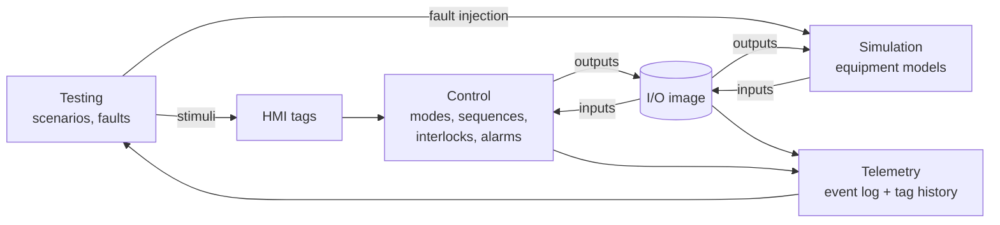

# ControlLab — Project Specification

*Living document and source of truth for the project. Last updated: 2026-09-22. Status: Phases 0–4 complete (simulation core, Control in Auto mode, declarative commissioning scenarios — all 8 of §6.3's interlocks covered, 0 gaps — and alarm management: latching, first-out, acknowledge). Phase 4's step 4 (feeder jam + sensor failure fault hooks) deliberately deferred — see §10's Phase 4 entry. Phase 5 complete — generic sampled tag history, state/alarm diffing event log, optional command sink, and a generated Markdown commissioning report (`python scripts/scenario_report.py --markdown FILE`). Phase 6 complete — self-contained HTML replay of any scenario run (`python scripts/replay.py SCENARIO.yaml`) and a live localhost dashboard with operator commands, fault injection, and replay download (`python scripts/dashboard.py`). Phase 7 in progress — steps 1-2 done (stdlib Modbus TCP server; the line's register map, served live with `python scripts/dashboard.py --modbus-port 5020`, documented in `docs/MODBUS-MAP.md`). 343 tests passing — see `docs/ARCHITECTURE.md` for what's actually implemented.*

---

## 1. Purpose

ControlLab is an open-source environment for virtual commissioning of industrial control systems. It pairs a simulated plant with a control layer, so an engineer can run and test control logic against equipment that behaves like the real thing (including when it fails) before any physical hardware exists.

The first target is deliberately small: a single bulk-material handling line. The goal is to do one line properly: realistic device behavior, explicit control logic, repeatable tests, and an auditable record of what happened.

## 2. The Problem

Control logic is usually tested for the first time on site, against real equipment, on a schedule that is already late. The consequences are well known:

- **Fault paths are the least tested code.** Startup and normal running get exercised. A feeder jam, a gate that never reaches its limit switch, or a motor that drops out mid-run often gets tested for the first time when it happens for real.
- **Commissioning evidence is manual.** Test sheets get filled in by hand, results are hard to reproduce, and a later logic change quietly invalidates tests that already passed.
- **Simulation tools tend to be expensive, closed, and tied to one vendor,** so small integrators and students don't use them.
- **Regression testing barely exists in controls work** compared with software. A change to one interlock can break another, and nothing catches it.

ControlLab applies software testing discipline (deterministic, automated, repeatable tests) to control-system behavior, while keeping controls engineering concepts first-class: I/O, scan cycles, permissives, trips, sequences, alarms.

## 3. Core Architecture

### 3.1 Separation of concerns

| Layer | Responsibility | Knows about |
|---|---|---|
| **Simulation** | Physical equipment behavior: material flow, motor response, gate travel, sensor signals, injected faults | Its own device models and the output side of the I/O image |
| **Control** | States, sequences, interlocks, modes, alarms, and responses to operator commands | Only the I/O image and operator commands, never simulation internals |
| **Testing** | Runs scenarios: sets initial conditions, schedules stimuli and faults, checks expectations | Drives the other layers; observes through I/O and telemetry |
| **Telemetry** | Records timestamped events, tag values, state transitions, and alarms | Reads everything; writes nothing back |
| **Visualization** | HMI/dashboard for observation and operator commands | Telemetry (read) and operator commands (write) |
| **AI** *(later)* | Proposes test cases and helps analyze results | Specs, scenario files, and telemetry. Never in the control loop |

### 3.2 The I/O image is the contract

The one hard boundary in the system is the **I/O image**: a flat table of named tags (digital and analog inputs and outputs), just like the process image in a PLC.

- Simulation writes **inputs** (sensor signals) and reads **outputs** (actuator commands).
- Control reads **inputs** and writes **outputs**.
- Control code may never import or inspect simulation objects. If control needs a piece of information, it has to exist as a tag, because that is all a real controller gets.

This boundary is what makes future protocol work straightforward. Exposing the I/O image over Modbus or OPC UA lets an external controller (a soft PLC, or a real one) replace ControlLab's built-in control layer without changing the simulation.

Operator commands (Start, Stop, Reset, mode selection, manual device commands) are a separate small set of **HMI tags**, kept apart from field I/O the same way HMI tags are kept apart from physical I/O in a real system.

### 3.3 Execution model

ControlLab runs on **simulated time** with a fixed step (initially `dt = 100 ms`). Each tick is one scan cycle:

```
1. Testing   applies any stimuli scheduled for time t (operator commands, fault injections)
2. Control   scans: reads inputs + HMI tags → executes logic → writes outputs
3. Simulation advances physics by dt using the new outputs → updates inputs
4. Telemetry records every tag change, state transition, and alarm at time t
5. t ← t + dt
```

Simulated time means tests are deterministic, run far faster than real time (a 10-minute sequence runs in well under a second), and give identical results every run. Anything random, such as sensor noise, uses a seeded generator.



### 3.4 Technology choices

- **Python 3.12+**: readable, strong testing tools, and the eventual protocol libraries (pymodbus, asyncua, paho-mqtt) are mature.
- **pytest** as the test runner. Scenarios are ordinary pytest tests at first.
- **No framework, no database, no web server** until a later phase needs one. Telemetry (Phase 5) goes to JSON Lines and CSV files. Phase 6's live dashboard is the first thing that needed a server, and it uses Python's stdlib `http.server`, localhost only, still no framework.
- Minimal dependencies. Anything added has to justify itself.

Current repository layout and what's actually implemented: `docs/ARCHITECTURE.md`.

## 4. Major Subsystems

**Simulation** (`services/simulation/`): One class per device type, each with a `step(dt)` method, plus a `Plant` that wires the five devices of the initial line together and moves material between them. Each device exposes its fault-injection hooks explicitly.

**I/O** (`services/simulation/engine/io_image.py` + `plant_io.py`, Phase 2 step 1 — done): A tag table shared between Simulation and Control — tag name, type (DI/DO/AI/AO), engineering units, current value — kept deliberately simple, a validated dictionary rather than a framework. The direction encoded in each tag's type is enforced in code, not just convention: Simulation can only `write_input()` DI/AI tags, Control can only `write_output()` DO/AO tags, and either side can `read()` anything. `plant_io.py` defines the exact 17-tag line from §5.3 and the glue (`publish_plant_inputs`/`apply_plant_commands`/`scan`) that wires `Plant` to it without `Plant` itself ever importing the I/O image — see `docs/ARCHITECTURE.md`.

**Control** (Phase 2, done — `services/control/`):
- ✅ *Device control modules*, one per actuator: `MotorControl` (run + optional speed command, a start-proof timer that detects "commanded to run but never confirmed" by timing since the device can't report that itself, and pass-through trip/fault detection) and `GateControl` (open/close command, a travel timeout — there's no "gate fault" DI tag in §5.3, so this is Control's own detection too). Both bind to I/O image tags by name, validated at construction; neither imports anything from `services.simulation.equipment` — `tests/unit/test_control_boundary.py` enforces that mechanically, not just by convention.
- ✅ *Line control*: `Interlocks` (a query object evaluating §6.3's table — permissives + trips, including `conveyor_confirmed_running`'s `RUNNING`-AND-`ZSS-104` combination, which catches a belt-slip fault `MotorControl` alone can't see), `HopperHysteresis` (the on/off feed-demand cycle from §6.2, pure logic, no I/O dependency), and `LineController` (the state machine itself — `IDLE/STARTING/RUNNING/STOPPING/FAULTED/ESTOPPED`, the downstream-first start sequence's three sub-steps, the upstream-first stop sequence's purge timer). Auto mode only — the mode manager doesn't exist yet because there's only one mode to manage; it arrives with Manual mode in a later increment (§6.1: "Auto first; Manual once Auto is proven").
- ✅ *Alarms (Phase 4 steps 1-3, complete)*: `Alarm`/`AlarmManager` (`services/control/alarms.py`) — latching, first-out, and acknowledge for the line's 9 alarm conditions (8 trip + bin-low warning), built directly on `Interlocks` and the device-control fault flags. `LineController` owns an `AlarmManager` instance, scans it every tick, exposes `acknowledge()` alongside `start()`/`stop()`/`reset()`, and `_scan_idle()` refuses a start while any trip-class alarm is latched and unacknowledged — independent of `reset()`, which only clears `FAULTED`. Surfaced through Testing: `vocabulary.py`'s `acknowledge` action + `any_unacknowledged_trip`/`latched_alarm_ids` read fields, and the scenario that closes §6.3's 8th interlock row.

`reset()`'s two-tier fault-clearing rule is the one piece of this worth flagging here: a pass-through condition (hopper high-high, a motor's own fault tag) genuinely blocks `reset()` until it clears, because Control can check it directly — but a *latched timing diagnostic* (`start_proof_fault`, `travel_fault`) has no independent "is it still broken" signal, so `reset()` clears it unconditionally and just gives the sequence one more chance; if the underlying problem is still there, the next start attempt fails again on its own. Both behaviors are tested explicitly (`tests/integration/test_line_controller.py`).

**Telemetry** (`services/telemetry/`, Phase 5, done): An append-only event log (commands, state transitions, alarms, faults) plus sampled tag history. ✅ *Sampled tag history — step 1, done*: `TagHistory` (`tag_history.py`) is a generic, IOImage-only recorder (knows nothing about this line's tags, Plant, or LineController — the same genericness `IOImage` itself has), sampled by an outside caller at the same tick boundary `services/testing/rig.py` uses; `write_csv()` is a separate, standalone export function, never called during a normal test run. ✅ *State/alarm event log — step 2, done*: `EventLog` (`events.py`) diffs `LineController.state` and every `Alarm`'s `active`/`acknowledged` fields against the previous sample, emitting `state_changed`/`alarm_activated`/`alarm_cleared`/`alarm_acknowledged` events; `write_jsonl()` exports it the same way `write_csv()` does. Zero lines changed in `line_controller.py`/`alarms.py`. ✅ *Commands — step 3, done*: `LineController.command_sink`, an optional plain callable (None by default) that `start()`/`stop()`/`reset()`/`acknowledge()` report to; `EventLog.record_command` is the intended target, emitting `command_issued` events stamped at the consuming tick. ✅ *Commissioning report — step 4, done*: `services/testing/commissioning_report.py` renders one deterministic Markdown document from the coverage matrix plus the event sequence every scenario run now records. Existing tests still assert on equipment/control state directly, deliberately — telemetry is an additional observation layer, not a replacement for the direct-state assertions already proven to work (confirmed explicitly before starting this phase; see §10's Phase 5 entry).

**Testing** (`tests/` for hand-written pytest; `services/testing/` + `scenarios/` for declarative commissioning scenarios, Phase 3 — done): `Scenario` loads the `given`/`when`/`expect`/`within` YAML shape from `CLAUDE.md` §10; `ScenarioRunner` builds a fresh rig, applies `given` (including driving `line_state: running` through a real `start()`, not a shortcut — and settling one tick before `when` is applied, since a precondition needs to be fully published, not a stale reading), applies `when`, then polls `expect` every scan until satisfied or `within` elapses — checking `Invariants` (§7 item 6: material conservation, "feeder never running while the conveyor isn't proven, beyond one scan," "no motor energized during E-stop") on every single tick, failing immediately and harder than a timeout the instant one trips. `services/testing/vocabulary.py` is the closed, explicit set of fields a scenario may reference — an unknown key is a hard error at load time, not silently ignored. Unlike Control, Testing is *allowed* to touch Simulation objects directly (§3.3: "Testing applies stimuli") — `services/testing/rig.py` is shared by the scenario runner and the ordinary pytest suite, so there's one canonical rig definition, not two that could drift. 15 scenarios now cover all 8 of §6.3's interlocks (the 8th, alarms, closed in Phase 4 step 3 once the alarm system existed); `services/testing/report.py` + `scripts/scenario_report.py` produce the coverage matrix, with four distinct states per row (covered / covered-but-failing / not-covered / not-applicable-yet) so a real gap is never confused with something that simply isn't buildable yet.

## 5. Initial Simulated Equipment

### 5.1 Process line

```
BIN-101 ──► XV-102 ──► FDR-103 ──► CV-104 ──► HOP-105 ──► (downstream draw)
Material    Slide      Screw        Belt        Surge
bin         gate       feeder       conveyor    hopper
```

The slide gate is included because it is the simplest device with travel time and limit switches, which is the classic source of "commanded but never arrived" faults.

### 5.2 Device behavior (Phase 1 — implemented)

| Device | Behavior modeled | Key parameters (initial) |
|---|---|---|
| **BIN-101** Material bin | Holds a mass of material and discharges only through the gate | Capacity 10,000 kg; low level at 10% |
| **XV-102** Slide gate | Travels open/closed over a fixed time; limit switches make only at the end of travel | Travel time 2 s |
| **FDR-103** Screw feeder (VFD) | Rate proportional to speed reference, *only if* motor running, gate open, and bin not empty | Max rate 5 kg/s; start delay 0.5 s |
| **CV-104** Belt conveyor | Carries material with a transport delay (material on the belt is modeled as a queue); motion switch confirms the belt is moving | 20 m at 2 m/s → 10 s transit; start delay 1 s |
| **HOP-105** Surge hopper | Accumulates incoming mass and discharges at a fixed downstream draw rate | Capacity 2,000 kg; draw 3 kg/s (configurable, may be 0) |
| **ES-001** E-stop / safety relay | When tripped, removes power from all motors **in the simulation**, regardless of control outputs | — |

**Material is conserved.** At every tick, bin + belt + hopper + discharged downstream + spilled equals the initial total. Spillage is modeled explicitly: material fed onto a stopped belt, or into a full hopper, is counted as spilled and logged. Spillage is the measurable consequence that most control mistakes produce, so tests can assert on it directly (for example, "zero spillage during a normal stop").

### 5.3 I/O list

| Tag | Type | Description |
|---|---|---|
| `LT-101` | AI | Bin level, % |
| `LSL-101` | DI | Bin low level switch |
| `XV-102.CMD_OPEN` | DO | Gate open command (de-energized = close) |
| `ZSO-102` | DI | Gate open limit switch |
| `ZSC-102` | DI | Gate closed limit switch |
| `M-103.RUN` | DO | Feeder motor run command |
| `M-103.RUNNING` | DI | Feeder motor running feedback (VFD) |
| `M-103.FAULT` | DI | Feeder VFD fault |
| `SC-103` | AO | Feeder speed reference, % |
| `M-104.RUN` | DO | Conveyor motor run command |
| `M-104.RUNNING` | DI | Conveyor motor running feedback (contactor aux) |
| `M-104.OL` | DI | Conveyor motor overload tripped |
| `ZSS-104` | DI | Conveyor motion (zero-speed) switch |
| `WT-105` | AI | Hopper weight, kg |
| `LSH-105` | DI | Hopper high level switch (80%) |
| `LSHH-105` | DI | Hopper high-high level switch (95%) |
| `ES-001` | DI | E-stop healthy (1 = healthy; fail-safe polarity) |

Tag naming loosely follows ISA-5.1 conventions. This table is the first commissioning artifact the project produces, and it should stay in sync with the code.

### 5.4 Injectable faults (Phase 1 hooks exist; Phase 4 surfaces them)

| Fault | Where it shows up |
|---|---|
| Motor fails to start | `RUN` set, `RUNNING` never arrives |
| Motor trips while running | Overload / VFD fault asserts, `RUNNING` drops |
| Belt slip / broken belt | `M-104.RUNNING` true but `ZSS-104` false |
| Gate fails to open / close | Limit switch never makes within the timeout |
| Gate limit switch stuck | Switch reads constant regardless of position |
| Feeder jam | Motor running, zero material flow (detected downstream by weight trend) |
| Sensor failure | Analog reads out of range; discrete stuck at 0/1 |
| E-stop pressed | `ES-001` drops; simulation de-energizes motors |
| Bin runs empty | Natural consequence, no special injection needed |

## 6. Operating Modes and Line States

**Modes** (operator-selected) and **states** (where the line currently is) are kept separate.

### 6.1 Modes

| Mode | Behavior |
|---|---|
| **Auto** | The line runs from Start/Stop commands via the automatic sequences. Hopper level control is active. |
| **Manual** | The operator commands individual devices. **All interlocks remain enforced**; manual mode bypasses the sequence, not the protection. |

The mode can only change while the line is **Idle**. Changing mode mid-run is refused and logged. (Interlock bypass for maintenance is a deliberate non-goal for early versions.)

### 6.2 Line state machine (Auto)

```
            Start                all proven             Stop
  IDLE ─────────────► STARTING ─────────────► RUNNING ─────────► STOPPING ──► IDLE
   ▲                     │                       │                   │
   │ Reset (fault        │ trip / step timeout   │ trip              │ trip
   │ cleared)            ▼                       ▼                   ▼
   └──────────────── FAULTED ◄──────────────────────────────────────┘

  E-stop from any state → ESTOPPED → (E-stop released + Reset) → IDLE
```

- **Start sequence (downstream first):** confirm permissives → start CV-104 → prove running (`RUNNING` and `ZSS-104` within 3 s) → open XV-102 → prove open (`ZSO-102` within 5 s) → start FDR-103 → prove running → RUNNING.
- **Stop sequence (upstream first):** stop FDR-103 → close XV-102 → run CV-104 for a purge time (transit time + margin, 15 s) so the belt clears → stop CV-104 → IDLE.
- **Hopper level control (RUNNING only):** the feeder runs at a fixed speed with on/off hysteresis. It stops at `LSH-105` and restarts when the hopper weight falls below a restart setpoint (60%). The conveyor stays running. (A PI rate controller comes later.)
- **No automatic restart after a trip.** A trip always goes to FAULTED. Returning to IDLE requires the cause to clear *and* an operator Reset.

### 6.3 Interlocks

**Permissives** gate a start. **Trips** act while running.

| Interlock | Type | Action |
|---|---|---|
| E-stop healthy | Permissive + trip | All outputs off; line → ESTOPPED |
| No active latched alarms | Permissive | Start refused |
| Hopper not high-high | Permissive | Start refused |
| Bin not low | Permissive | Start refused (warning only while running) |
| Conveyor proven running | Permissive + trip for feeder | Feeder cannot run onto a stopped belt; conveyor loss stops feeder immediately |
| Hopper high-high | Trip | Feeder stops, gate closes; line → FAULTED |
| Any motor fail-to-start / trip | Trip | Upstream equipment stops; line → FAULTED |
| Gate travel timeout | Trip | Feeder stops; line → FAULTED |

Trips cascade **upstream**: if a device stops, everything feeding it stops, and anything downstream keeps running so it can clear.

## 7. Testing Philosophy

1. **Tests read like commissioning procedures.** A scenario states initial conditions, operator actions, injected faults, and expected observable results, in that order. An engineer who has never read the code should be able to follow it.
2. **Tests observe the way a commissioning engineer does:** through I/O tags, line state, alarms, and the event log. They do not reach into internal variables.
3. **Deterministic by construction.** Simulated time and seeded randomness mean a failing test fails the same way every run.
4. **Every interlock gets a test that trips it.** An interlock without a test is an untested claim. Phase 3 adds a coverage matrix that makes gaps visible.
5. **Timing is asserted, not assumed.** Expectations come with windows ("feeder stops within 200 ms of conveyor motion loss"), because timing is where real control bugs hide.
6. **Invariants run on every scan of every test,** not just in dedicated tests. Initial invariants:
   - Material is conserved (§5.2).
   - The feeder is never running while the conveyor is not proven running (beyond one scan).
   - No motor output is energized while the E-stop is tripped.
   - No spillage occurs during normal start and stop sequences.
7. **The simulator is tested too.** Device models get their own unit tests (gate travel time, transport delay, conservation). A wrong plant model makes every control test meaningless.

Test tiers, in the order they get built:

| Tier | Example |
|---|---|
| Device model | Gate reaches `ZSO-102` in 2.0 s ± one tick |
| Control module | Motor module raises fail-to-start after 3 s without `RUNNING` |
| Sequence | Normal start reaches RUNNING in the correct order; normal stop leaves an empty belt |
| Fault | Conveyor overload mid-run → feeder stops, gate closes, line FAULTED, zero spillage beyond transit contents |
| Commissioning suite | The full ordered set, producing a report (Phase 3) |

## 8. Design Principles

- **Concrete before generic.** Build this one line in plain code first. A plant-configuration format, a device plugin system, or a generic sequence engine only gets built once the hardcoded version has shown what is actually needed.
- **The I/O image is the only contract** between control and simulation (§3.2).
- **Fail-safe defaults.** A de-energized output is the safe state. Loss of signal is treated as the unsafe condition. Unknown means stopped.
- **Explicit state machines.** Every state is named and enumerated, every transition is logged with its cause, and there is no implicit state hidden in flags.
- **Determinism over realism.** Model behavior at the level controls engineering needs (delays, limits, feedback, failure), not physics for its own sake.
- **Deterministic logic controls; AI assists.** AI may propose tests or explain results. It never issues commands to the control layer or the plant.
- **Every artifact is inspectable.** Event logs, reports, and scenarios are plain text that a human can read and diff.

## 9. Non-Goals

- **Not a safety system and not for safety validation.** ControlLab does not provide or verify SIL-rated functions. The simulated E-stop exists to test *control-system responses* to a safety trip, not to validate safety design.
- **Not a physics simulator.** No discrete-element material modeling, no 3D, no motor electrical dynamics.
- **Not a PLC runtime for real equipment,** and not an IEC 61131-3 compiler or editor.
- **Not a SCADA/HMI product.** The eventual dashboard exists to observe and drive tests.
- **No multi-user, authentication, cloud deployment, or database** in early phases.
- **No generic plant builder before Phase 7 (Protocols).** The initial line is defined in code until then.
- **No interlock bypass / maintenance override** until the core is solid, since bypass logic is a safety-sensitive feature in its own right.

## 10. Roadmap

*Phase numbering matches `CLAUDE.md` §18. Each phase must be usable and fully tested before the next one starts. Current status of each phase: `docs/ARCHITECTURE.md`.*

### Phase 0 — Foundation ✅ done
- Repository, this specification, `docs/ARCHITECTURE.md`, Python environment, pytest, coding conventions, the domain model in §5.

### Phase 1 — Simulation core ✅ done
- The five devices plus E-stop (`SimClock`, `Motor`, `Gate`, `MaterialBin`, `Hopper`, `Feeder`, `Conveyor`, `EStop`, `Plant`), material transport, conservation, spillage accounting, deterministic state transitions.

**Done when:** a normal start → run → stop scenario shows material moving bin-to-hopper with zero spillage, a feeder-onto-a-stopped-conveyor scenario shows spillage, an E-stop scenario shows every motor held until an explicit reset, and running the same scenario twice gives identical results. All four are covered in `tests/integration/test_plant.py`.

### Phase 2 — Control ✅ done
- ✅ **Step 1 — the I/O image** (tag table). `services/simulation/engine/io_image.py` (the generic, reusable mechanism) + `plant_io.py` (the line's exact 17 tags from §5.3, and the `Plant`-facing glue). `Plant` itself still has zero knowledge of it — see `docs/ARCHITECTURE.md`.
- ✅ **Step 2 — device control modules**. `services/control/motor_control.py` (`MotorControl`) and `gate_control.py` (`GateControl`), both operating purely on I/O image tags — construction validates each bound tag's type, and `tests/unit/test_control_boundary.py` mechanically enforces that neither ever imports `services.simulation.equipment` (proven by deliberately sabotaging it and watching the test catch it, then reverting — not just asserted). Each supervises one timing-based fault its device can't report about itself (start-proof / travel-timeout, defaulting to the 3s/5s windows §6.2 already specifies) plus a pass-through of any fault the device *does* report on its own.
- ✅ **Step 3 — line control**: `services/control/interlocks.py` (`Interlocks`), `hopper_hysteresis.py` (`HopperHysteresis`), `line_state.py` (`LineState`/`StartStep`), `line_controller.py` (`LineController`) — Auto mode only, per §6.1's own "Auto first; Manual once Auto is proven" (the mode manager doesn't exist yet — nothing to manage with only one mode). Every interlock in §6.3 has a dedicated test that trips it (§7, item 4), ahead of Phase 3's formal coverage matrix.
- ✅ **Step 4 — retarget Phase 1's four scenarios through Control**, plus the E-stop-reset-ordering test. All five now proven with `LineController` (or `Plant`) as the driver, same assertions as Phase 1, different path to them:
  - *Conservation* and *no-spillage-on-correct-order* — `test_full_normal_cycle_conserves_material`.
  - *Spillage-on-wrong-order* — not a literal port, and deliberately not one: once Control enforces the downstream-first sequence, "feeder commanded before the conveyor proves running" isn't a race Control can lose, it's a command sequence `LineController` has no code path to produce. Proven two ways in `test_wrong_order_spillage_is_structurally_unreachable_through_control` — every `start()`-driven test in the file reaches `RUNNING` with zero spillage no matter what Testing throws at it, and *deliberately reaching around* `LineController` to drive its own `feeder_ctrl`/`gate_ctrl`/`conveyor_ctrl` directly (bypassing the sequencing, not the devices) reproduces the exact same spillage Phase 1 demonstrated — proving the protection is real sequencing, not a fluke of the happy path never trying anything else. Also reinforced in the conveyor start-fault test: even when the conveyor never proves running, `plant.gate.state`/`plant.feeder.motor.state` never leave their at-rest values — not "commanded, then dropped," never touched.
  - *E-stop-holds-until-reset* — `test_estop_holds_everything_off_and_requires_explicit_restart`.
  - *E-stop-reset-ordering* — added at both layers it matters: `tests/integration/test_plant.py::test_manual_motor_estop_reset_does_not_stick_while_plant_estop_still_tripped` (calling `Motor.estop_reset()` directly while `plant.estop` is still tripped doesn't stick — the next `Plant.step()` re-asserts `ESTOP` regardless, which is *why* it's safe that `LineController` has no path to that call at all) and `test_line_controller.py::test_reset_alone_does_not_recover_from_estopped_without_the_estop_released` (the reverse order from the existing test — `reset()` pressed *before* the E-stop is physically released must refuse, not just succeed when released first).

**Retroactive Phase 1 fix, discovered building step 3:** `LineController` cannot call `Motor.estop_reset()` — that's a raw simulation-object method, off-limits per §3.2 — but *something* has to bring a motor back to `STOPPED` once the physical E-stop releases. `Plant.step()` now does this automatically (a real safety relay re-arms the starters on its own, hardware-side, independent of any PLC program); the two Phase 1/step-1 tests that used to do this by hand (`plant.motor.estop_reset()`) had those calls removed and were re-verified to produce identical outcomes. `LineController.ESTOPPED`'s continuous command-enforcement is the other half — together they close the exact gap step 1 flagged: `tests/integration/test_plant_io.py::test_estop_via_io_image_holds_motors_until_explicit_reset` still demonstrates the raw gap at the I/O-image layer alone; `tests/integration/test_line_controller.py::test_estop_holds_everything_off_and_requires_explicit_restart` proves `LineController` closes it.

### Phase 3 — Testing / commissioning scenarios ✅ done
- ✅ **Step 1 — scenario format + runner + invariants.** `services/testing/` (`scenario.py`, `vocabulary.py`, `invariants.py`, `runner.py`, `rig.py`) plus four proof-of-concept scenarios under `scenarios/` (`safety/estop_from_running.yaml` is literally `CLAUDE.md` §10's illustrative example, made real; `startup/normal_start.yaml`, `shutdown/normal_stop.yaml`, `faults/gate_travel_timeout.yaml`). Discovered and run automatically by `pytest` (`tests/integration/test_scenarios.py`), not a separate tool. One real bug found and fixed while proving this out: the runner checked `expect`/invariants *before* the first tick processed a `when` stimulus, catching a transient state that exists only in Python call order, not one the real system passes through (§3.3's own diagram has Testing's stimulus and Simulation's advance within the *same* tick) — fixed by ticking before every check, not after.
- ✅ **Step 2 — a scenario for every interlock in §6.3.** 9 new scenario files (13 total). 7 of the 8 rows now have at least one passing declarative scenario; the 8th ("No active latched alarms") genuinely can't yet — there's no alarm system to check (Phase 4), and writing a scenario that pretends to test it would be fabricating coverage, not providing it. Two rows carry an honest note rather than silent partial coverage: "Bin not low"'s warning-while-running half has no mechanism to test until Phase 4/5's alarm system exists; "Conveyor proven running"'s permissive half (feeder can't run onto a stopped belt) is proven structurally by a pytest test, not a declarative one, because `LineController`'s public API has no way to even attempt the wrong order — see `docs/ARCHITECTURE.md`. A real modeling bug found writing these, in the FIRST new scenario tried: `given` and `when` aren't interchangeable — `given` gets one full settle tick before `when` is applied, `when` doesn't get one before the polling loop starts. A precondition (the hopper is already high before the operator does anything) belongs in `given`; get it backwards and the scenario checks a stale reading for one tick, which surfaces as a confusing failure, not an obvious "you did this wrong." Documented explicitly in `scenario.py`'s docstring, and a dedicated test (`test_level_precondition_modeled_as_when_instead_of_given_behaves_differently`) locks in what the wrong way actually produces, so a future change to the settle mechanics can't quietly break it without a test noticing. A second, related bug: `Invariants`' conservation baseline was captured once at rig construction, so any scenario using a level-injecting field (`hopper_level_pct`, `bin_level_pct`) as legitimate setup looked identical to "material appeared from nowhere." Fixed with `Invariants.rebaseline()`, called after each setup phase (`given`, then `when`) — conservation is now checked against "as configured for this scenario," not "as originally built."
- ✅ **Step 3 — the interlock coverage matrix.** `services/testing/report.py` (pure logic, unit-tested) cross-references every scenario's `interlock:` tag against the full §6.3 table and categorizes each row as covered / covered-but-failing / not-covered / not-applicable-yet — deliberately four distinct states, since collapsing "nobody's tested this" and "this can't be tested yet" into one bucket would misrepresent what's actually missing. Also flags any `interlock:` tag matching no known row (a likely typo) instead of silently dropping it. `scripts/scenario_report.py` is the thin CLI: runs every scenario, prints the report, optional `--out FILE.md`, and exits non-zero on any failure or real gap — verified to actually catch problems, not just demonstrated on the happy path, by deliberately adding a failing scenario with a typo'd `interlock:` tag and confirming both showed up correctly before removing it.

**Phase 3 status:** 7/8 interlocks covered by a passing declarative scenario, 1 not yet applicable (Phase 4), 0 real gaps.

### Phase 4 — Fault injection, alarms ✅ done (steps 1-3; step 4 deferred)
- Formalize the fault-injection API covering §5.4 (most hooks already exist on the Phase 1 equipment classes — `fail_to_start`, `trip_now`, `stuck`, `motion_switch_stuck_false` — this phase is about surfacing them through Control/Testing, not inventing new ones).
- Alarm management: latching, first-out indication, acknowledge and reset, alarm log.
- ✅ **Step 1 — alarm core.** `services/control/alarms.py`: `Alarm` (active/acknowledged stored, `latched = active or not acknowledged` computed) and `AlarmManager` (a small generic register/scan/acknowledge engine, built directly on `Interlocks` and the device-control fault flags — no new detection logic, every condition already existed). 9 alarms: the 8 trip-class conditions already reachable through `Interlocks`/`MotorControl`/`GateControl`, plus bin-low as the first warning-class alarm (`is_warning=True`, deliberately excluded from `any_unacknowledged_trip()` so it stays a warning, not a silent second block on top of its existing direct permissive row). First-out is sticky per episode — the originating alarm keeps the flag even after its own condition clears, until the whole board is inactive and acknowledged. 12 new tests (207 total).
- ✅ **Step 2 — wired into `LineController`.** `LineController` builds its own `AlarmManager(self.interlocks)` (same pattern as `self.hysteresis` — not injected, since the alarm set is hardcoded for this line same as `Interlocks` itself), scans it every tick right after the three device-control modules (so it reads that tick's fresh fault flags), and exposes `acknowledge()` as a fourth one-shot operator command alongside `start()`/`stop()`/`reset()`. The "no active latched alarms" permissive turned out to belong in `LineController._scan_idle()`, not inside `Interlocks.start_permissives_ok()` as that method's own docstring originally assumed — `AlarmManager` is built ON TOP of `Interlocks`, so `Interlocks` checking back into it would be circular; `LineController` is already the one place every other permissive/trip decision gets combined, so it's the natural home once the actual dependency shape was clear (docstring corrected to match). `fault_reason` is deliberately left alone, not merged with the alarm system: it stays the short, already-tested, human-readable per-transition reason; `AlarmManager` is the richer, latched, acknowledgeable view sitting alongside it, not a replacement — two complementary views of the same underlying conditions, kept in sync only because both read the same tick's data, not because one derives from the other. Fixed three existing tests whose fault→reset→start-again sequences now correctly need an explicit `acknowledge()` in between (previously nothing gated a restart on an operator having seen what tripped); added three new ones proving the refusal itself, that a recovered-but-unacknowledged *warning* never blocks a start, and that `acknowledge()` is genuinely one-shot (doesn't silently pre-ack a later, unrelated alarm). 3 new tests (210 total).
- ✅ **Step 3 — surfaced through Testing.** `vocabulary.py` gained the `acknowledge` action and two read fields (`any_unacknowledged_trip`, `latched_alarm_ids`). One new declarative scenario (`scenarios/faults/unacknowledged_alarm_blocks_start.yaml`) closes §6.3's 8th row — `scripts/scenario_report.py` now reports **8/8, 0 not-applicable, 0 real gaps**. The scenario itself proves the block is reachable through the normal commissioning-scenario path (hopper high-high, single-stage `given`/`when`, matching every other scenario's shape); the coverage row's `note` honestly points at the pytest tests from step 2 for the full latch → reset → refuse → acknowledge → allow lifecycle, since the `given`/`when` format has no way to express that multi-stage sequence without a settle tick smearing the stages together — exactly the same split already established for the "Conveyor proven running" row.
- **Step 4 — deferred, deliberately.** The two §5.4 fault hooks that still don't exist (feeder jam, via downstream weight-trend detection; sensor failure, via analog out-of-range / discrete stuck) are qualitatively different work from steps 1-3: every alarm/interlock this phase surfaced was *wiring up something that already existed*, while these two need genuinely new detection logic designed from scratch. Neither maps to an existing §6.3 interlock row, so nothing built in steps 1-3 depends on them, and the coverage matrix is already 8/8. Confirmed with Tabor before closing the phase rather than assumed either way — build them as their own future increment if full §5.4 parity is ever wanted.

### Phase 5 — Telemetry ✅ done
- JSONL event log (commands, state transitions, alarms, faults) and CSV tag history, as an *additional* observation layer alongside the direct-state-inspection tests already use through Phase 4 — not a replacement for it. Confirmed explicitly before starting: the 220 existing tests keep asserting on equipment/control state directly; migrating them off that would be a large, risky rewrite of already-correct code for no functional gain. "Tests and reports read from the same record" (this section's original framing) means the report generator (step 4) shouldn't invent its own separate, driftable data-collection mechanism when telemetry already exists — not that every existing test must be rerouted through it.
- **Architecture: pull/diff, not push.** Telemetry observes Simulation and Control's existing public state from outside, at the same tick boundary `services/testing/rig.py`'s `tick()` already uses — the same non-invasive relationship Testing already has with Control (`vocabulary.py`'s `READ_FIELDS` never reaches into `LineController` internals). No telemetry-specific logging calls anywhere in `services/control/` or `services/simulation/`; Phase 2-4's tested code stays untouched. Known, accepted limitation: pull/diff only observes state at tick boundaries, so a transient condition that begins and ends within a single tick is invisible to it — not solved in Phase 5 unless the simulation contract itself demonstrates such a state is meaningful.
- **The one exception: commands.** A command can occur with zero observable state change (`stop()` while already stopped) — a pure diff can't see that, but a commissioning audit trail should still record it. A minimal optional command sink is added to `LineController`'s four one-shot methods (`start`/`stop`/`reset`/`acknowledge`): optional, defaults to a no-op, zero behavior change when unconfigured, zero file I/O, doesn't require any other telemetry infrastructure to exist. This is the only place Phase 5 touches already-tested Phase 2-4 code.
- ✅ **Step 1 — generic tag history.** `services/telemetry/tag_history.py`: `TagHistory`, built only against `IOImage`'s existing public interface (`names()`/`read()`) — no Plant, no LineController, no line-specific tags hardcoded, the same genericness `IOImage` itself has. `record(t)` is called by an outside caller once per tick; the timestamp comes from the caller, keeping this class ignorant of `SimClock`/`dt` the same way `IOImage` is ignorant of simulated time. `write_csv()` is a standalone function, not a method, mirroring `report.py`/`scenario_report.py`'s pure-logic/file-writer split — nothing writes a file during a normal test run. Columns are the union of every tag ever recorded, not `IOImage`'s tag list at export time, so a tag defined mid-run gets its own column (blank before it existed) instead of a crash. 7 new tests (220 total).
- ✅ **Step 2 — state/alarm telemetry observer.** `services/telemetry/events.py`: `EventLog` diffs `LineController.state` and every `Alarm`'s `active`/`acknowledged` fields against the previous `sample(t)` call, emitting `state_changed` (with `fault_reason` riding along), `alarm_activated` (with `first_out`/`is_warning` riding along), `alarm_cleared`, and `alarm_acknowledged` events. Deliberately only two diffable primitives per alarm — `latched` is itself just `active or not acknowledged`, so a transition in it always coincides with one of the other three events; recording it separately would be the same fact twice, not new information. `write_jsonl()` exports it, standalone, mirroring `write_csv()`. Zero lines changed in `line_controller.py`/`alarms.py` — confirms the architecture decision. A real, non-obvious finding while writing the tests: a stuck-gate scenario produced *two* activate/clear cycles for `XV-102.TRAVEL_FAULT` before any `acknowledge()` — genuine behavior (`GateControl`'s "latches until the command changes" rule resets `travel_fault` the instant `FAULTED` re-commands the gate closed, but the gate is still physically stuck and can never reach `CLOSED`, so its own 2-second timeout re-accumulates and re-fires on its own), not a bug; Phase 4's own tests never surfaced it because they only ever asserted `Alarm.latched`, never the raw `active` flag's path getting there. Fixed by picking hopper high-high (a pure level condition) for that specific test instead of touching Gate/GateControl. 7 new tests (227 total).
- ✅ **Step 3 — minimal optional command sink.** `LineController.command_sink: Callable[[str], None] | None`, None by default; each of the four one-shot commands calls it with its own name before raising its request flag. A plain callable, not a telemetry type, so Control still imports nothing from `services/telemetry/` — now enforced by a second guard in `tests/unit/test_control_boundary.py` (import lines only; Control's docstrings legitimately describe the relationship in prose, which a bare substring match flagged on the first run). Wired explicitly by the caller (`line.command_sink = event_log.record_command`), not auto-attached by `EventLog`'s constructor, so nothing changes Control's configuration as a hidden side effect. **Timestamp design:** the sink fires *between* ticks, where no time is available without handing Control or the sink a clock. `record_command()` therefore only queues; the next `sample(t)` emits each queued command as `command_issued` stamped with that tick's `t`, *before* the same tick's state/alarm diffs. That stamp is the honest one — the command is a one-shot request that the next `scan()` consumes, so that tick is when it took effect — and the ordering keeps cause ahead of effect (`command_issued start` then `state_changed idle→starting`, same `t`). Commands queued before the first `sample()` are still emitted: a command is a recorded fact, not a diff, so the baseline-only first call doesn't apply to it. A dedicated test proves the sink changes no Control behavior (identical tick-by-tick state trace with and without it through a stuck-gate fault, acknowledge, and reset). 8 new tests (235 total).
- ✅ **Step 4 — the generated commissioning report.** Four choices confirmed with Tabor before any code, each taking the recommended option: (1) **telemetry is always on in `run_scenario()`**, not opt-in. Every run attaches an `EventLog` + command sink and returns `events` and `when_applied_t` on `ScenarioResult`, so the report reads the run's own record and there's no second collection path to drift. (2) **Markdown only**, no HTML yet (CLAUDE.md §14). (3) **One entry point**: `scripts/scenario_report.py --markdown FILE`, with rendering in a new pure module `services/testing/commissioning_report.py` (the same logic/file-writer split `report.py` uses), so one suite run feeds both outputs. (4) **No per-scenario raw JSONL/CSV export** in this step; `write_jsonl`/`write_csv` already exist for that. The report has an overall verdict, a results table (response time vs. each scenario's `within` limit, plus the margin), the §6.3 coverage matrix, and each scenario's event sequence with every event labeled *setup* (reaching `given`) or *response* (reacting to `when`). It's **byte-identical across runs**: no wall-clock timestamp, no absolute paths, simulated time only, so a committed report diffs cleanly and a changed line means changed behavior. A test enforces that. `TagHistory` is deliberately not recorded in scenario runs yet; nothing in the report reads it.
  - **Finding — `given` preconditions reach Control one scan late. ✅ Resolved in the settle-tick follow-up below.** Surfaced by the report itself: in `hopper_high_high_blocks_start.yaml`, `unacknowledged_alarm_blocks_start.yaml`, `bin_low_blocks_start.yaml`, and `estop_blocks_start.yaml`, the precondition's alarm (or the ESTOPPED transition) is logged as a *response* event at the same tick as the `start` command, not as setup. Cause: within a tick, `LineController.scan()` runs *before* `plant_scan()` publishes inputs, so the runner's settle tick does publish `given`'s effects to the I/O image (exactly what `runner.py`/`scenario.py` document), but Control doesn't *scan* them until the next tick, and that's the same tick where it consumes `when`. Confirmed directly: after one settle tick the high-high input reads True and `WT-105.HIGH_HIGH` is still inactive; it activates on tick 2. All 14 scenarios still prove what they claim, because `AlarmManager.scan()` runs before the state machine in the same scan, so the permissive refusal still sees the condition. But "`given` is settled before `when`" is true for the I/O image and not for Control's own state. Recorded, not changed: the obvious fix (a second settle tick) changes the runner's already-tested timing semantics, so that decision is flagged for Tabor rather than made here.
  - **Finding — a stale coverage note. ✅ Resolved in the follow-up below.** The report printed `report.py`'s "Bin not low" row note verbatim: "the 'warning only while running' half has no mechanism yet -- no alarm/notification system exists before Phase 4/5." That had been untrue since Phase 4 step 1 added `LSL-101.LOW` as a warning-class alarm. The actual gap was a missing scenario, not a missing mechanism.
  - 14 new tests (249 total).
- ✅ **Follow-up — bin low while running.** Closes the stale-note finding. New scenario `scenarios/faults/bin_low_while_running_warns_only.yaml` (given running, when the bin drops to 5%: the line stays RUNNING, `LSL-101.LOW` latches, no trip-class alarm is raised), tagged to the "Bin not low" row, which now has both halves covered. A declarative scenario passes the moment its expectations *first* hold, so on its own it can't show the line doesn't trip a few seconds later. A companion pytest (`test_bin_low_while_running_stays_a_warning_for_the_whole_run`) asserts RUNNING on every tick for 10 s of feeding from the low bin, and that the bin really was being drawn down. The row's note now says exactly that instead of the stale claim. 2 new tests (251 total).
- ✅ **Follow-up — second settle tick.** Closes the one-scan-late finding, per Tabor's decision. `runner.SETTLE_TICKS = 2`: inside `tick()` Control scans before the plant publishes inputs, so a `given` precondition needs one tick to reach the I/O image and a second for Control to scan it. The count comes from that scan order and wasn't tuned. All 15 scenarios pass unchanged, with identical response times (measured from `when`). In the report, every precondition alarm is now a *setup* event ahead of the `start` command. One scenario's meaning got sharper, not weaker: `estop_blocks_start.yaml` previously had the E-stop and the start request land on the same scan, and now it proves a start is ignored while the line is already ESTOPPED, which is what "E-stop blocks start" means. The existing given-vs-when test (`test_level_precondition_modeled_as_when_instead_of_given_behaves_differently`) still passes, so the distinction `scenario.py` documents still holds. 1 new test (252 total).

### Phase 6 — Visualization ✅ done
- A lightweight local web dashboard: line mimic, device states, live tag values, alarm list, operator commands.
- Replay of a recorded run from telemetry.
- **Scoped with Tabor before any code; all four recommendations taken.** (1) **Replay first.** It needs no server and builds directly on Phase 5 telemetry. The live dashboard follows and reuses the same mimic. (2) **Vanilla JS + inline SVG**, no build step, no node toolchain. React only if UI complexity ever justifies it. (3) **When the live dashboard arrives, Python's stdlib `http.server`** serves it, with the browser polling JSON state and POSTing operator commands. That means zero new dependencies; FastAPI is the upgrade path if push or multiple clients ever become a real need. This supersedes the earlier "FastAPI/React is the intent" note in `ARCHITECTURE.md`'s tech-stack section. (4) **`run_scenario()` always records `TagHistory` too**, reversing step 4's "not recorded yet" now that something reads it.
- ✅ **Step 1 — tag history in every scenario run.** `ScenarioResult.tags` is a `TagHistory` sampled on exactly the ticks the `EventLog` samples: a baseline at t=0, then one per tick through `given`'s run-up, settle, and polling. The runner pairs the two recorders in a small explicit `_Telemetry` dataclass. The first draft attached `tags` onto the `EventLog` instance as an ad-hoc attribute, which is exactly the hidden state CLAUDE.md §6 rules out, so it was replaced before any test ran against it. 1 new test.
- ✅ **Step 2 — the replay viewer.** `services/visualization/replay.py` (pure) plus `replay_template.html`; `python scripts/replay.py SCENARIO.yaml [--out FILE]` writes one self-contained HTML file with no dependencies and no network. The file has a line mimic (bin with level, gate, feeder, inclined conveyor, hopper with level and LSH/LSHH setpoint lines, E-stop), a scrubber with play/pause/speed and previous/next-event jumps (←/→/space), the latched alarm board with first-out, a clickable event log split into setup/response, and all 17 I/O tags with changed-this-tick highlighting. **Replay is reconstructed purely from telemetry, never re-simulated.** Line state comes from `state_changed` events and the alarm board is rebuilt from `alarm_activated/cleared/acknowledged`. An end-to-end test checks that the reconstruction ends where the real `LineController` ended, so a fact missing from the event log would show up as a failing test. Visualization depends only on Telemetry (§3.1): `replay.py` takes events + a `TagHistory` + a title, knows nothing about scenarios, and a future live-dashboard recording can be replayed the same way. **Display convention** follows high-performance HMI practice: equipment in grays, dark fill for running/open, hollow for stopped/closed, and color only when something is abnormal. Red means a trip. Amber means a warning, *or a command its feedback doesn't agree with* (dashed outline). That last one is the most commissioning-relevant thing on screen: a motor commanded to run but not yet proven, or a gate commanded open but still travelling, is visibly different from both running and stopped. Recorded strings are embedded with `</` escaped, so nothing in the data can close the `<script>` block (tested). The viewer was checked in a real browser: it renders, has no console errors, and shows the correct states at idle, mid-start (conveyor commanded but unproven), gate travelling, and the final FAULTED frame with the first-out alarm. 6 unit tests + 1 end-to-end test.
  - **Finding — `Plant.time_s` drifted.** The replay data showed `t = 2.500000000000001` after 25 ticks. `Plant.step()` accumulated with a bare `+= dt`, the same float-drift class Phase 1 already fixed in `SimClock` and the `Motor`/`Gate` timers by rounding. `Plant` was simply missed. Nothing in Control reads plant time, so no behavior was wrong, but every telemetry timestamp is `Plant.time_s`. The commissioning report masked it with `.2f` formatting; the raw JSONL and replay data didn't. Fixed with the established `round(..., 9)` and pinned with a test. 1 new test.
- ✅ **Step 3 — live dashboard.** `python scripts/dashboard.py [--port 8000] [--speed 1]` serves it on 127.0.0.1 with the stdlib `ThreadingHTTPServer` and no new dependencies. `services/visualization/live.py` has three small parts. **`LiveSession`** is the deterministic core: a rig built exactly as every scenario's is, the same telemetry the runner records, and the continuous invariants. Browser commands and stimuli are *queued* and applied only at the next tick boundary (§3.3), so a click never lands mid-scan. `step()` is one DT and never reads the wall clock. An invariant violation is shown as a banner, not raised, and the session keeps running. **`Pacer`** is the only real-time piece: a thread calling `step()` every DT/speed seconds, which resyncs rather than bursting catch-up ticks after a stall. **`make_handler()`** is a thin JSON layer: state polling with `since=` so only new events travel, command/stimulus/run/restart POSTs, and `/api/replay`, which downloads the session through the step-2 viewer. Both follow-up choices confirmed with Tabor: a **separate fault-injection panel** routed through the same closed scenario vocabulary (`vocabulary.apply_field`), so there's no new way into the plant, and **"Download replay"**. Visualization now depends on Testing (rig, vocabulary, invariants) because the dashboard *drives* the line, the runner's role; `replay.py`, which only observes, still depends on Telemetry alone. **Security** (localhost only, no auth, per §9): any web page can send requests to localhost, so every POST must be `application/json` (a cross-origin page can't send that without a CORS preflight, which is never answered) and the Host header must be localhost/127.0.0.1 (blocks DNS rebinding). Both are tested. **Refactor:** the mimic, styles, and renderers moved out of `replay_template.html` into shared `hmi.css` / `mimic.svg.html` / `hmi.js`, inlined into both pages by `page.py`, so the line is drawn by one piece of code, not two copies. Checked in a real browser: start → RUNNING with material flowing; a feeder trip faults the line on the second tick (same as the deterministic test); the full recovery path works; the replay downloads; no console errors.
  - **Finding — tripped motors could never be recovered live.** The first recovery test re-faulted. Un-injecting the trip (`feeder_trip: false`) clears the *cause*, but the drive's own latched fault (`Motor.state == FAULT`) stays up, and Control has no I/O tag to reset it. `test_reset_succeeds_once_a_passthrough_cause_clears` already documented that recovery needs both, but it called `plant.feeder.motor.clear_fault()` directly, and the scenario vocabulary never had that action because no scenario had to recover. Added three one-shot **field resets** to the vocabulary (`feeder_drive_reset`, `conveyor_overload_reset`, `gate_reset`: resetting the VFD, overload relay, or gate actuator at the equipment) and a matching dashboard panel. They're deliberately separate from un-injecting the cause: in a real plant those are two different actions, and folding them together would make a repair look like less work than it is. Scenario files can use them too. A test proves recovery is refused without the field reset.
  - Test infrastructure: the HTTP tests' `serve_forever` default 0.5 s shutdown poll had pushed the suite from 0.4 s to 4.5 s; set to 0.01 s. One browser observation (the line still RUNNING 800 ms after a trip) didn't reproduce in two reruns, and the server-side time series shows the expected 2-tick response, so it's recorded here as not reproduced, not as a known issue.
  - 27 new tests (288 total). **Phase 6 complete.**

### Phase 7 — Protocols (in progress)
- Modbus TCP server exposing the I/O image.
- **External controller mode:** built-in Control disabled, an external soft PLC (e.g. OpenPLC) drives the simulated plant over Modbus. This is where ControlLab becomes true virtual commissioning of someone else's logic.
- ~~OPC UA server; MQTT telemetry publishing.~~ ~~A plant definition file.~~ Moved to *Later (unscheduled)* at scoping — see below.
- **Scoped with Tabor before any code; all four recommendations taken.**
  1. **Scope: Modbus + external-controller mode only.** OPC UA and MQTT are "another way to read the same tags". A plant definition file is a generalization project best done once there's a second plant to generalize *from*. Both are deferred until the core payoff (someone else's logic driving this plant) is proven.
  2. **Modbus: our own stdlib server, compatibility-tested with `pymodbus`.** The subset needed is small: Modbus TCP's 7-byte MBAP header plus function codes 1/2/3/4/5/6/15/16 and the standard exception responses, around 200 lines with zero runtime dependencies. `pymodbus` (3.15 at scoping; 56 releases in 3.x with repeated breaking renames) becomes a **dev-only** dependency, and its *client* talks to our server in the test suite. That's independent proof our framing is correct, which is the condition for hand-rolling a protocol at all.
  3. **Register map: each tag type in its natural Modbus table, analog as scaled int16.** DI → discrete inputs (FC2), DO → coils (FC1/5/15), AI → input registers (FC4), AO → holding registers (FC3/6/16). Each analog tag is one register with an explicit engineering-unit scale in the map (e.g. `LT-101` % ×100). That's PLC-idiomatic, maps to OpenPLC `INT`/`WORD`, and avoids float32 word-order ambiguity between vendors. The map is a data table, generated into a published I/O-to-Modbus document as a commissioning artifact next to §5.3. Operator commands (start/stop/reset/acknowledge) become **HMI coils** in their own block, kept apart from field I/O as §3.2 always specified.
  4. **Timing: free-running real time.** An external PLC scans on its own wall clock, and Modbus has no concept of a tick. So in external mode the simulation paces itself at 1× (the Phase 6 `Pacer`) and the controller polls whenever it likes, like real hardware. Determinism remains the built-in controller's job. External-mode checks use real-time tolerances. A lockstep handshake mode can be added later if a deterministic software-in-the-loop harness is ever actually needed.
- **Planned steps** (each committed and pushed on completion):
  - ✅ **Step 1 — Modbus TCP server core.** `services/protocols/modbus.py`, stdlib only. It has three layers. A `DataStore` interface covers the four tables; it knows nothing about ControlLab, and `MemoryDataStore` is the reference implementation (step 2 adds the `IOImage`-bound one). `handle_pdu()`/`handle_adu()` are pure bytes-in/bytes-out functions holding all protocol validation: the spec's quantity limits (2000/125 read, 1968/123 write), byte-count consistency, exact request lengths, and 0xFF00/0x0000 coil encoding. `ModbusServer` is a stdlib `ThreadingTCPServer` that handles every request under a caller-supplied lock, so a client can never read a half-applied scan once step 2 shares that lock with the tick loop. It binds 127.0.0.1 by default on port 5020, since 502 is privileged. The unit ID is echoed but not checked, which is standard for a single TCP device. Non-Modbus frames (protocol ID ≠ 0, or an MBAP length that disagrees with the frame) are silently discarded per the spec, and an insane MBAP length drops the connection instead of waiting for 64 KB. **Error attribution:** a malformed request is `ILLEGAL_DATA_VALUE`, but a failure inside the store (e.g. a register value over 16 bits) is `SERVER_DEVICE_FAILURE`. The first draft caught `struct.error` globally, which would have blamed the client for a server bug, so request lengths are now validated explicitly up front and any later packing error is correctly the server's. **Conformance, not self-consistency:** the unit tests use the exact byte sequences from the Modbus Application Protocol spec's worked examples (v1.1b3 §6.1, 6.3, 6.6, 6.11, 6.12), and the interop tests drive the server with `pymodbus` 3.15's client over a real socket (bits and registers both ways, exception codes, 50 requests on one connection, 8 concurrent clients). A deliberate mutation (MSB-first bit packing, a classic Modbus mistake) fails both suites. `pymodbus` is a dev-only dependency; the runtime never imports it. 33 new tests (321 total).
  - ✅ **Step 2 — the register map.** `services/protocols/register_map.py` is generic like `TagHistory`: `Point`, `HmiCoil`, `RegisterMap.validate()` (every tag mapped exactly once, the table matches the tag type, no address collisions including the HMI block, and analog full scale fits in 16 bits, with *every* problem reported at once), `IOImageDataStore`, and `render_markdown()`. `services/protocols/line_map.py` holds this line's addresses, **written out by hand, not derived from tag order**, because once a PLC program uses them they're a contract and a new tag must never shift existing ones. The generated `docs/MODBUS-MAP.md` is the commissioning artifact, and a test fails if the committed copy drifts from the served map. **Access rules:** sensors are read-only by construction (DI/AI live in the two input tables, which have no write function codes). With the built-in controller in charge, the output coils/holding registers are *also* read-only (`ILLEGAL_DATA_ADDRESS`), because `LineController` rewrites every output every scan, so a SCADA write would silently fight it; step 3 flips `outputs_writable`. A multi-write is validated whole before any of it applies, and a read spanning an unmapped address is refused, not zero-padded, because a PLC reading 0 from a hole in the map is a silent wrong value. Analog values clamp at 0..65535 like a saturating transmitter; they never wrap. **HMI coils 100-103** (start/stop/reset/acknowledge) are momentary pushbuttons: 1 issues the command through a callback (this module never touches Control), and they always read back 0. `python scripts/dashboard.py --modbus-port 5020` serves the live line. The store asks for the I/O image on every request, so the dashboard's New session is picked up without restarting the server. **Finding — the session lock had to become re-entrant.** The Modbus server must hold `LiveSession`'s lock so it never serves a half-applied scan, and an HMI coil write calls `session.command()`, which takes that same lock from inside the request, so a plain `Lock` deadlocks. `LiveSession` now uses an `RLock`, exposed as `session.lock`. Verified across processes: a separate `pymodbus` process read the idle line, was refused (exception 02) when forcing the feeder coil, started the line with coil 100, and read the outputs and the scaled hopper weight coming up. 22 new tests (343 total).
  - ⬜ **Step 3 — external-controller mode, proven with our own logic.** Run ControlLab with the built-in `LineController` switched off and the plant exposed over Modbus. The reference external controller is *our own `LineController` in a separate process*, driving a local `IOImage` mirror synced over Modbus each scan. It needs zero Control changes, because Control already only touches the I/O image. The existing scenarios then run against it with real-time tolerances. This is the end-to-end proof of §3.2's central claim: the I/O image is the contract.
  - ⬜ **Step 4 — OpenPLC demo.** A Structured Text program implementing the §6.2 sequence, run in OpenPLC against ControlLab, documented step by step. A manual, recorded demo, not part of the automated suite, since OpenPLC isn't a test dependency.

### Phase 8 — AI engineering assistance
- Generate candidate scenario files from the I/O list, interlock table, and sequence description. Candidates are reviewed by an engineer before they become tests.
- Analyze failed runs: summarize the event log around the failure and point to the likely cause.
- AI output is always a *proposal* in a reviewable file, never a live action — it never issues commands to Control.

### Phase 9 — Virtual commissioning
- External controller integration and virtual I/O mapping built out fully.
- Reproducible software-in-the-loop commissioning workflows against real, externally-supplied control logic — the payoff the whole architecture (§3) was built toward.

### Later (unscheduled)
- OPC UA server and MQTT telemetry publishing (deferred from Phase 7 at scoping).
- A plant definition file (deferred from Phase 7 at scoping; best done once a second plant exists to generalize from).
- A lockstep (step-handshake) mode for external controllers, if a deterministic software-in-the-loop harness is ever needed.
- PI rate control for the feeder; weigh-belt feeder model.
- Additional equipment: diverter gates, bucket elevators, multiple lines sharing a hopper.
- ISA-88-style phases and recipes.
- Maintenance mode with audited interlock bypass.

## 11. Open Questions

- Repository name, license (MIT vs Apache-2.0), and hosting.
- Whether the scenario YAML format in Phase 3 should follow an existing convention or stay minimal and project-specific.
- For external controller mode, which soft PLC to target first (OpenPLC is the default candidate).

---

## Change Log

| Date | Change |
|---|---|
| 2026-09-21 | Initial specification: purpose, architecture, initial line, modes, testing philosophy, roadmap V0.1–V0.6. |
| 2026-09-21 | Master project context (`CLAUDE.md`) added; roadmap renumbered from V0.1–V0.6 to Phase 0–9 to match it; telemetry moved from Phase 1 to Phase 5; Manual mode and the I/O image module both confirmed as Phase 2 (Control) work, not Phase 1. See `docs/ARCHITECTURE.md` Reconciliation notes. Phase 0–1 implemented: `services/simulation/` (SimClock + five devices + E-stop + Plant) with unit and integration tests. Two timing bugs found and fixed during implementation, both in `Motor`/`Gate`: (1) the elapsed-time check for leaving a timed state ran one tick late, so a 0s delay/travel-time took an extra tick to resolve — fixed by checking the threshold in the same tick a timed state is entered; (2) repeated `+= dt` drifted below the exact threshold (ten additions of 0.1 summed to 0.9999999999999999, not 1.0) — fixed by rounding the accumulator, the same class of fix `SimClock` already used. 33 tests pass; a manual determinism spot-check (two independent runs of the same scenario) produced byte-identical results. |
| 2026-09-22 | Review pass before Phase 2: fixed leftover V0.x labels from the renumbering, documented a real (non-bug) simplification in `Gate` — direction reversals take the full nominal travel time, not just the remaining distance, since there's no continuous position variable. Phase 2 step 1 shipped: the I/O image (`services/simulation/engine/io_image.py`, generic and reusable — the DI/AI-vs-DO/AO write direction is enforced in code) and `plant_io.py` (the line's exact 17 tags from §5.3, verified against the doc by test, plus the `Plant`-facing glue). `Plant` remains untouched — it still has no knowledge of the I/O image. 21 new tests (54 total). Along the way, driving an E-stop-and-reset scenario purely through the I/O image surfaced a real, expected gap: with no Control/interlock logic yet, a stale run command left asserted in the image restarts a motor the instant it's reset — documented in the test and in §10's Phase 2 entry as exactly what step 3's interlocks need to close. |
| 2026-09-22 | Phase 2 step 2 shipped: `services/control/` — `MotorControl` and `GateControl`, operating purely on I/O image tags, construction-validated against each tag's type. Each detects one timing-based fault its device can't report about itself (start-proof for motors, travel-timeout for gates — no "gate fault" DI tag exists in §5.3, so Control has to time it) at the 3s/5s windows §6.2 already specified, plus passes through any fault the device does report itself. A deliberate latching choice, tested explicitly both ways: the fault clears when the command changes or `clear_fault()` is called, but NOT just because the device eventually confirms/arrives late while still commanded — something took longer than expected either way, worth keeping visible. Added `tests/unit/test_control_boundary.py`, a mechanical guard on the architecture's central rule (Control never imports `services.simulation.equipment`) — proven to actually catch a violation by deliberately sabotaging it, watching the test fail, then reverting, rather than trusting an untested guard. 25 new tests (79 total). |
| 2026-09-22 | **Phase 2 (Control) complete** — steps 3 and 4 shipped together: `Interlocks` (§6.3's table as a query object — `conveyor_confirmed_running` combines `RUNNING` and `ZSS-104`, since `MotorControl.running` alone would miss a belt slip), `HopperHysteresis` (§6.2's on/off feed cycle), `LineController` (the full `IDLE/STARTING/RUNNING/STOPPING/FAULTED/ESTOPPED` machine, downstream-first start with three timed sub-steps, upstream-first stop with a purge timer). Auto mode only, per §6.1's own deferral of Manual. `reset()`'s two-tier rule — pass-through conditions block it until genuinely clear, latched timing diagnostics (`start_proof_fault`, `travel_fault`) clear unconditionally since Control has no independent way to verify those are fixed, only to re-test by trying again — is the single most deliberate design decision in this module, and is tested explicitly in both directions plus a "reset succeeds, retry re-faults on its own" test proving it doesn't paper over a persistent problem. Every §6.3 interlock has a dedicated test that trips it. Retroactive Phase 1 fix required to make step 3 possible: `Plant.step()` now auto-resets a motor from `ESTOP` to `STOPPED` the instant the physical E-stop releases (Control can't do this itself — `Motor.estop_reset()` is off-limits per §3.2) — the two Phase 1 tests that used to do this by hand had those calls removed and were re-verified to produce identical outcomes. Together with `LineController.ESTOPPED`'s continuous command-enforcement, this closes the exact gap step 1 flagged (`tests/integration/test_line_controller.py::test_estop_holds_everything_off_and_requires_explicit_restart`). One additional gap found and fixed while writing tests: `stop()` requested mid-`STARTING` was silently dropped — real operators expect Stop to abort a startup, not be ignored; `_begin_stop_sequence()` turned out to already be safe to call from any start step, so the fix was three lines. 41 new tests (120 total). |
| 2026-09-22 | **Step 4 closed out properly.** The previous entry's "spillage-on-wrong-order has no equivalent" was true but was only ever argued in prose — never actually demonstrated. Added `test_wrong_order_spillage_is_structurally_unreachable_through_control`: proves it by deliberately reaching around `LineController` to drive its own `feeder_ctrl`/`gate_ctrl`/`conveyor_ctrl` directly, reproducing the exact spillage Phase 1 showed at the raw layers — the contrast against `LineController.start()` never spilling, however Testing prods it, is the actual proof the sequencing is real. Also strengthened the conveyor start-fault test to assert the gate and feeder are never touched at all, not just dropped. The E-stop-reset-ordering test flagged when step 1 shipped and never written: added at both layers — `test_plant.py::test_manual_motor_estop_reset_does_not_stick_while_plant_estop_still_tripped` (why it's safe that `LineController` has no path to `Motor.estop_reset()` at all) and `test_line_controller.py::test_reset_alone_does_not_recover_from_estopped_without_the_estop_released` (the reverse order from the existing recovery test — `reset()` before the E-stop physically releases must refuse). 3 new tests (123 total), all passing on first run. |
| 2026-09-22 | **Phase 3 step 1 shipped**: the declarative scenario format, runner, and invariant checker. `pyyaml` added as the first real dependency beyond pytest — justified by matching `CLAUDE.md` §10's own illustrative format and being far more readable than JSON for hand-authored commissioning-style test files; `Minimal dependencies` (§3.4) means justified, not zero. `services/testing/vocabulary.py`'s field set is deliberately closed — an unknown `given`/`when`/`expect` key is a hard `ScenarioLoadError`, not silently ignored, matching the project's "fail loud" posture everywhere else. `Invariants` covers three of §7 item 6's four listed invariants continuously (material conservation, feeder-not-running-unconfirmed with the one-scan grace, no-motor-energized-during-estop); the fourth ("no spillage during normal start/stop") is deliberately left as a per-scenario `expect`, not a universal check — it's only true for normal-operation scenarios, and a belt-slip fault scenario legitimately spills for the one tick before `LineController` reacts, so making it universal would mean either weakening it or wrongly failing scenarios that are deliberately testing a fault. Real bug found and fixed while proving this out: the runner's poll loop checked invariants/`expect` *before* the first tick processed a `when` stimulus (e.g. `estop: tripped` sets a flag, but nothing forces motors out of RUNNING until `Plant.step()` actually runs) — caught by the very first scenario tried (the E-stop one), fixed by ticking before every check, consistently, including the `given.line_state: running` runup loop. `services/testing/rig.py` also became the single canonical rig builder: `tests/integration/test_line_controller.py`'s own `make_rig()` now delegates to it (config in one place, not two that could drift) — refactor verified behavior-preserving by re-running its full 28-test suite unchanged. 48 new tests (171 total): the loader, the vocabulary, the invariants (including the grace-period edge cases), the runner's error paths (a malformed scenario must raise, never report a quiet failed result), and the four scenario files themselves, auto-discovered and run by `pytest`. |
| 2026-09-22 | **Phase 3 complete** — steps 2 and 3 shipped together. Step 2: 9 new scenarios (13 total) covering 7 of §6.3's 8 interlock rows — the 8th (alarms) genuinely isn't buildable before Phase 4, documented as such rather than faked. Found two real bugs writing the very first new scenario tried, not contrived edge cases: (1) `given` (settled for one tick before `when`) and `when` (no such grace) aren't interchangeable — a precondition modeled in the wrong one produces a stale-reading failure that doesn't look like a modeling mistake; documented in `scenario.py` and locked in by a dedicated test. (2) `Invariants`' conservation baseline was captured once at rig construction, so a scenario's own deliberate level-preset (`hopper_level_pct`/`bin_level_pct`) looked identical to "material appeared from nowhere" — fixed with `Invariants.rebaseline()`, called after `given` and again after `when`, so conservation is checked from "as configured," not "as originally built." Step 3: `services/testing/report.py` (unit-tested) + `scripts/scenario_report.py` (thin CLI) — the interlock coverage matrix, with four distinct per-row states (covered / covered-but-failing / not-covered / not-applicable-yet) so "no test yet" and "can't be tested yet" are never conflated, plus detection of an `interlock:` tag matching no known row. Verified to actually catch problems — a failing scenario and a typo'd tag were both deliberately added, confirmed to show up correctly, then removed — not just demonstrated passing. 24 new tests (195 total). Phase 3 status: 7/8 interlocks covered, 1 not yet applicable, 0 real gaps. |
| 2026-09-22 | **Phase 4 step 1 shipped**: `services/control/alarms.py` — `Alarm` (two stored booleans, `active`/`acknowledged`; `latched` is a computed property, not a third stored flag, so an alarm self-clears the instant it's both acknowledged and inactive with no separate manual reset) and `AlarmManager`, a small generic register/scan/acknowledge engine sitting directly on `Interlocks` and the device-control modules' existing fault flags — no new detection logic anywhere, every condition this phase surfaces already existed. 9 alarms hardcoded for this line (mirroring how `Interlocks`/`plant_io.py` are also line-specific, not a pluggable format): 8 trip-class plus bin-low as the first warning-class alarm, deliberately excluded from the new `any_unacknowledged_trip()` so a warning can't silently become a second hard block on top of its existing direct permissive row. First-out is sticky per episode (the originating alarm keeps the flag even after its own condition clears, until the whole board is inactive and acknowledged), with a fixed registration-order tie-break only for the edge case of two conditions going active on the exact same scan. Not yet wired into `LineController` — that's step 2. 12 new tests (207 total). |
| 2026-09-22 | **Phase 4 step 2 shipped**: `AlarmManager` wired into `LineController` — built internally (`self.alarms = AlarmManager(self.interlocks)`, same pattern as `self.hysteresis`), scanned every tick right after the three device-control modules, and a new `acknowledge()` one-shot operator command alongside `start()`/`stop()`/`reset()`. The "no active latched alarms" permissive landed in `LineController._scan_idle()`, not inside `Interlocks.start_permissives_ok()` as that method's own docstring had assumed before `AlarmManager` existed — `AlarmManager` is built on top of `Interlocks`, so the reverse check would be circular; `Interlocks`' docstring corrected to explain why, now that the real dependency shape is known. `fault_reason` was deliberately left alone rather than merged into the alarm system — it stays the short, already-tested, per-transition reason string; `AlarmManager` is a richer, latched, acknowledgeable view alongside it, kept in sync only because both read the same tick's underlying conditions, not because either derives from the other. Three existing tests needed a real fix, not a workaround: their fault→reset→start-again sequences now correctly require an explicit `acknowledge()` in between, since nothing previously stopped a restart without an operator having seen what tripped — exactly the new behavior this step exists to add. Three new tests added: the refusal itself (start blocked after reset until acknowledged, then allowed and re-faults on its own since the underlying problem — gate still stuck — was never fixed), a recovered-but-unacknowledged *warning* never blocking a start, and `acknowledge()` being genuinely one-shot (doesn't silently pre-ack a later, unrelated alarm). 3 new tests (210 total). |
| 2026-09-22 | **Phase 4 step 3 shipped**: alarms surfaced through Testing. `vocabulary.py` gained the `acknowledge` action and two read fields, `any_unacknowledged_trip` and `latched_alarm_ids`. One new scenario, `scenarios/faults/unacknowledged_alarm_blocks_start.yaml`, closes §6.3's 8th interlock row ("No active latched alarms") — `scripts/scenario_report.py` now reports 8/8, 0 not-applicable, 0 real gaps. The scenario itself is deliberately single-stage (hopper high-high, matching every other scenario's `given`/`when` shape) because the format has no way to express "trip → wait for FAULTED → reset → wait for IDLE → retry" as a single scenario — `given`/`when` are each one setup phase with one settle tick, not an arbitrary sequence of stages, and trying to force a multi-stage story into given+when produces the exact stale-reading class of bug §7's testing philosophy already flagged twice during Phase 3. The coverage row's `note` points instead at the three pytest tests from step 2 for the full latch → reset-refuses → acknowledge → allow lifecycle — the same split already established for the "Conveyor proven running" row, not a new pattern. Flipping `report.py`'s "No active latched alarms" row from a permanent `applicable=False` stub to real, testable coverage required fixing two existing tests in `test_report.py` that had baked in `len(INTERLOCKS) - 1` arithmetic assuming exactly one not-applicable row always existed — replaced with a synthetic `CoverageReport` fixture decoupled from the real table's current contents, so the next table change doesn't silently break aggregate-count tests again. 3 new tests (the scenario itself, plus one new test each in `test_vocabulary.py` and `test_report.py`; 213 total). |
| 2026-09-22 | **Phase 4 closed — step 4 deliberately deferred.** Before closing the phase, explicitly confirmed with Tabor whether the two remaining §5.4 fault hooks (feeder jam, sensor failure) should be built now. Declined: unlike steps 1-3, which were purely wiring up conditions that already existed somewhere in Control, these two need genuinely new detection logic designed from scratch, neither maps to an existing §6.3 interlock row, and the coverage matrix is already 8/8 without them. Recorded as a real decision, not a silent skip — build them as their own future increment if full §5.4 parity is ever wanted. |
| 2026-09-22 | **Phase 5 scoped and architecture confirmed with Tabor before any code**: pull/diff, not push — telemetry observes Control/Simulation's existing public state from outside at the same tick boundary `rig.py` already uses, zero telemetry-specific calls added anywhere in `services/control/`/`services/simulation/`, with one explicit, deliberate exception (a minimal optional command sink, since a command like `stop()` while already stopped produces no observable state change for a diff to catch). Existing tests explicitly confirmed to stay on direct-state assertions, not migrate to telemetry — an additional observation layer, not a replacement. File output kept a strictly separate, explicit, opt-in concern from in-memory recording, mirroring `report.py`/`scenario_report.py`. **Phase 5 step 1 shipped**: `services/telemetry/tag_history.py` — `TagHistory`, built only against `IOImage`'s public interface, proven generic the same way `MotorControl`/`GateControl` were (tests build a bare synthetic `IOImage`, not this line's real one). `write_csv()` is a standalone function; columns are the union of every tag ever recorded, not `IOImage`'s tag list at export time. Also fixed a real, unrelated gap found in passing: `Alarm`/`AlarmManager` were never added to `services/control/__init__.py`'s `__all__` re-exports when Phase 4 built them, unlike every other Control module — fixed, and `services/telemetry/__init__.py` created following the same convention. 7 new tests (220 total). |
| 2026-09-22 | **Phase 5 step 2 shipped**: `services/telemetry/events.py` — `EventLog`, diffing `LineController.state` and every `Alarm`'s `active`/`acknowledged` against the previous sample. Unlike `TagHistory`, this is inherently line-specific (it reads `LineController`/`AlarmManager`, both already line-specific), so its tests (`tests/integration/test_event_log.py`) use the real rig, not a bare fixture. Deliberately only two diffable primitives tracked per alarm — `latched` and `first_out` are both derivable from `active`/`acknowledged` transitions already captured by the three alarm event types, so tracking them separately would double-record the same fact. `write_jsonl()` mirrors `write_csv()`'s standalone-function split. Zero lines changed in `line_controller.py`/`alarms.py`, confirming the pull/diff architecture actually holds up in practice, not just on paper. A real finding while writing the tests, not a contrived edge case: the first scenario tried for "clear then acknowledge" (a stuck gate) produced two activate/clear cycles before any `acknowledge()`, because `GateControl`'s existing "latches until the command changes" rule resets `travel_fault` the instant `FAULTED` re-commands the gate closed, but the gate is still physically stuck and never reaches `CLOSED`, so its own 2-second timeout re-accumulates and re-fires on its own — real, already-existing Phase 2 behavior that Phase 4's own tests never exercised (they only ever asserted `Alarm.latched`, which stays correctly true throughout regardless). Fixed by using hopper high-high instead, not by touching Gate/GateControl. 7 new tests (227 total). |
| 2026-09-22 | **Phase 5 step 3 shipped**: `LineController.command_sink` — optional, None by default, a plain callable the four one-shot commands report their name to. The only Phase 5 change to already-tested Control code, as scoped; the full existing suite passes unchanged, and a new test proves an identical state trace with and without a sink attached. `EventLog.record_command()` queues; the next `sample(t)` emits `command_issued` stamped at the consuming tick and ordered before that tick's diffs (cause before effect, no clock handed to Control). New boundary guard: `services/control/` must never import `services.telemetry`. The guard's first version was a bare substring match like the existing simulation guard, and it failed on `line_controller.py`'s own docstring, which explains the telemetry relationship in prose. Switched it to check import lines only. The existing simulation guard is unchanged: its string (`simulation.equipment`) never appears in legitimate prose today, so it hasn't had this problem yet. 8 new tests (235 total). |
| 2026-09-22 | **Phase 5 step 4 shipped; Phase 5 complete.** Four step-4 design choices confirmed with Tabor up front, each taking the recommended option: telemetry always on in `run_scenario()`, Markdown only, one entry point (`scenario_report.py --markdown`), no raw per-scenario telemetry export. `ScenarioResult` gained `events` and `when_applied_t`. New `services/testing/commissioning_report.py` (pure) renders the verdict, the timing-vs-limit table, the §6.3 coverage matrix, and per-scenario event sequences split into setup and response. Output is byte-identical across runs, and a test enforces it. Two real findings surfaced by reading the first generated report, both recorded and not worked around: (1) `given` preconditions reach Control one scan late, because the settle tick publishes to the I/O image but Control scans before the plant publishes, so precondition alarms show as *response* events at the `when` tick. All scenarios remain valid. The possible fix (a second settle tick) changes tested runner timing and is left for Tabor to decide. (2) `report.py`'s "Bin not low" note still says no alarm mechanism exists, which has been stale since Phase 4 step 1. 14 new tests (249 total). |
| 2026-09-22 | **Bin-low-while-running coverage — closes step 4's stale-note finding.** New scenario `bin_low_while_running_warns_only.yaml` plus a sustained pytest (RUNNING asserted every tick for 10 s of feeding from a 5% bin). The scenario proves the warning is reached; the pytest proves the line never trips, which the scenario format's pass-on-first-match semantics can't show. `report.py`'s "Bin not low" note rewritten to match. 15 scenarios, 8/8 interlocks, 2 new tests (251 total). The other step-4 finding (`given` reaching Control one scan late) is still open, pending Tabor's decision. |
| 2026-09-22 | **Second settle tick — closes step 4's one-scan-late finding.** `runner.SETTLE_TICKS = 2`, derived from the scan order inside `tick()` (Control scans before the plant publishes). `given` is now settled in Control's own state before `when`, not just in the I/O image. All 15 scenarios pass with identical response times, and every precondition alarm now reports as setup. `scenario.py`'s given-vs-when docstring and `ARCHITECTURE.md` were updated to match. New test pins it. 252 tests. |
| 2026-09-22 | **Phase 6 scoped; steps 1-2 shipped.** Four decisions confirmed with Tabor, all recommended: replay first, vanilla JS + SVG, stdlib `http.server` for the later live dashboard, `TagHistory` always recorded. Step 1: `ScenarioResult.tags`, sampled on the same ticks as events via an explicit `_Telemetry` pair (a first draft's ad-hoc attribute on `EventLog` was replaced as hidden state). Step 2: `services/visualization/replay.py` + `replay_template.html` + `scripts/replay.py`, a self-contained HTML replay reconstructed purely from telemetry, with high-performance-HMI display conventions (amber dashed = commanded but not proven). Checked in a real browser. Finding fixed: `Plant.time_s` accumulated with a bare `+= dt` and drifted (2.500000000000001 after 25 ticks), the same bug class Phase 1 fixed in `SimClock`/`Motor`/`Gate`; now rounded like them. 9 new tests (261 total). |
| 2026-09-22 | **Phase 6 step 3 shipped; Phase 6 complete.** Live dashboard: `services/visualization/live.py` (`LiveSession` deterministic core with queued inputs applied at tick boundaries; `Pacer` real-time thread; stdlib HTTP handler), `live_template.html`, `scripts/dashboard.py`. Operator commands, a separate fault-injection panel through the scenario vocabulary, run/pause/speed, new session, download replay, and an invariant-violation banner. Localhost-only guards: JSON-only POSTs (CSRF) and a Host check (DNS rebinding). The mimic/CSS/renderers were refactored into shared `hmi.css`/`mimic.svg.html`/`hmi.js` assembled by `page.py`. Finding fixed: a tripped motor could never be recovered live because the vocabulary had no way to reset a device's own fault latch; added the field resets `feeder_drive_reset`/`conveyor_overload_reset`/`gate_reset`, kept separate from un-injecting the cause. Checked in a real browser. 27 new tests (288 total). |
| 2026-09-22 | **Phase 7 scoped with Tabor, no code yet.** Four decisions, all recommended: Modbus + external-controller mode only (OPC UA, MQTT, and the plant definition file moved to Later); our own stdlib Modbus TCP server, with `pymodbus` as a dev-only compatibility-test client; scaled-int16 register map with a separate HMI coil block; free-running real-time clock coupling. Four planned steps, the key one being step 3: our own `LineController` as the external controller over Modbus, which proves the I/O image is the contract with no Control changes. |
| 2026-09-22 | **Phase 7 step 1 shipped**: `services/protocols/modbus.py`, a stdlib Modbus TCP server (FC 1/2/3/4/5/6/15/16 plus exception responses) over a generic `DataStore` interface, with pure PDU/ADU functions and a lock-guarded `ThreadingTCPServer` bound to localhost by default. Unit tests use the spec's own worked-example bytes, and interop tests use `pymodbus` 3.15's client (dev-only dependency). A mutation check (MSB-first bit order) fails both suites. Draft fix: request lengths are validated explicitly so a server-side packing bug reports `SERVER_DEVICE_FAILURE` instead of blaming the client with `ILLEGAL_DATA_VALUE`. 33 new tests (321 total). |
| 2026-09-22 | **Phase 7 step 2 shipped**: generic `register_map.py` (validated `RegisterMap`, `IOImageDataStore`, Markdown renderer) + the line's hand-written `line_map.py` + generated `docs/MODBUS-MAP.md` with a drift test. Sensors read-only by construction; outputs read-only while the built-in controller owns them; HMI coils 100-103 are momentary pushbuttons; whole-request validation; unmapped spans refused, not zero-padded; analog values clamp and never wrap. `dashboard.py --modbus-port` serves the live line. Finding: `LiveSession`'s lock became an `RLock`, because an HMI coil write re-enters `command()` while the server holds the lock. Verified from a separate `pymodbus` process. 22 new tests (343 total). |
