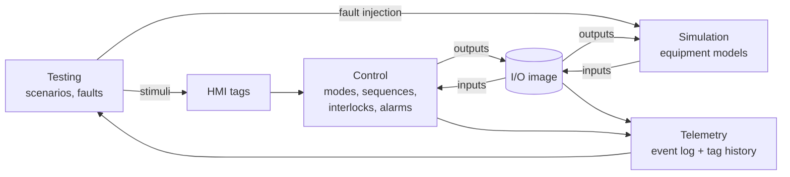

# ControlLab — Project Specification

*Living document and source of truth for the project. Last updated: 2026-09-21. Status: Phase 0–1 complete (`services/simulation/`, 33 tests passing) — see `docs/ARCHITECTURE.md` for what's actually implemented.*

---

## 1. Purpose

ControlLab is an open-source environment for virtual commissioning of industrial control systems. It pairs a simulated plant with a control layer, so an engineer can run and test control logic against equipment that behaves like the real thing (including when it fails) before any physical hardware exists.

The first target is deliberately small: a single bulk-material handling line. The goal is to do one line properly: realistic device behavior, explicit control logic, repeatable tests, and an auditable record of what happened.

## 2. The Problem

Control logic is usually tested for the first time on site, against real equipment, on a schedule that is already late. The consequences are well known:

- **Fault paths are the least tested code.** Startup and normal running get exercised. A feeder jam, a gate that never reaches its limit switch, or a motor that drops out mid-run often gets tested for the first time when it happens for real.
- **Commissioning evidence is manual.** Test sheets get filled in by hand, results are hard to reproduce, and a later logic change quietly invalidates tests that already passed.
- **Simulation tools tend to be expensive, closed, and tied to one vendor,** so small integrators and students don't use them.
- **Regression testing barely exists in controls work** compared with software. A change to one interlock can break another, and nothing catches it.

ControlLab applies software testing discipline (deterministic, automated, repeatable tests) to control-system behavior, while keeping controls engineering concepts first-class: I/O, scan cycles, permissives, trips, sequences, alarms.

## 3. Core Architecture

### 3.1 Separation of concerns

| Layer | Responsibility | Knows about |
|---|---|---|
| **Simulation** | Physical equipment behavior: material flow, motor response, gate travel, sensor signals, injected faults | Its own device models and the output side of the I/O image |
| **Control** | States, sequences, interlocks, modes, alarms, and responses to operator commands | Only the I/O image and operator commands, never simulation internals |
| **Testing** | Runs scenarios: sets initial conditions, schedules stimuli and faults, checks expectations | Drives the other layers; observes through I/O and telemetry |
| **Telemetry** | Records timestamped events, tag values, state transitions, and alarms | Reads everything; writes nothing back |
| **Visualization** *(later)* | HMI/dashboard for observation and operator commands | Telemetry (read) and operator commands (write) |
| **AI** *(later)* | Proposes test cases and helps analyze results | Specs, scenario files, and telemetry. Never in the control loop |

### 3.2 The I/O image is the contract

The one hard boundary in the system is the **I/O image**: a flat table of named tags (digital and analog inputs and outputs), just like the process image in a PLC.

- Simulation writes **inputs** (sensor signals) and reads **outputs** (actuator commands).
- Control reads **inputs** and writes **outputs**.
- Control code may never import or inspect simulation objects. If control needs a piece of information, it has to exist as a tag, because that is all a real controller gets.

This boundary is what makes future protocol work straightforward. Exposing the I/O image over Modbus or OPC UA lets an external controller (a soft PLC, or a real one) replace ControlLab's built-in control layer without changing the simulation.

Operator commands (Start, Stop, Reset, mode selection, manual device commands) are a separate small set of **HMI tags**, kept apart from field I/O the same way HMI tags are kept apart from physical I/O in a real system.

### 3.3 Execution model

ControlLab runs on **simulated time** with a fixed step (initially `dt = 100 ms`). Each tick is one scan cycle:

```
1. Testing   applies any stimuli scheduled for time t (operator commands, fault injections)
2. Control   scans: reads inputs + HMI tags → executes logic → writes outputs
3. Simulation advances physics by dt using the new outputs → updates inputs
4. Telemetry records every tag change, state transition, and alarm at time t
5. t ← t + dt
```

Simulated time means tests are deterministic, run far faster than real time (a 10-minute sequence runs in well under a second), and give identical results every run. Anything random, such as sensor noise, uses a seeded generator.



### 3.4 Technology choices

- **Python 3.12+**: readable, strong testing tools, and the eventual protocol libraries (pymodbus, asyncua, paho-mqtt) are mature.
- **pytest** as the test runner. Scenarios are ordinary pytest tests at first.
- **No framework, no database, no web server** until a later phase needs one. Telemetry (Phase 5) goes to JSON Lines and CSV files.
- Minimal dependencies. Anything added has to justify itself.

Current repository layout and what's actually implemented: `docs/ARCHITECTURE.md`.

## 4. Major Subsystems

**Simulation** (`services/simulation/`): One class per device type, each with a `step(dt)` method, plus a `Plant` that wires the five devices of the initial line together and moves material between them. Each device exposes its fault-injection hooks explicitly.

**I/O** (`services/simulation/engine/io_image.py` + `plant_io.py`, Phase 2 step 1 — done): A tag table shared between Simulation and Control — tag name, type (DI/DO/AI/AO), engineering units, current value — kept deliberately simple, a validated dictionary rather than a framework. The direction encoded in each tag's type is enforced in code, not just convention: Simulation can only `write_input()` DI/AI tags, Control can only `write_output()` DO/AO tags, and either side can `read()` anything. `plant_io.py` defines the exact 17-tag line from §5.3 and the glue (`publish_plant_inputs`/`apply_plant_commands`/`scan`) that wires `Plant` to it without `Plant` itself ever importing the I/O image — see `docs/ARCHITECTURE.md`.

**Control** (Phase 2, not yet built):
- *Device control modules*, one per actuator: a motor module (run command, start-proof timer, fail-to-start and trip detection) and a gate module (open/close command, travel timeout).
- *Line control*: the mode manager, the line state machine, the start and stop sequences, and the interlock logic.
- *Alarms*: latched alarms with first-out indication and operator reset (Phase 4).

**Telemetry** (Phase 5, not yet built): An append-only event log (commands, state transitions, alarms, faults) plus sampled tag history. Tests and reports read from the same record. Until this exists, tests assert on equipment state directly.

**Testing** (`tests/` now; a scenario harness in Phase 3): Today, ordinary pytest against `Plant` and its devices. Phase 3 adds a scenario harness to set initial plant conditions, schedule stimuli at simulated times, run until a condition or a timeout, and assert against telemetry, plus continuous **invariant checks** evaluated on every scan (see §7).

## 5. Initial Simulated Equipment

### 5.1 Process line

```
BIN-101 ──► XV-102 ──► FDR-103 ──► CV-104 ──► HOP-105 ──► (downstream draw)
Material    Slide      Screw        Belt        Surge
bin         gate       feeder       conveyor    hopper
```

The slide gate is included because it is the simplest device with travel time and limit switches, which is the classic source of "commanded but never arrived" faults.

### 5.2 Device behavior (Phase 1 — implemented)

| Device | Behavior modeled | Key parameters (initial) |
|---|---|---|
| **BIN-101** Material bin | Holds a mass of material and discharges only through the gate | Capacity 10,000 kg; low level at 10% |
| **XV-102** Slide gate | Travels open/closed over a fixed time; limit switches make only at the end of travel | Travel time 2 s |
| **FDR-103** Screw feeder (VFD) | Rate proportional to speed reference, *only if* motor running, gate open, and bin not empty | Max rate 5 kg/s; start delay 0.5 s |
| **CV-104** Belt conveyor | Carries material with a transport delay (material on the belt is modeled as a queue); motion switch confirms the belt is moving | 20 m at 2 m/s → 10 s transit; start delay 1 s |
| **HOP-105** Surge hopper | Accumulates incoming mass and discharges at a fixed downstream draw rate | Capacity 2,000 kg; draw 3 kg/s (configurable, may be 0) |
| **ES-001** E-stop / safety relay | When tripped, removes power from all motors **in the simulation**, regardless of control outputs | — |

**Material is conserved.** At every tick, bin + belt + hopper + discharged downstream + spilled equals the initial total. Spillage is modeled explicitly: material fed onto a stopped belt, or into a full hopper, is counted as spilled and logged. Spillage is the measurable consequence that most control mistakes produce, so tests can assert on it directly (for example, "zero spillage during a normal stop").

### 5.3 I/O list

| Tag | Type | Description |
|---|---|---|
| `LT-101` | AI | Bin level, % |
| `LSL-101` | DI | Bin low level switch |
| `XV-102.CMD_OPEN` | DO | Gate open command (de-energized = close) |
| `ZSO-102` | DI | Gate open limit switch |
| `ZSC-102` | DI | Gate closed limit switch |
| `M-103.RUN` | DO | Feeder motor run command |
| `M-103.RUNNING` | DI | Feeder motor running feedback (VFD) |
| `M-103.FAULT` | DI | Feeder VFD fault |
| `SC-103` | AO | Feeder speed reference, % |
| `M-104.RUN` | DO | Conveyor motor run command |
| `M-104.RUNNING` | DI | Conveyor motor running feedback (contactor aux) |
| `M-104.OL` | DI | Conveyor motor overload tripped |
| `ZSS-104` | DI | Conveyor motion (zero-speed) switch |
| `WT-105` | AI | Hopper weight, kg |
| `LSH-105` | DI | Hopper high level switch (80%) |
| `LSHH-105` | DI | Hopper high-high level switch (95%) |
| `ES-001` | DI | E-stop healthy (1 = healthy; fail-safe polarity) |

Tag naming loosely follows ISA-5.1 conventions. This table is the first commissioning artifact the project produces, and it should stay in sync with the code.

### 5.4 Injectable faults (Phase 1 hooks exist; Phase 4 surfaces them)

| Fault | Where it shows up |
|---|---|
| Motor fails to start | `RUN` set, `RUNNING` never arrives |
| Motor trips while running | Overload / VFD fault asserts, `RUNNING` drops |
| Belt slip / broken belt | `M-104.RUNNING` true but `ZSS-104` false |
| Gate fails to open / close | Limit switch never makes within the timeout |
| Gate limit switch stuck | Switch reads constant regardless of position |
| Feeder jam | Motor running, zero material flow (detected downstream by weight trend) |
| Sensor failure | Analog reads out of range; discrete stuck at 0/1 |
| E-stop pressed | `ES-001` drops; simulation de-energizes motors |
| Bin runs empty | Natural consequence, no special injection needed |

## 6. Operating Modes and Line States

**Modes** (operator-selected) and **states** (where the line currently is) are kept separate.

### 6.1 Modes

| Mode | Behavior |
|---|---|
| **Auto** | The line runs from Start/Stop commands via the automatic sequences. Hopper level control is active. |
| **Manual** | The operator commands individual devices. **All interlocks remain enforced**; manual mode bypasses the sequence, not the protection. |

The mode can only change while the line is **Idle**. Changing mode mid-run is refused and logged. (Interlock bypass for maintenance is a deliberate non-goal for early versions.)

### 6.2 Line state machine (Auto)

```
            Start                all proven             Stop
  IDLE ─────────────► STARTING ─────────────► RUNNING ─────────► STOPPING ──► IDLE
   ▲                     │                       │                   │
   │ Reset (fault        │ trip / step timeout   │ trip              │ trip
   │ cleared)            ▼                       ▼                   ▼
   └──────────────── FAULTED ◄──────────────────────────────────────┘

  E-stop from any state → ESTOPPED → (E-stop released + Reset) → IDLE
```

- **Start sequence (downstream first):** confirm permissives → start CV-104 → prove running (`RUNNING` and `ZSS-104` within 3 s) → open XV-102 → prove open (`ZSO-102` within 5 s) → start FDR-103 → prove running → RUNNING.
- **Stop sequence (upstream first):** stop FDR-103 → close XV-102 → run CV-104 for a purge time (transit time + margin, 15 s) so the belt clears → stop CV-104 → IDLE.
- **Hopper level control (RUNNING only):** the feeder runs at a fixed speed with on/off hysteresis. It stops at `LSH-105` and restarts when the hopper weight falls below a restart setpoint (60%). The conveyor stays running. (A PI rate controller comes later.)
- **No automatic restart after a trip.** A trip always goes to FAULTED. Returning to IDLE requires the cause to clear *and* an operator Reset.

### 6.3 Interlocks

**Permissives** gate a start. **Trips** act while running.

| Interlock | Type | Action |
|---|---|---|
| E-stop healthy | Permissive + trip | All outputs off; line → ESTOPPED |
| No active latched alarms | Permissive | Start refused |
| Hopper not high-high | Permissive | Start refused |
| Bin not low | Permissive | Start refused (warning only while running) |
| Conveyor proven running | Permissive + trip for feeder | Feeder cannot run onto a stopped belt; conveyor loss stops feeder immediately |
| Hopper high-high | Trip | Feeder stops, gate closes; line → FAULTED |
| Any motor fail-to-start / trip | Trip | Upstream equipment stops; line → FAULTED |
| Gate travel timeout | Trip | Feeder stops; line → FAULTED |

Trips cascade **upstream**: if a device stops, everything feeding it stops, and anything downstream keeps running so it can clear.

## 7. Testing Philosophy

1. **Tests read like commissioning procedures.** A scenario states initial conditions, operator actions, injected faults, and expected observable results, in that order. An engineer who has never read the code should be able to follow it.
2. **Tests observe the way a commissioning engineer does:** through I/O tags, line state, alarms, and the event log. They do not reach into internal variables.
3. **Deterministic by construction.** Simulated time and seeded randomness mean a failing test fails the same way every run.
4. **Every interlock gets a test that trips it.** An interlock without a test is an untested claim. Phase 3 adds a coverage matrix that makes gaps visible.
5. **Timing is asserted, not assumed.** Expectations come with windows ("feeder stops within 200 ms of conveyor motion loss"), because timing is where real control bugs hide.
6. **Invariants run on every scan of every test,** not just in dedicated tests. Initial invariants:
   - Material is conserved (§5.2).
   - The feeder is never running while the conveyor is not proven running (beyond one scan).
   - No motor output is energized while the E-stop is tripped.
   - No spillage occurs during normal start and stop sequences.
7. **The simulator is tested too.** Device models get their own unit tests (gate travel time, transport delay, conservation). A wrong plant model makes every control test meaningless.

Test tiers, in the order they get built:

| Tier | Example |
|---|---|
| Device model | Gate reaches `ZSO-102` in 2.0 s ± one tick |
| Control module | Motor module raises fail-to-start after 3 s without `RUNNING` |
| Sequence | Normal start reaches RUNNING in the correct order; normal stop leaves an empty belt |
| Fault | Conveyor overload mid-run → feeder stops, gate closes, line FAULTED, zero spillage beyond transit contents |
| Commissioning suite | The full ordered set, producing a report (Phase 3) |

## 8. Design Principles

- **Concrete before generic.** Build this one line in plain code first. A plant-configuration format, a device plugin system, or a generic sequence engine only gets built once the hardcoded version has shown what is actually needed.
- **The I/O image is the only contract** between control and simulation (§3.2).
- **Fail-safe defaults.** A de-energized output is the safe state. Loss of signal is treated as the unsafe condition. Unknown means stopped.
- **Explicit state machines.** Every state is named and enumerated, every transition is logged with its cause, and there is no implicit state hidden in flags.
- **Determinism over realism.** Model behavior at the level controls engineering needs (delays, limits, feedback, failure), not physics for its own sake.
- **Deterministic logic controls; AI assists.** AI may propose tests or explain results. It never issues commands to the control layer or the plant.
- **Every artifact is inspectable.** Event logs, reports, and scenarios are plain text that a human can read and diff.

## 9. Non-Goals

- **Not a safety system and not for safety validation.** ControlLab does not provide or verify SIL-rated functions. The simulated E-stop exists to test *control-system responses* to a safety trip, not to validate safety design.
- **Not a physics simulator.** No discrete-element material modeling, no 3D, no motor electrical dynamics.
- **Not a PLC runtime for real equipment,** and not an IEC 61131-3 compiler or editor.
- **Not a SCADA/HMI product.** The eventual dashboard exists to observe and drive tests.
- **No multi-user, authentication, cloud deployment, or database** in early phases.
- **No generic plant builder before Phase 7 (Protocols).** The initial line is defined in code until then.
- **No interlock bypass / maintenance override** until the core is solid, since bypass logic is a safety-sensitive feature in its own right.

## 10. Roadmap

*Phase numbering matches `CLAUDE.md` §18. Each phase must be usable and fully tested before the next one starts. Current status of each phase: `docs/ARCHITECTURE.md`.*

### Phase 0 — Foundation ✅ done
- Repository, this specification, `docs/ARCHITECTURE.md`, Python environment, pytest, coding conventions, the domain model in §5.

### Phase 1 — Simulation core ✅ done
- The five devices plus E-stop (`SimClock`, `Motor`, `Gate`, `MaterialBin`, `Hopper`, `Feeder`, `Conveyor`, `EStop`, `Plant`), material transport, conservation, spillage accounting, deterministic state transitions.

**Done when:** a normal start → run → stop scenario shows material moving bin-to-hopper with zero spillage, a feeder-onto-a-stopped-conveyor scenario shows spillage, an E-stop scenario shows every motor held until an explicit reset, and running the same scenario twice gives identical results. All four are covered in `tests/integration/test_plant.py`.

### Phase 2 — Control (in progress)
- ✅ **Step 1 — the I/O image** (tag table). Done: `services/simulation/engine/io_image.py` (the generic, reusable mechanism) + `plant_io.py` (the line's exact 17 tags from §5.3, and the `Plant`-facing glue). `Plant` itself still has zero knowledge of it — see `docs/ARCHITECTURE.md`.
- ⬜ **Step 2 — device control modules**: run/open commands issued through the I/O image, not directly against simulation objects.
- ⬜ **Step 3 — line control**: the mode manager (Auto first; Manual once Auto is proven — see §6.1), the line state machine (§6.2), start/stop sequences, interlocks (§6.3), hopper hysteresis control.
- ⬜ **Step 4 — retarget Phase 1's four integration scenarios** to run through Control instead of calling `Plant`'s devices by hand (the I/O-image equivalents already exist in `tests/integration/test_plant_io.py`, driven by hand for now — Control replaces the hand-driving, not the assertions).

**Done when:** the start/stop sequences and interlocks from §6 are driven through Control (not by tests calling `Plant`'s devices — or the I/O image's tags — directly, as they do today), and the same conservation/no-spillage/E-stop scenarios still pass driven that way. One finding from building step 1, worth carrying into step 3: with no interlock logic yet, a stale run command left asserted in the I/O image will restart a motor the instant it's reset out of an E-stop (`tests/integration/test_plant_io.py::test_estop_via_io_image_holds_motors_until_explicit_reset`) — that's precisely the gap §6.2's "no automatic restart after a trip" rule exists to close, and step 3 needs a test proving it's closed.

### Phase 3 — Testing / commissioning scenarios
- Declarative scenario files (the `given`/`when`/`expect`/`within` shape in `CLAUDE.md` §10), a scenario runner, timing-window assertions.
- A fault test for every interlock in §6.3 — an interlock without a test is an untested claim.
- Continuous invariant checks (§7, item 6) running on every scan of every scenario.
- An interlock coverage matrix.

### Phase 4 — Fault injection, alarms
- Formalize the fault-injection API covering §5.4 (most hooks already exist on the Phase 1 equipment classes — `fail_to_start`, `trip_now`, `stuck`, `motion_switch_stuck_false` — this phase is about surfacing them through Control/Testing, not inventing new ones).
- Alarm management: latching, first-out indication, acknowledge and reset, alarm log.

### Phase 5 — Telemetry
- JSONL event log (commands, state transitions, alarms, faults) and CSV tag history, replacing the direct-state-inspection tests use through Phase 4.
- A generated commissioning report (Markdown/HTML): scenarios run, pass/fail, timing vs. limits, alarm sequences, interlock coverage.

### Phase 6 — Visualization
- A lightweight local web dashboard: line mimic, device states, live tag values, alarm list, operator commands.
- Replay of a recorded run from telemetry.

### Phase 7 — Protocols
- Modbus TCP server exposing the I/O image.
- **External controller mode:** built-in Control disabled, an external soft PLC (e.g. OpenPLC) drives the simulated plant over Modbus. This is where ControlLab becomes true virtual commissioning of someone else's logic.
- OPC UA server; MQTT telemetry publishing.
- A plant definition file, now that there's a working reference implementation to generalize from.

### Phase 8 — AI engineering assistance
- Generate candidate scenario files from the I/O list, interlock table, and sequence description. Candidates are reviewed by an engineer before they become tests.
- Analyze failed runs: summarize the event log around the failure and point to the likely cause.
- AI output is always a *proposal* in a reviewable file, never a live action — it never issues commands to Control.

### Phase 9 — Virtual commissioning
- External controller integration and virtual I/O mapping built out fully.
- Reproducible software-in-the-loop commissioning workflows against real, externally-supplied control logic — the payoff the whole architecture (§3) was built toward.

### Later (unscheduled)
- PI rate control for the feeder; weigh-belt feeder model.
- Additional equipment: diverter gates, bucket elevators, multiple lines sharing a hopper.
- ISA-88-style phases and recipes.
- Maintenance mode with audited interlock bypass.

## 11. Open Questions

- Repository name, license (MIT vs Apache-2.0), and hosting.
- Whether the scenario YAML format in Phase 3 should follow an existing convention or stay minimal and project-specific.
- For external controller mode, which soft PLC to target first (OpenPLC is the default candidate).

---

## Change Log

| Date | Change |
|---|---|
| 2026-09-21 | Initial specification: purpose, architecture, initial line, modes, testing philosophy, roadmap V0.1–V0.6. |
| 2026-09-21 | Master project context (`CLAUDE.md`) added; roadmap renumbered from V0.1–V0.6 to Phase 0–9 to match it; telemetry moved from Phase 1 to Phase 5; Manual mode and the I/O image module both confirmed as Phase 2 (Control) work, not Phase 1. See `docs/ARCHITECTURE.md` Reconciliation notes. Phase 0–1 implemented: `services/simulation/` (SimClock + five devices + E-stop + Plant) with unit and integration tests. Two timing bugs found and fixed during implementation, both in `Motor`/`Gate`: (1) the elapsed-time check for leaving a timed state ran one tick late, so a 0s delay/travel-time took an extra tick to resolve — fixed by checking the threshold in the same tick a timed state is entered; (2) repeated `+= dt` drifted below the exact threshold (ten additions of 0.1 summed to 0.9999999999999999, not 1.0) — fixed by rounding the accumulator, the same class of fix `SimClock` already used. 33 tests pass; a manual determinism spot-check (two independent runs of the same scenario) produced byte-identical results. |
| 2026-09-22 | Review pass before Phase 2: fixed leftover V0.x labels from the renumbering, documented a real (non-bug) simplification in `Gate` — direction reversals take the full nominal travel time, not just the remaining distance, since there's no continuous position variable. Phase 2 step 1 shipped: the I/O image (`services/simulation/engine/io_image.py`, generic and reusable — the DI/AI-vs-DO/AO write direction is enforced in code) and `plant_io.py` (the line's exact 17 tags from §5.3, verified against the doc by test, plus the `Plant`-facing glue). `Plant` remains untouched — it still has no knowledge of the I/O image. 21 new tests (54 total). Along the way, driving an E-stop-and-reset scenario purely through the I/O image surfaced a real, expected gap: with no Control/interlock logic yet, a stale run command left asserted in the image restarts a motor the instant it's reset — documented in the test and in §10's Phase 2 entry as exactly what step 3's interlocks need to close. |
